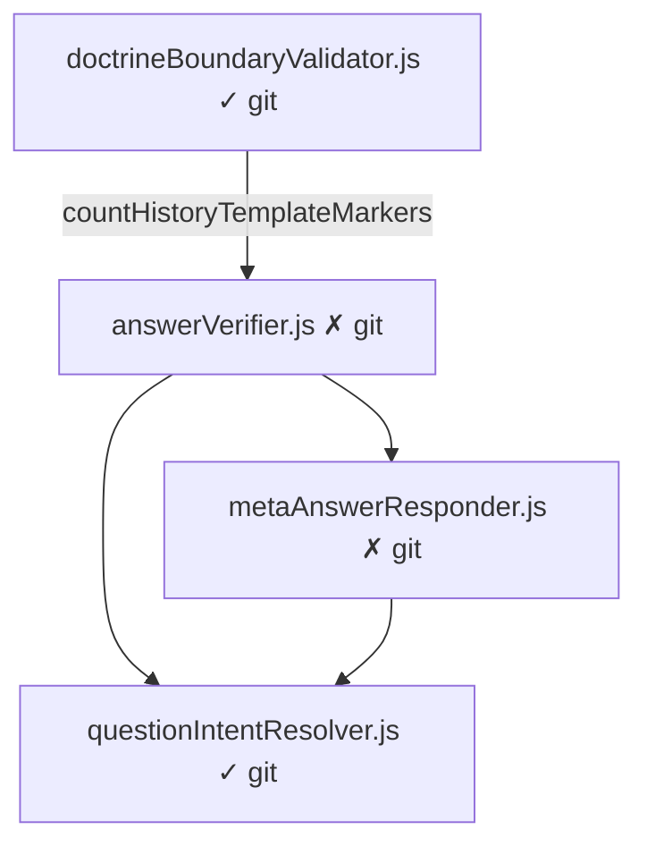

# AnswerVerifier Dependency Audit

**Date:** 2026-06-06  
**Deploy commit:** `57b3f96`  
**Render error:** `Cannot find module './answerVerifier'`  
**Scope:** Investigation only — no code changes, deploy, or push.

---

## Executive summary

| Question | Answer |
|----------|--------|
| Is `answerVerifier.js` the **only** missing runtime dependency? | **No.** Adding only `answerVerifier.js` will cause the **next** crash on **`metaAnswerResponder.js`** (also untracked). |
| Is `answerVerifier.js` self-contained? | **No.** It requires `./metaAnswerResponder` at load time. |
| Minimum files to fix Render crash chain | **`services/answerVerifier.js`** + **`services/metaAnswerResponder.js`** |
| Path / case correct? | **Yes** — failure is git deploy parity only |

---

## 1. `services/answerVerifier.js` analysis

### FILE

`services/answerVerifier.js` — **exists locally**, **not in git** (`??`)

### EXPORTS

| Export | Type |
|--------|------|
| `verifyAnswer` | function |
| `applyAnswerVerification` | function |
| `countHistoryTemplateMarkers` | function |
| `hasWordingAnswerSignals` | function |
| `SABBATH_HISTORY_TEMPLATE_MARKERS` | array of RegExp |

**Used by `doctrineBoundaryValidator.js` (Render crash path):** only `countHistoryTemplateMarkers`.

### IMPORTS (local `require`)

| Line | Require | Target |
|------|---------|--------|
| 6 | `require('./metaAnswerResponder')` | `buildMetaAnswerResponse`, `detectWordingFocus` |
| 7 | `require('./questionIntentResolver')` | `findPriorQuestion` |

### Package dependencies

**None.** No `npm` packages imported.

### Internal functions (not exported)

`buildStrictRegenerationReply`, `buildFallbackReply` — use `buildMetaAnswerResponse` from `metaAnswerResponder`.

---

## 2. Transitive dependencies

```
doctrineBoundaryValidator.js:6
  └── answerVerifier.js                    ← MISSING FROM GIT (Render crash #1)
        ├── metaAnswerResponder.js         ← MISSING FROM GIT (Render crash #2 if only #1 fixed)
        │     └── questionIntentResolver.js  ✓ tracked
        └── questionIntentResolver.js      ✓ tracked
```

### `metaAnswerResponder.js` (untracked)

| Field | Value |
|-------|-------|
| **IMPORTS** | `./questionIntentResolver` (`findPriorQuestion`, dynamic `isMetaAboutPreviousAnswer`) |
| **GIT** | Not tracked |
| **Transitive** | `questionIntentResolver.js` — **tracked** |

---

## 3. All `require('./answerVerifier')` / `require('../services/answerVerifier')` matches

| File | Line | Statement | On OpenAI-first hot path? |
|------|------|-----------|---------------------------|
| `services/doctrineBoundaryValidator.js` | 6 | `require('./answerVerifier')` | **Yes — Render crash** |
| `services/companionPostureValidator.js` | 9 | `require('./answerVerifier')` | No (file also untracked) |
| `services/answerMatchGate.js` | 11 | `require('./answerVerifier')` | No (`masterBuddyRuntime`; file untracked) |
| `scripts/sprint2FinalCReasoningFirstHttp.js` | 12 | `require('../services/answerVerifier')` | No (script only) |

### Caller chain (Render)

```
routes/buddy.js
  → buddyBrain.runBuddy
    → openAiFirstCompanionRuntime.js
      → reasonFirstComposer.js:8
        → doctrineBoundaryValidator.js:6
          → answerVerifier.js  MODULE_NOT_FOUND
```

---

## 4. Git verification

```bash
$ git ls-files | grep answerVerifier
(empty)

$ git ls-files | grep metaAnswerResponder
(empty)

$ git status --short services/answerVerifier.js services/metaAnswerResponder.js
?? services/answerVerifier.js
?? services/metaAnswerResponder.js
```

### Case sensitivity

| Path | Exists |
|------|--------|
| `services/answerVerifier.js` | Yes |
| `services/AnswerVerifier.js` | No |
| `services/answerverifier.js` | No |

---

## 5. `doctrineBoundaryValidator.js` require (exact)

```javascript
const { countHistoryTemplateMarkers } = require('./answerVerifier');
```

**Expected resolution:** `services/answerVerifier.js`  
**Render actual:** file absent in `57b3f96` checkout  
**Path correct:** yes

---

## 6. MISSING FILES table

| File | GIT | Local | Required by | Risk |
|------|-----|-------|-------------|------|
| `services/answerVerifier.js` | **No** | Yes | `doctrineBoundaryValidator.js` (committed) | **CRITICAL — current Render blocker** |
| `services/metaAnswerResponder.js` | **No** | Yes | `answerVerifier.js` | **CRITICAL — next blocker if only answerVerifier added** |
| `services/answerMatchGate.js` | No | Yes | `masterBuddyRuntime` only | Low (not OpenAI-first) |
| `services/companionPostureValidator.js` | No | Yes | Scripts / posture tests | Low |
| `services/responseContract.js` | No | Yes | `masterBuddyRuntime`, `answerMatchGate` | Low |
| `services/liveResponseCapture.js` | No | Yes | Local `routes/buddy.js` only (uncommitted) | Low unless route instrumentation deployed |

---

## 7. RISK LEVEL summary

| Item | Risk |
|------|------|
| Deploy with only `answerVerifier.js` added | **HIGH** — fails on `metaAnswerResponder` at next `require` |
| Deploy with `answerVerifier.js` + `metaAnswerResponder.js` | **LOW** for this crash chain — both deps of hot path resolve to tracked `questionIntentResolver` |
| Local uncommitted `sabbathHistoryDeepResponder.js` diff adding `metaAnswerResponder` | **HIGH** if committed without `metaAnswerResponder.js` — loads via `retrievalEvidencePack` **before** `reasonFirstComposer` |

---

## 8. Recommended git commands (DO NOT RUN — documentation only)

Minimum deploy-parity fix for current Render stack at `57b3f96`:

```bash
git add services/answerVerifier.js services/metaAnswerResponder.js
git commit -m "$(cat <<'EOF'
Add missing answerVerifier and metaAnswerResponder modules for doctrine validation.

These files are required by doctrineBoundaryValidator on the OpenAI-first path but were never committed in 57b3f96.

EOF
)"
git push origin main
```

Verify before push:

```bash
git ls-files | grep -E 'answerVerifier|metaAnswerResponder'
node -e "require('./services/doctrineBoundaryValidator'); console.log('doctrineBoundaryValidator OK')"
node -e "require('./services/openAiFirstCompanionRuntime'); console.log('openAiFirst OK')"
```

---

## 9. Dependency graph (answerVerifier subgraph)



---

**STOP — audit only. No modifications executed.**

**End of report.**
