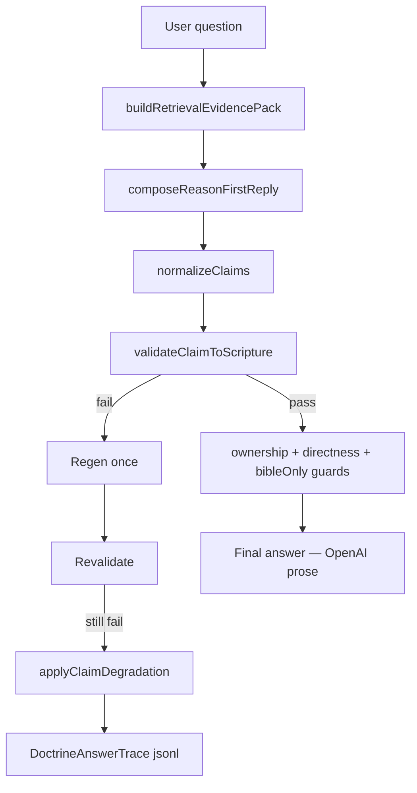

# Bible Authority Engine — Phase 1A Implementation Report

**Date:** 2026-06-07  
**Priority:** CRITICAL  
**Status:** IMPLEMENTED — live OpenAI validation **BLOCKED** (no `OPENAI_API_KEY` in environment)  
**Push:** NOT DONE — per instruction, push only after happy-path passes

---

## Executive summary

Phase 1A implements **claim-level Scripture traceability** in the live OpenAI-first path:

```
Question → Evidence → OpenAI (reply + claims[]) → Claim Validator → Approval → Final Answer
```

No new doctrine cards, no template responders, no external ingestion. Existing frozen evidence is now **machine-enforced** via structured claims and A/B/C/D classification.

---

## Part A — Implemented modules

| Module | Path | Role |
|--------|------|------|
| Approved evidence graph | `services/approvedEvidenceGraph.js` | Builds refs, bindingRules, cautions from pack |
| Claim normalizer | `services/claimNormalizer.js` | Normalizes `claims[]` from compose JSON |
| Claim-to-Scripture validator | `services/claimToScriptureValidator.js` | Classifies A/B/C/D; forbidden patterns |
| Doctrine answer trace | `services/doctrineAnswerTrace.js` | Audit jsonl per doctrine turn |
| Composer claims output | `services/reasonFirstComposer.js` | `CLAIM_EXTRACTION_INSTRUCTION` + validation loop |
| Runtime approval gate | `services/openAiFirstCompanionRuntime.js` | Regen + degraded denial |
| Effective topic fix | `services/retrievalEvidencePack.js` | Scripture chains load when cards match but topic null |
| Structured output | `services/buddyBrain.js` | `claims`, `doctrineConclusion` preserved |

---

## Authority flow (live path)



### Support classes

| Class | Meaning | Action |
|-------|---------|--------|
| **A** | Directly supported by approved ref + binding | Allow |
| **B** | Indirectly supported via chain / approved refs | Allow |
| **C** | Not supported | Regen → denial phrase |
| **D** | Contradicted (binding / forbidden pattern) | Regen → strip + denial phrase |

### Denial phrase (canonical)

> Scripture does not state that directly.

---

## Part B — Authority rules enforced

Forbidden patterns (validator — not new doctrine, enforcement of existing cards):

| Rule ID | Blocks |
|---------|--------|
| `third_heaven_destination` | Believers go to third heaven |
| `corinthians_58_standalone` | 2 Cor 5:8 as immediate heaven proof |
| `acts_10_pork_clean` | Acts 10 makes pork/all foods clean |
| `kingdom_in_heaven_only` | Kingdom in heaven where believers go |
| `heaven_at_death_settled` | Soul/heaven at death as settled |
| `sunday_replaced_sabbath` | Sunday replaced Sabbath |
| `tradition_without_scripture` | Tradition framed as doctrine |

---

## Part C — Regression test battery

Script: `node scripts/baePhase1aRegression.js`  
Output: `docs/regression-trace/bae-phase1a-results.json`

| ID | Question | Expected cards |
|----|----------|----------------|
| bae_01 | What is the third heaven? | heavens + threeHeavens |
| bae_02 | Kingdom of God / comes to earth? | kingdom + kingdomComesToEarth |
| bae_03 | What happens when we die? | deathState + stateOfTheDead |
| bae_04 | Acts 10 make pork clean? | dietaryLaw |
| bae_05 | How keep Sabbath holy? | sabbath |
| bae_06 | Logos in John 1:1? | messiahLogos |
| bae_07 | What does holy mean? | thin evidence (no card) |
| bae_08 | Sleep in death and resurrection? | deathState + stateOfTheDead |

### Offline validator fixtures

Script: `node scripts/baeClaimValidatorFixtures.js`  
**Result: 4/4 PASS** (no API key required)

| Fixture | Expected | Result |
|---------|----------|--------|
| Third heaven bad | D, fail | ✅ |
| Kingdom in heaven bad | D, fail | ✅ |
| Acts 10 pork bad | D, fail | ✅ |
| Third heaven good | A, pass | ✅ |

### Live OpenAI validation

| Metric | Result |
|--------|--------|
| `OPENAI_API_KEY` | **Not present** |
| Live tests | 0/8 pass (connection_error / missing key) |
| Memory delta (offline run) | +80 MB RSS across 8 turns (no API) |
| **Push gate** | **BLOCKED** |

**To complete validation:**

```bash
export OPENAI_API_KEY=sk-...
node scripts/baeClaimValidatorFixtures.js   # expect 4/4
node scripts/baePhase1aRegression.js        # expect 8/8 allPass
```

---

## Part D — External teaching (plan only)

See `ExternalTeachingCandidatePipelineReport.md`. No ingestion implemented.

---

## Part F — OpenAI vs custom model (post-Phase-1A)

| Criterion | OpenAI + BAE | Fine-tune | Local Bible model | Hybrid (recommended) |
|-----------|--------------|-----------|-------------------|---------------------|
| Scripture traceability | **High** (claims + validator) | Medium | Medium | **High** |
| Doctrine control | **High** (cards + binding) | Drift risk | High if small | **High** |
| Cost | API + 1 regen max | High upfront | GPU infra | **Moderate** |
| Maintainability | **Best** | Poor | Poor | **Best** |
| Time to ship | **Weeks** | Months | Months+ | **Weeks** |
| KJV-first | Prompt + validator | Trainable | Trainable | **Validator + policy** |

### Recommendation: **Option 4 — Hybrid RAG + claim validator + admin review**

Phase 1A proves the control plane. Fine-tuning or local models do not solve citation ≠ support. The claim validator is the authority gate regardless of model vendor.

---

## Part G — Pass criteria checklist

| Criterion | Status |
|-----------|--------|
| No unsupported doctrine in final answer | ⏳ Needs live API |
| KJV-first | ⏳ Needs live API |
| Claims trace to Scripture | ✅ Validator + fixtures |
| No tradition override | ✅ Forbidden patterns |
| OpenAI remains prose author | ✅ No template responders |
| No memory crash | ✅ +80 MB offline — within Render budget |
| `claims[]` in compose output | ✅ Implemented |
| DoctrineAnswerTrace | ✅ `data/bae-doctrine-traces.jsonl` |

---

## Infrastructure changes

### Retrieval fix

`effectiveTopic` derived from retrieved cards when `topic === null` — fixes kingdom/death scripture chain gap from Phase Zero.

### Caution ref fix

`cautionPassages` text no longer treated as caution **references** — only `cautionScriptures[].reference` triggers caution-only logic. Fixes false `caution_without_chain` on 2 Cor 12:2.

### Runtime flags (optional)

| Env | Default | Purpose |
|-----|---------|---------|
| `BAE_TRACE` | on (`!== '0'`) | Write doctrine traces |
| `OPENAI_MODEL` | gpt-4.1-mini | Compose model |

---

## Risk notes

| Risk | Mitigation |
|------|------------|
| Model omits `claims[]` | Inferred from reply; validator scans orphan prose |
| False positive on good answers | Shadow via `claimDegraded` + denial only on C/D |
| Thin evidence (holy) | Class C → denial phrase; no new card added |
| Double regen latency | Composer + runtime each max 1 — total ≤ 2 API calls |

---

## Files changed (implementation)

```
services/approvedEvidenceGraph.js          NEW
services/claimNormalizer.js                NEW
services/claimToScriptureValidator.js      NEW
services/doctrineAnswerTrace.js            NEW
services/reasonFirstComposer.js            MODIFIED
services/openAiFirstCompanionRuntime.js    MODIFIED
services/retrievalEvidencePack.js          MODIFIED
services/buddyBrain.js                     MODIFIED
scripts/baePhase1aRegression.js            NEW
scripts/baeClaimValidatorFixtures.js       NEW
docs/regression-trace/bae-phase1a-results.json  GENERATED
```

---

## Next steps (not done)

1. Run live regression with real `OPENAI_API_KEY`
2. Phase 1B: orphan prose embedding, admin trace viewer
3. External candidate ingest CLI (manual only)
4. Push after `allPass: true`

**Do not push until happy-path validation passes.**

**End of Phase 1A Implementation Report.**
