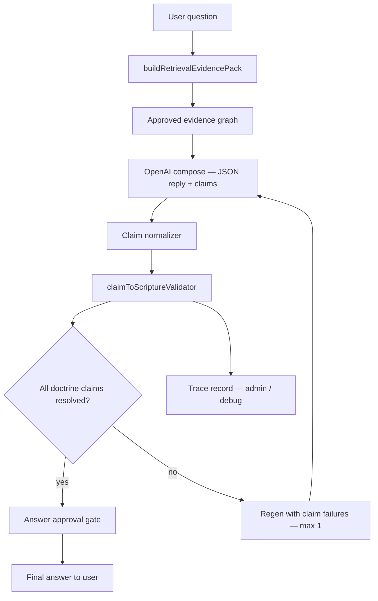
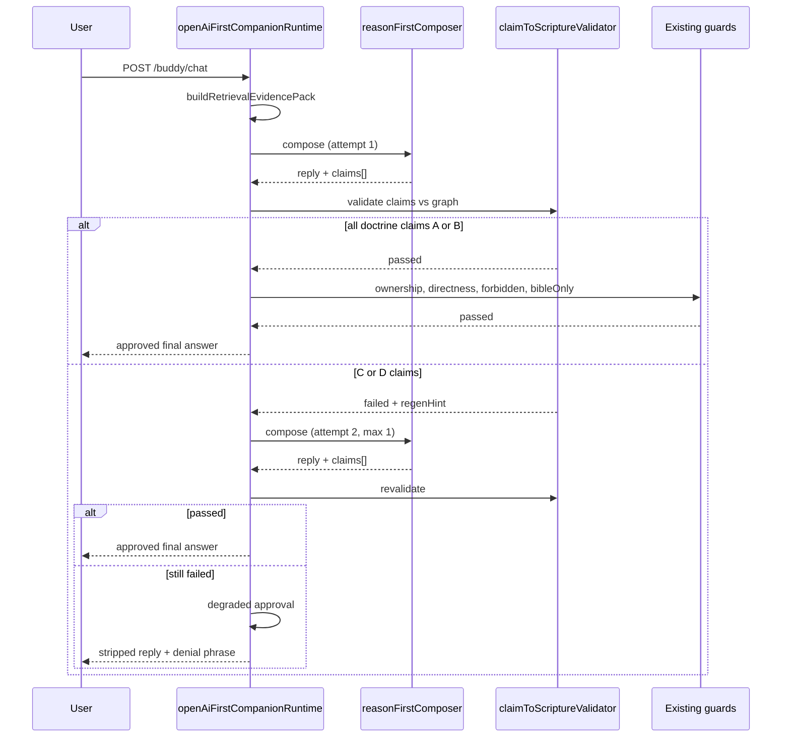

# Bible Authority Engine — Phase 1 Claim Validation Architecture

**Date:** 2026-06-07  
**Priority:** CRITICAL  
**Status:** DESIGN ONLY — no implementation, no doctrine changes, no new evidence, no push  
**Prerequisite:** `BibleAuthorityTraceabilityAudit.md` (Phase Zero)

---

## 1. Problem statement

Phase Zero proved:

| Finding | Implication |
|---------|-------------|
| Evidence often retrieves correctly | The bottleneck is **not** primarily missing cards |
| OpenAI still produces unsupported doctrinal conclusions | Prose-level regex cannot see semantic claims |
| Validators check citation **mentions**, not claim **support** | Citation ≠ support is the core authority-order bug |
| No claim extractor exists | Steps 6–8 of the trace pipeline are absent |

Phase 1 adds **machine-enforceable claim traceability** without changing doctrine content, adding cards, or ingesting external teaching.

---

## 2. Target pipeline



**Authority order (non-negotiable):**

1. Retrieval selects **approved** evidence only (unchanged).
2. OpenAI authors **prose** (`reply`) and **metadata** (`claims[]`).
3. Validator judges claims against evidence graph — **never rewrites doctrine**.
4. Final answer ships only after approval gate passes.

---

## 3. Doctrine answer audit model

For **every doctrine turn** (intent ∈ `definition`, `direct_yes_no`, `meaning_word_study`, `how_to_practice`, `doctrine_explanation`, `correction_repair`, or `evidenceCards.length > 0`), persist a **DoctrineAnswerTrace**:

```json
{
  "traceId": "uuid",
  "userMessage": "What is the third heaven?",
  "timestamp": "ISO-8601",
  "retrieval": {
    "currentIntent": "definition",
    "topic": "heavens",
    "cardIds": ["heavens"],
    "catalogKeys": ["threeHeavens"],
    "scriptureChainId": "heavensLayers",
    "approvedRefCount": 27,
    "bindingRuleCount": 5,
    "evidencePackBytes": 14700
  },
  "compose": {
    "openaiCalled": true,
    "attempts": 1,
    "model": "gpt-4o-mini",
    "promptTokens": 4200,
    "completionTokens": 380
  },
  "claims": [],
  "validation": {},
  "doctrineConclusion": "",
  "approval": { "status": "pending|approved|rejected|degraded" },
  "finalReplyHash": "sha256"
}
```

### 3.1 Fields extracted per doctrine answer

| Field | Source | Purpose |
|-------|--------|---------|
| **claims made** | OpenAI `claims[]` (normalized) | Per-assertion audit |
| **scripture cited** | Union of `supportingScriptures` across claims + regex scan of `reply` | Cross-check model honesty |
| **evidence cards used** | `evidencePack.evidenceCards.cards[].topic` | Tie claims to frozen assets |
| **catalog entries used** | `approvedCatalogEvidence.catalogKeys` | Line-upon-line chain context |
| **doctrine conclusion** | Highest-weight `doctrine` claim text (or `doctrineConclusion` field) | One-line summary for admin review |

**Doctrine conclusion** is derived, not authored by validator:

```
doctrineConclusion = claims
  .filter(c => c.type === 'doctrine')
  .sort(by confidence desc, then claim length desc)[0]?.claim
  || inferFromReply(reply)  // fallback for migration only
```

---

## 4. Claim extraction format

### 4.1 Composer JSON schema extension

Extend existing `response_format: json_object` output in `reasonFirstComposer.js` (design only — not implemented):

```json
{
  "reply": "User-facing prose. KJV references inline.",
  "confidence": "high|medium|low",
  "memory_used": false,
  "claims": [
    {
      "claimId": "c1",
      "claim": "Paul names a third heaven in 2 Corinthians 12:2.",
      "type": "doctrine|pastoral|procedural|clarification",
      "supportingScriptures": ["2 Corinthians 12:2"],
      "confidence": "high|medium|low",
      "derivedFrom": "evidence_card:heavens|catalog:threeHeavens|user_question|inference"
    }
  ],
  "doctrineConclusion": "Scripture names a third heaven in Paul's experience; it does not state believers' final destination is the third heaven."
}
```

### 4.2 Field rules

| Field | Rule |
|-------|------|
| `claim` | Atomic assertion — one verifiable proposition per entry |
| `type` | `doctrine` claims are **validated**; `pastoral`/`procedural` are logged only |
| `supportingScriptures` | KJV refs the model asserts support this claim (may be empty → triggers `ungrounded`) |
| `confidence` | Model self-report; validator does **not** trust this for pass/fail |
| `derivedFrom` | Traceability hint — validator checks against actual retrieval, not model claim |
| `reply` | **Only** field shown to user; claims are runtime metadata |

### 4.3 Claim extraction modes (by intent)

| Mode | When | Claims required |
|------|------|-----------------|
| `binding` | Doctrine intents + evidence cards present | `claims[]` mandatory, ≥1 `doctrine` claim |
| `advisory` | Pastoral / emotional turns | Optional; validator skipped |
| `thin` | Doctrine intent but **no** evidence cards (e.g. "holy mean") | Mandatory; expect `not_supported` → safe fallback phrase |

### 4.4 Extraction anti-patterns to forbid in prompt

- Claims must **not** introduce scriptures absent from approved evidence graph (flag `unsupported_citation`).
- Claims must **not** paraphrase binding rules as if they were direct Scripture quotes.
- `reply` must not contradict passing `doctrine` claims (secondary coherence check).

---

## 5. Approved evidence graph (validator input)

Build once per turn from existing assets — **no new doctrine content**:

```
ApprovedEvidenceGraph
├── refs[]              ← collectApprovedReferences()
├── bindingRules[]      ← card.bindingRules + catalog cautions
├── forbiddenClaims[]   ← bindingRules phrased as negations + doctrineBoundaries
├── cautionRefs[]       ← 2 Cor 5:8, etc. — require co-witness
├── cardTopics[]        ← heavens, kingdom, deathState, …
└── catalogChains[]     ← teachingOrder per catalogKey
```

**Topic resolution fix (Phase 1a — infrastructure, not doctrine):** When `topic === null` but cards retrieved, set `effectiveTopic` from `evidenceCards.cards[0].topic` so scripture chains load. This is retrieval wiring, not new evidence.

---

## 6. Claim-to-Scripture validator

**Module:** `services/claimToScriptureValidator.js` (proposed)

### 6.1 Input

```json
{
  "reply": "…",
  "claims": [ … ],
  "evidencePack": { … },
  "approvedGraph": { … },
  "userMessage": "…",
  "currentIntent": "definition"
}
```

### 6.2 Support classification (A / B / C / D)

| Class | Code | Definition | Example |
|-------|------|------------|---------|
| **Supported directly** | `A` | Claim text is authorized by an approved ref **and** binding rules permit the assertion | "Paul names third heaven" + 2 Cor 12:2 |
| **Supported indirectly** | `B` | Claim follows from **chain** of approved refs + binding rules; no single verse states it verbatim | "Kingdom hope includes reign on earth" from Matt 6:10 + Rev 5:10 chain |
| **Not supported** | `C` | No approved ref + binding rule authorizes claim; Scripture may be silent | "Believers go to third heaven at death" |
| **Contradicted** | `D` | Claim violates `bindingRules`, `forbiddenClaims`, or negation patterns | "Kingdom is in heaven where believers go" vs kingdom-on-earth binding |

### 6.3 Validation algorithm (per doctrine claim)

```
for each claim where type === 'doctrine':
  1. Normalize supportingScriptures → canonical KJV tokens
  2. Check refs ⊆ approvedGraph.refs
     → if not: classification C, issue unsupported_citation
  3. Match claim text against forbiddenClaims / binding negations
     → if hit: classification D, issue contradicted_binding_rule
  4. If refs ∈ cautionRefs and no co-witness in claim or chain
     → classification C, issue caution_without_chain
  5. Semantic match claim ↔ bindingRules + teachingOrder
     → direct lemma/entity match: A
     → chain inference (catalog teachingOrder order): B
     → no match: C
  6. Cross-check reply prose for orphan doctrine (claims missed by model)
     → regex + embedding-lite optional Phase 1b
```

### 6.4 Semantic matching strategy (phased)

| Phase | Method | Notes |
|-------|--------|-------|
| **1a** | Rule library + binding rule substring/negation patterns | Closes Acts 10, kingdom-in-heaven gaps from Phase Zero |
| **1b** | Claim ↔ bindingRule embedding similarity (local, no external API) | Catches paraphrase drift |
| **2** | Optional micro-call: "Does ref X support claim Y?" temperature 0 | Only on `C` borderline |

Validator **never** generates replacement doctrine text.

### 6.5 Output schema

```json
{
  "passed": false,
  "validatorResult": "pass|fail|degraded",
  "claimResults": [
    {
      "claimId": "c2",
      "claim": "Believers go to the third heaven when they die.",
      "classification": "D",
      "supportingScriptures": ["2 Corinthians 12:2"],
      "issues": ["contradicted_binding_rule", "citation_does_not_support_claim"],
      "bindingRuleHit": "2 Corinthians 12:2 names third heaven — does NOT prove believers' final destination",
      "recommendedResolution": "deny"
    }
  ],
  "unsupportedClaims": ["Believers go to the third heaven when they die."],
  "contradictedClaims": ["Believers go to the third heaven when they die."],
  "orphanDoctrineInReply": [],
  "regenHint": "Remove or correct claim c2. Say: Scripture does not state that directly.",
  "traceRecord": { … }
}
```

---

## 7. Phase Zero examples — validator behavior

### 7.1 Believers go to third heaven

| Claim | Class | Reason |
|-------|-------|--------|
| "Paul names third heaven in 2 Cor 12:2" | **A** | Direct ref + binding permits naming |
| "Believers go to third heaven at death" | **D** | Contradicts `heavens.card` bindingRules |
| "2 Cor 12:2 proves believer destination" | **D** | Explicit binding negation |

**Resolution:** Reject claim c2; regen or append denial sentence.

### 7.2 Kingdom is in heaven

| Claim | Class | Reason |
|-------|-------|--------|
| "Jesus taught pray thy kingdom come on earth" | **A** | Matt 6:10 in approved set |
| "The kingdom is in heaven where believers go after death" | **D** | Contradicts `kingdom.card` bindingRules (on earth / comes down) |

**Current bug:** Regex passes because Matt 6:10 is **mentioned** while teaching **D**. Claim validator classifies **D** regardless of citation presence.

### 7.3 Acts 10 made pork clean

| Claim | Class | Reason |
|-------|-------|--------|
| "Acts 10 records Peter's vision" | **A** | Factual, card supports |
| "Acts 10 makes all foods clean including pork" | **C/D** | Card `cautionPassages` + dietary caution — not authorized; Peter explains Gentiles in Acts 11 |

**Resolution:** Classify **D** if claim asserts clean foods; **C** if over-extrapolation without explicit binding (configurable strictness).

### 7.4 Thin evidence — "What does holy mean?"

| Claim | Class | Reason |
|-------|-------|--------|
| "Holy means set apart" | **C** | No evidence card — not in approved graph |
| "Exodus 20:8-11 defines holy in Sabbath context" | **B** | Only if Sabbath card retrieved — today it is **not** |

**Resolution:** `validatorResult: degraded` → require reply to include *"Scripture does not state that directly"* for unsupported etymology, or refuse etymology claim.

---

## 8. Unsupported claim handling

### 8.1 Resolution actions

| Classification | Action | User sees |
|----------------|--------|-----------|
| **A / B** | Approve claim | Normal prose |
| **C** (non-critical) | **Deny in place** — regen removes claim or adds denial phrase | "...Scripture does not state that directly." |
| **C** (critical, yes/no question) | **Regen** with `regenHint` | Direct answer with denial |
| **D** | **Regen** (max 1) or **block claim** | Corrected prose |
| **D** after regen | **Degraded approval** — strip offending sentences via guard, append safe line | Partial answer + denial |

### 8.2 Canonical safe phrase (existing policy)

> Scripture does not state that directly.

Already in `BIBLE_ONLY_REGEN_HINT` — claim validator references it in `regenHint`, does not invent new doctrine.

### 8.3 What validator must NOT do

- Add new scriptures to the answer
- Substitute template doctrine paragraphs
- Call a second "author" model to rewrite theology
- Pull from pretrained tradition to "fill gaps"

---

## 9. Answer approval flow



### 9.1 Approval gate checklist

Final answer **cannot** ship until:

| Gate | Owner |
|------|-------|
| `claims.length >= 1` (doctrine mode) | Composer schema |
| Every `doctrine` claim classified A or B | `claimToScriptureValidator` |
| No `D` claims remain | Validator |
| `orphanDoctrineInReply` empty or flagged safe | Validator + optional prose scan |
| Existing guards pass (ownership, directness, KJV policy) | Unchanged |
| `DoctrineAnswerTrace` written | `requestMemoryLogger` / jsonl |

### 9.2 Integration point

Insert **after** `normalizeStructured`, **before** `validateBibleOnlyAuthority`:

```
composeReasonFirstReply
  → normalizeStructured (claims[] preserved)
  → claimToScriptureValidator     ← NEW
  → validateReasonFirstReply
  → validateBibleOnlyAuthority    ← demoted to secondary / overlap retirement plan
```

`bibleOnlyAuthorityValidator` remains as defense-in-depth during Phase 1; retirement of redundant regex happens in Phase 2 after claim validator proves coverage.

### 9.3 Degraded approval (fail-safe)

If regen exhausts and `D` claims remain:

1. Remove sentences tied to failed `claimId`s (sentence segmentation map from claim offsets — Phase 1b).
2. Append: *"Scripture does not state that directly."*
3. Set `approval.status = degraded` and log for admin review.
4. **Never** call `personalizedFallback` or template responders.

---

## 10. Architecture component map

```
services/
├── claimToScriptureValidator.js      NEW — core Phase 1
├── approvedEvidenceGraph.js          NEW — graph builder from existing assets
├── claimNormalizer.js                NEW — schema + KJV ref canonicalization
├── doctrineAnswerTrace.js            NEW — trace record writer
├── reasonFirstComposer.js            MODIFY — schema + prompt instruction
├── openAiFirstCompanionRuntime.js    MODIFY — approval gate wiring
├── bibleOnlyAuthorityValidator.js    KEEP — overlap during migration
├── retrievalEvidencePack.js          MODIFY — effectiveTopic from cards (1a)
└── evidenceCards/*.js                UNCHANGED — no new cards
```

---

## 11. Performance impact

| Metric | Current (core path) | Phase 1 estimate | Notes |
|--------|---------------------|------------------|-------|
| OpenAI calls / turn | 1–2 | 1–2 | No extra author call in 1a |
| Completion tokens | ~300–600 | +80–150 | `claims[]` metadata |
| Validator CPU | <5 ms (regex) | 15–40 ms | Rule matching + graph build |
| Latency p50 | ~2–4 s | ~2.1–4.2 s | Negligible CPU; token add only |
| Latency p95 (regen) | ~5–8 s | ~5–8.5 s | Unchanged regen cap |

**Phase 1b** (embedding similarity): +20–50 ms CPU, no API.

**Phase 2** (borderline micro-call): +1 API call on ~10% of failed turns only.

---

## 12. Memory impact

| Area | Impact |
|------|--------|
| **Per-request heap** | +30–80 KB (approved graph + claim results) |
| **Prompt tokens** | +200–400 tokens for claims schema instructions |
| **Trace storage** | ~2–4 KB per doctrine turn (jsonl) |
| **Render 2GB plan** | **Safe** — graph is ephemeral per request |

Mitigations already aligned with codebase:

- `evidencePackSlimmer` for duplicate evidence removal
- Gate `DoctrineAnswerTrace` behind `BUDDY_LIVE_TRACE` / sample rate in production
- Do not persist full prompt in trace by default — store hashes + claim results only

---

## 13. Render deployment impact

| Concern | Assessment |
|---------|------------|
| **Plan** | Standard (2 GB) sufficient — no new services |
| **Env vars** | Optional: `BAE_CLAIM_VALIDATION=1`, `BAE_TRACE_SAMPLE_RATE=0.1` |
| **Cold start** | No change — validator is pure JS |
| **PERSISTENCE=MEMORY** | Traces to jsonl / optional Postgres later — not blocking |
| **Rollback** | Feature flag disables claim gate; falls back to current regex path |

**Deploy sequence (when implemented):**

1. Ship validator **shadow mode** — log failures, do not block
2. Enable blocking on staging with `bibleOnlyAuthorityRegression.js` + claim fixtures
3. Production enable after happy-path battery passes with real `OPENAI_API_KEY`

---

## 14. Implementation phases

### Phase 1a — Foundation (1–2 weeks)

| Task | Risk |
|------|------|
| `approvedEvidenceGraph.js` from existing cards/catalog | Low |
| `effectiveTopic` from retrieved cards | Low |
| Extend composer JSON schema with `claims[]` | Medium — model compliance |
| `claimNormalizer.js` | Low |
| `claimToScriptureValidator.js` rule library (Phase Zero gaps) | Medium |
| Wire approval gate in `openAiFirstCompanionRuntime` | Medium |
| Shadow logging only | Low |

**Exit criteria:** 7 Phase Zero test fixtures classify correctly; shadow logs show <10% false positive.

### Phase 1b — Semantic hardening (1 week)

| Task | Risk |
|------|------|
| Orphan doctrine scan (reply vs claims) | Medium |
| Embedding similarity for paraphrase | Medium |
| Sentence-level degradation map | Low |
| Admin trace viewer (read jsonl) | Low |

**Exit criteria:** Kingdom-in-heaven paraphrase caught without citing Matt 6 alone.

### Phase 1c — Regression & production gate (1 week)

| Task | Risk |
|------|------|
| Extend `scripts/bibleOnlyAuthorityRegression.js` with claim assertions | Low |
| `scripts/claimValidationFixtures.js` for A/B/C/D cases | Low |
| Happy-path live API battery | High — needs key |
| Retire redundant regex (overlap audit) | Low |

**Exit criteria:** `allPass: true`; no push until met.

### Phase 2 (out of scope for this design)

- Admin review UI for `DoctrineAnswerTrace`
- KJV corpus quote verification
- External teaching ingestion

---

## 15. Risk analysis

| Risk | Likelihood | Impact | Mitigation |
|------|------------|--------|------------|
| Model omits `claims[]` | Medium | High | Schema validation → regen; composer instruction |
| Model lies in claims (cites ref that doesn't support) | High | Critical | Validator classifies C/D independent of model citations |
| False positives block good answers | Medium | High | Shadow mode first; A/B indirect rules tuned with fixtures |
| False negatives (subtle D) | Medium | Critical | 1b embedding; orphan prose scan |
| Latency regression | Low | Medium | Token budget cap on claims; max 8 doctrine claims |
| Render OOM | Low | High | Ephemeral graph; no full prompt in memory logs |
| Dual-validator conflict | Medium | Low | Claim validator primary; bibleOnly secondary until 1c |
| Thin evidence turns (holy) | High | Medium | `degraded` path + denial phrase — **not** new cards in Phase 1 |

---

## 16. Success metrics

| Metric | Target |
|--------|--------|
| Phase Zero 7 tests — correct A/B/C/D | 100% on fixtures |
| Unsupported tradition in regression | 0% pass rate |
| Citation-with-contradiction (kingdom, third heaven) | 0% pass rate |
| Claim extraction compliance | ≥95% on doctrine turns |
| p95 latency increase | <500 ms |
| False positive rate (shadow) | <5% before blocking enable |

---

## 17. Non-goals (explicit)

- No new heaven, kingdom, or dietary cards
- No doctrine text changes in cards or catalog
- No external teaching ingestion
- No fine-tuning or local LLM
- No template responder fallback
- No push until live validation passes

---

## 18. Related documents

| Document | Role |
|----------|------|
| `BibleAuthorityTraceabilityAudit.md` | Phase Zero evidence |
| `BibleAuthorityEngineRootCausePlan.md` | Root cause |
| `BibleAuthorityEngineImplementationRecommendation.md` | Prior recommendation (superseded in detail by this doc) |
| `scripts/evidenceTraceabilityAudit.js` | Retrieval diagnostic |
| `scripts/bibleOnlyAuthorityRegression.js` | Future regression gate |

---

**End of Phase 1 design. Stop here — no implementation until approved.**
