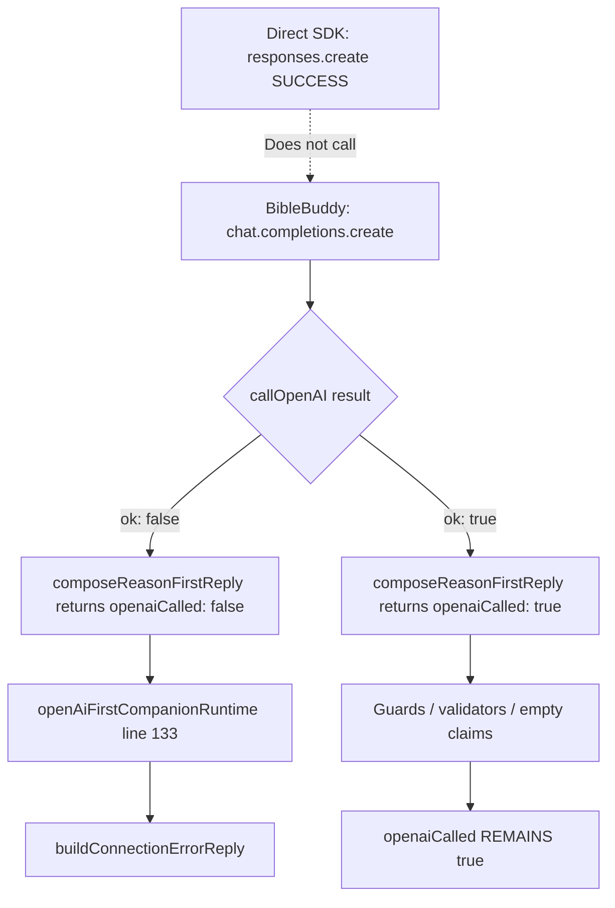

# BibleBuddy OpenAI Execution Trace

**Date:** 2026-06-07  
**Priority:** CRITICAL  
**Premise:** Direct SDK test with `client.responses.create({ model: 'gpt-4.1-mini', input: 'Reply with OK' })` returns **SUCCESS** — `OPENAI_API_KEY` is valid.  
**Question:** Why does BibleBuddy sometimes report `openaiCalled: false`?  
**Scope:** Diagnosis only. No doctrine, evidence, validator, traceability, approval-gate, or retrieval changes. No fixes, push, or deploy.

---

## Executive answer

**Direct SDK success does not exercise the BibleBuddy OpenAI path.**

| Your proof test | BibleBuddy production path |
|-----------------|----------------------------|
| `client.responses.create(...)` | `openai.chat.completions.create(...)` |
| Minimal input string | ~15–50 KB system prompt + JSON user payload |
| No `response_format` | `response_format: { type: 'json_object' }` |
| Fresh `new OpenAI({ apiKey })` in same script | Singleton `openaiClient.js` frozen at **first `require()`** |
| Single call | Up to 2 calls per turn (compose + guard regen) |

Inside BibleBuddy, `openaiCalled` becomes `false` **only** when:

1. **`callOpenAI` returns `ok: false`** (client null or `chat.completions.create` throws), **or**
2. **Crisis safety short-circuit** (no OpenAI attempted), **or**
3. **Observability reads wrong field** (measurement script ignores `runtime.openAiCalled` fallback).

**Validation failure, guard failure, empty claims, and claim degradation never set `openaiCalled: false`.** If the Chat Completions call succeeds, compose always returns `openaiCalled: true` even when internal validators fail.

---

## Live execution map

```
User question
    │
    ▼
POST /buddy/chat  OR  runBuddy()  (scripts/tests)
    │
    ▼
buddyBrain.runBuddy                          [buddyBrain.js:989–1016]
    │  hard cutover → openAiFirstCompanionRuntime only
    ▼
runOpenAiFirstCompanionRuntime               [openAiFirstCompanionRuntime.js:44–436]
    │
    ├─ crisis? ──YES──► H.fallbackReply      [62–100]  openaiCalled:false  (no OpenAI)
    │
    ▼ NO
buildRetrievalEvidencePack                   [103–113]  retrieval only — no openaiCalled
    │
    ▼
composeReasonFirstReply (attempt 1)          [118–129]
    │
    ├─ buildComposerSystemPrompt             evidence JSON in system message
    ├─ build userPayload                     duplicate evidence object
    └─ callOpenAI                            [reasonFirstComposer.js:173–192]
            │
            ├─ !openai module ──► ok:false ──► openaiCalled:false
            └─ chat.completions.create
                    │
                    ├─ THROWS ──► ok:false ──► openaiCalled:false ──► connection message
                    └─ SUCCESS ──► ok:true, raw JSON string
                            │
                            ▼
                    safeJsonParse + normalizeStructured
                            │
                            ▼
                    normalizeClaims (claims extraction)
                            │
                            ▼
                    validateReasonFirstReply + validateClaimToScripture (compose-time)
                            │  (failure → regenInstruction, NOT openaiCalled:false)
                            ▼
                    return { openaiCalled: true, structured }
    │
    ▼
openaiCalled = !!composed.openaiCalled       [openAiFirstCompanionRuntime.js:133]
    │
    ├─ false ──► buildConnectionErrorReply   [144–159]  user sees connection message
    │
    └─ true ──► post-compose guards          [163–269]
            │      ownership, directness, forbidden, bibleOnly, claims
            │      fail → composeReasonFirstReply (attempt 2) [219–247]
            │      regen API fail → KEEPS attempt 1, openaiCalled STAYS true
            ▼
        claim degradation / strip forbidden    (openaiCalled unchanged)
    │
    ▼
attachDebug → runtime.coreDebug.openaiCalled [358–397]
structured.runtime.openAiCalled              [339]
    │
    ▼
finalizeBuddyResponse                        [buddyBrain.js:675–798]
    memory, sessions, persistence            (does not mutate openaiCalled)
    │
    ▼
HTTP normalizePayload / JSON response
```

---

## Where SDK SUCCESS becomes `openaiCalled: false`



**The discontinuity is at `callOpenAI` (`reasonFirstComposer.js:173–192`).** Nothing between a successful `responses.create` and BibleBuddy's `chat.completions.create` is shared except the API key string loaded into the singleton client.

---

## Every `openaiCalled` assignment (live `/buddy/chat` path)

| # | File | Line(s) | Assignment | When |
|---|------|---------|------------|------|
| A1 | `reasonFirstComposer.js` | 291 | `structured.runtime.openaiCalled: false` | Early return on API failure |
| A2 | `reasonFirstComposer.js` | 293 | `return { openaiCalled: false }` | Same |
| A3 | `reasonFirstComposer.js` | 383 | `structured.runtime.openaiCalled: true` | Successful API path (always after loop) |
| A4 | `reasonFirstComposer.js` | 398 | `return { openaiCalled: true }` | Same |
| B1 | `openAiFirstCompanionRuntime.js` | 70 | `runtime.openAiCalled: false` | Crisis route |
| B2 | `openAiFirstCompanionRuntime.js` | 76 | `attachDebug({ openaiCalled: false })` | Crisis |
| B3 | `openAiFirstCompanionRuntime.js` | 133 | `let openaiCalled = !!composed.openaiCalled` | **Authoritative turn flag** |
| B4 | `openAiFirstCompanionRuntime.js` | 339 | `runtime.openAiCalled: openaiCalled` | Final runtime |
| B5 | `openAiFirstCompanionRuntime.js` | 362 | `attachDebug({ openaiCalled })` | → `runtime.coreDebug.openaiCalled` |
| C1 | `coreResponseGuards.js` | 83 | `runtime.openAiCalled: false` | Inside `buildConnectionErrorReply` template |
| D1 | `coreRestorationDebug.js` | 52 | `openaiCalled: !!openaiCalled` | Debug mirror (not a separate decision) |

**`buddyBrain.runBuddy` never assigns `openaiCalled`.**  
**`finalizeBuddyResponse` never mutates it.**

Guard helpers (`directnessGuard.js:14`, `ownershipAntiOverrideGuard.js:43`) receive `openaiCalled` as **input** — they do not set the turn flag.

---

## Return path inventory

### `callOpenAI` (`reasonFirstComposer.js:173–192`)

| Return | Line | Condition | `ok` | Becomes `openaiCalled` |
|--------|------|-----------|------|------------------------|
| `{ ok: false, error: 'openai_unavailable' }` | 175 | `openai` module is `null` | false | **false** |
| `{ ok: true, raw, error: null }` | 189 | `chat.completions.create` resolved | true | **true** (downstream) |
| `{ ok: false, error: e.message }` | 191 | `create()` threw | false | **false** |

**No other return paths.**

### `composeReasonFirstReply` (`reasonFirstComposer.js:198–403`)

| Return | Line | Condition | `openaiCalled` |
|--------|------|-----------|----------------|
| Early API failure object | 284–297 | `!result.ok` inside loop | **false** |
| Success object | 396–402 | Loop completed (API succeeded at least once) | **true** |

**Critical:** If API succeeds once, internal validation can fail and loop can end without `composePassed`, but code still falls through to lines 365–402 with **`openaiCalled: true`**. Validator/guard failure does **not** flip the flag.

### `runOpenAiFirstCompanionRuntime` (`openAiFirstCompanionRuntime.js:44–436`)

| Return | Line | Condition | `openaiCalled` |
|--------|------|-----------|----------------|
| `H.finalizeBuddyResponse(crisisReply)` | 88–100 | `safety.level === 'crisis'` | **false** |
| `H.finalizeBuddyResponse(structured)` | 422–435 | Normal exit | value from line 133 |

Intermediate branches:

| Branch | Lines | `openaiCalled` after |
|--------|-------|----------------------|
| `!openaiCalled` → connection error | 144–159 | **false** |
| Guards + successful regen | 211–247 | **true** (unchanged or regen success) |
| Guards + failed regen API | 242–247 | **true** (first compose kept) |

### `runBuddy` (`buddyBrain.js:989–1016`)

| Return | Line | Notes |
|--------|------|-------|
| `runOpenAiFirstCompanionRuntime(...)` | 1016 | Passthrough — no `openaiCalled` logic |

---

## False-path conditions (live path only)

See `OpenAIFalsePathInventory.md` for the full table. Summary:

| ID | Trigger | Error source | User-visible |
|----|---------|--------------|--------------|
| FP-01 | `openai` module null | `openaiClient.js` load failure | Connection message |
| FP-02 | `OPENAI_API_KEY` empty at **first** `require('./openaiClient')` | SDK 401 / empty bearer | Connection message |
| FP-03 | `chat.completions.create` 401/403 | OpenAI auth | Connection message |
| FP-04 | 429 rate limit | OpenAI quota | Connection message |
| FP-05 | 5xx / ECONNRESET / ETIMEDOUT | Network / OpenAI | Connection message |
| FP-06 | Context length exceeded | OpenAI (large evidence prompt) | Connection message |
| FP-07 | `json_object` response_format rejected | OpenAI model/API | Connection message |
| FP-08 | Crisis keywords | `classifySafety` — no API call | Crisis hotline text |
| FP-09 | Process OOM mid-request | Infrastructure | Connection message or HTTP reset |
| FP-10 | Measurement reads `coreDebug` only | Observability gap | **False `openaiCalled: false` in JSON artifacts** |

FP-10: `liveRequestTrace.js:31` uses `dbg.openaiCalled ?? rt.openAiCalled`. Phase 1B measurement (`baePhase1bLiveMeasurement.js:173`) uses **`!!dbg.openaiCalled` only** — no fallback to `runtime.openAiCalled`.

---

## Singleton client / env timing

```1:15:services/openaiClient.js
let openai = null;

try {
  const OpenAI = require("openai");
  openai = new OpenAI({
    apiKey: process.env.OPENAI_API_KEY,
  });
  console.log("✅ OpenAI client ready");
} catch (error) {
  console.warn("⚠️ OpenAI not ready yet:", error.message);
}
```

| Scenario | Effect |
|----------|--------|
| `server.js` | `dotenv.config()` line 6 **before** routes load → key usually present |
| `baePhase1bLiveMeasurement.js` | **No `dotenv`** — key must be exported before `node` starts |
| `buddyBrain.js` line 3 | Requires `openaiClient` at load — initializes singleton early |
| Key set **after** first require in same process | Client keeps **stale/empty** key |
| `✅ OpenAI client ready` | Prints on module load — **does not prove key valid or that Chat Completions works** |

Your `responses.create` test uses a **new client instance** in the same REPL/script with the current env — it does not validate the singleton used by `callOpenAI`.

---

## Proving BibleBuddy path (diagnostic — no code changes)

Run these in the **same shell** as measurement, **before** any `require('./services/buddyBrain')`:

```bash
# 1 — Mirror your proof (Responses API — NOT used by BibleBuddy)
node -e "
const OpenAI=require('openai');
const c=new OpenAI({apiKey:process.env.OPENAI_API_KEY});
c.responses.create({model:'gpt-4.1-mini',input:'Reply with OK'}).then(r=>console.log('responses:',(r.output_text||'').slice(0,20))).catch(e=>console.log('responses ERR',e.message));
"

# 2 — Exact BibleBuddy API surface
node -e "
require('dotenv').config();
const openai=require('./services/openaiClient');
openai.chat.completions.create({
  model: process.env.OPENAI_MODEL||'gpt-4.1-mini',
  temperature:0.72,
  response_format:{type:'json_object'},
  messages:[{role:'system',content:'Return JSON with reply field.'},{role:'user',content:'{\"userMessage\":\"test\"}'}]
}).then(c=>console.log('chat:',(c.choices[0].message.content||'').slice(0,60))).catch(e=>console.log('chat ERR',e.message));
"

# 3 — Full compose chain
node -e "
require('dotenv').config();
const {composeReasonFirstReply}=require('./services/reasonFirstComposer');
const {buildRetrievalEvidencePack}=require('./services/retrievalEvidencePack');
(async()=>{
  const pack=buildRetrievalEvidencePack({userId:'trace',message:'What is the third heaven?',routingHintsOnly:true});
  const r=await composeReasonFirstReply({userId:'trace',mode:'COMPANION',personaKey:'ADAPTIVE_COMPANION',message:'What is the third heaven?',safety:{level:'standard'},profile:{},runtimeContext:{},evidencePack:pack,coreRestoration:true});
  console.log({openaiCalled:r.openaiCalled,apiError:(r.apiError||'').slice(0,100),claims:(r.structured?.claims||[]).length});
})();
"
```

If (1) passes and (2) or (3) fails → root cause is **Chat Completions path**, not API key validity.

---

## Related documents

- `OpenAIFalsePathInventory.md` — complete false-path table with line numbers
- `OpenAIExecutionDecisionTree.md` — decision tree for operators
- `OpenAIExecutionStabilityAudit.md` — prior stability audit

**No fixes implemented.**
