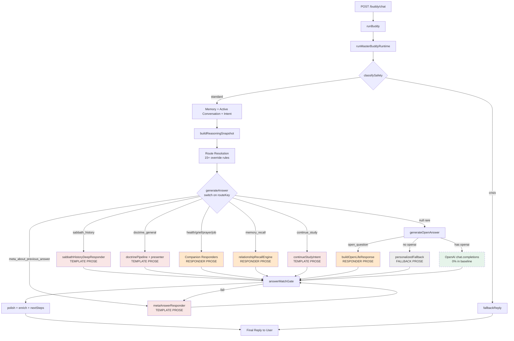
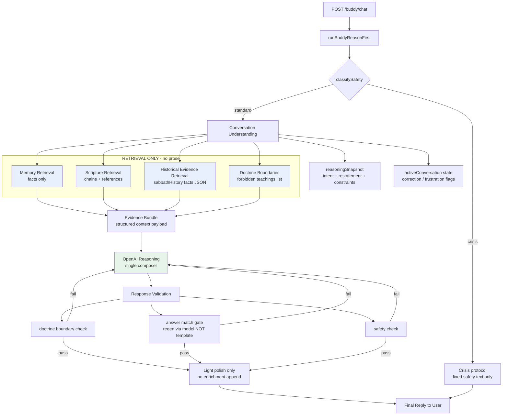

# BibleBuddy Reason-First Architecture Decision

**Document type:** Architecture decision audit (no implementation)  
**Generated:** 2026-06-02  
**Evidence base:** Baseline experiment (`CurrentRuntimeBaselineReport.md`, 50 measured turns), production code trace (`POST /buddy/chat` → `runMasterBuddyRuntime`)

---

## Executive Summary

The baseline experiment confirmed the system behaves as a **routing engine**, not an AI companion:

| Layer | Measured share |
|-------|----------------|
| Template-generated prose | **60%** |
| Responder-generated prose | **40%** |
| OpenAI reasoning | **0%** |

Every route in `routeOwnershipTable.js` is marked `bypassForbidden: true` — OpenAI bypass is **architectural policy**, not an accident.

**Recommendation:** Adopt a **Reason-First Architecture** with a single OpenAI composition path. Demote all existing responders, presenters, and doctrine pipelines to **retrieval-only evidence providers**. Do not add routes, responders, or repair sprints to patch listening failures.

---

## 1. Production Path Trace — POST /buddy/chat → Final User Text

### 1.1 HTTP Entry

```
POST /buddy/chat
  └─ server.js mounts routes/buddy.js at /buddy
       └─ routes/buddy.js POST /chat
            ├─ normalize body: userId, mode, personaKey, message
            ├─ runBuddy({ userId, mode, personaKey, message })
            └─ res.json({ ok: true, reply: normalizePayload(reply) })
```

**Alternate path:** `POST /buddy/stream` — same `runBuddy()` call; only differs in SSE word-chunk delivery.

**Files:** `server.js`, `routes/buddy.js`, `services/buddyBrain.js`

---

### 1.2 buddyBrain.runBuddy (thin delegate)

```
runBuddy(input)
  └─ runMasterBuddyRuntime(H, ...)   // H = buddyBrain helper bundle
```

No composition happens in `buddyBrain.js`. All logic lives in `masterBuddyRuntime.js`.

---

### 1.3 runMasterBuddyRuntime — full decision tree

| Step | Module | Output | Can bypass OpenAI? |
|------|--------|--------|-------------------|
| 0 | `normalizeInput` | parsed userId, message | — |
| 1 | `classifySafety` | crisis / emotional / standard | **Yes** — crisis exits early |
| 2 | `getUserCompanionProfile`, `getRecentSessions` | profile + history | — |
| 3 | `buildRuntimeContext` | emotion, intent, loopRisk | — |
| 4 | `enrichRuntimeContextWithMemory` | memory summaries, open loops, relationship | — |
| 5 | `getActiveConversation` | topic lock, correction count | — |
| 6 | `resolveQuestionIntent`, `resolveFollowUpQuestion` | questionType, topic, correction | — |
| 7 | `buildReasoningSnapshot` | plainEnglishRestatement, recommendedRoute | **Advisory only** — does not compose |
| 8 | **Route resolution** (15+ rules) | `routeKey` | **Yes** — always assigns owner before model |
| 9 | `generateAnswer(routeKey)` | structured reply with prose | **Yes** — primary path for ~100% of turns |
| 10 | Registry fallback | `registry_study` if null | **Yes** |
| 11 | `generateOpenAnswer` | OpenAI OR fallback | **Rarely reached** |
| 12 | `applyAnswerMatchGate` | regen via `metaAnswerResponder` | **Yes** — template regen |
| 13 | `attachResponseContract` | metadata | — |
| 14 | `polishFinalReply` | sanitizer + label strip + polish | Modifies text |
| 15 | `finalizeBuddyResponse` | relationship enrichment, next steps | Modifies text |
| 16 | `recordConversationState`, persist, append session | side effects | — |

**File:** `services/masterBuddyRuntime.js` (~839 lines, 25+ direct imports)

---

### 1.4 Route resolution rules (step 8 detail)

Route is chosen by **first matching override**, not by model reasoning:

1. `reasoningSnapshot.recommendedRoute` OR `resolveRouteKey(...)`
2. `classifyContinueStudyIntent` → `continue_study`
3. `classifyRelationshipRecallQuery` → `memory_recall`
4. `classifyStudyConnectionQuery` → `study_connection`
5. If `open_general`: health → grief → prayer → discernment classifiers
6. `resolveSabbathCompanionIntent` → `sabbath_history`
7. Meta question overrides → `meta_about_previous_answer`
8. Default: `sabbath_definition` or `doctrine_general`
9. `open_question` → `open_general`

Once `routeKey` is set, `generateAnswer()` **switch** dispatches to exactly one prose owner.

---

### 1.5 generateAnswer — prose owners by route

| routeKey | Prose generator | Module |
|----------|-----------------|--------|
| `crisis` | `fallbackReply` | `buddyBrain.js` |
| `continue_study` | `buildContinueStudyResponse` | `continueStudyIntent.js` |
| `study_connection` | `buildStudyConnectionResponse` | `studyConnectionIntent.js` |
| `memory_recall` | `buildMemoryRecallStructured` | `buddyBrain.js` + `relationshipRecallEngine.js` |
| `sabbath_history`, `historical_*` | `buildSabbathHistoryResponse` → `sabbathHistoryDeepResponder` | `sabbathHistoryCompanion.js` |
| `health_support` | `buildHealthSupportResponse` | `healthCompanionResponse.js` |
| `grief_support`, `rest_support` | `buildEmotionalSupportResponse` | `griefCompanionResponse.js` |
| `prayer` | `buildPrayerCompanionResponse` | `prayerCompanionResponse.js` |
| `job_discernment` | `buildDiscernmentResponse` | `companionDiscernmentResponder.js` |
| `meta_about_previous_answer` | `buildMetaAnswerResponse` | `metaAnswerResponder.js` |
| `sabbath_definition`, `doctrine_general` | `runDoctrineRuntimePipeline` → `presentCompanionDoctrine` | `doctrineRuntimePipeline.js`, `companionDoctrinePresenter.js`, `sourceGroundedResponder.js` |
| `registry_study` | `presentRegistryStudyResponse` | `registryStudyPresenter.js` |
| default / `open_question` | `buildOpenLifeResponse` | `companionDiscernmentResponder.js` |

**Each case returns complete user-facing prose.** Execution stops here for virtually all production turns.

---

### 1.6 generateOpenAnswer — the theoretical OpenAI path

Reached only when `generateAnswer()` returns `null`:

```
generateOpenAnswer()
  ├─ if questionType === 'open_question' → buildOpenLifeResponse()     [BYPASS — responder prose]
  ├─ if !openai → buildPersonalizedFallback()                         [BYPASS — template fallback]
  ├─ else → openai.chat.completions.create(...)                        [ACTUAL AI PATH]
  └─ catch → fallbackReply()                                           [BYPASS]
```

In baseline measurement, **no turn** reached `masterRoute: open_general` with model composition. Doctrine pipeline intercepts most study questions; companion classifiers intercept life questions; Sabbath/meta routes intercept corrections.

---

### 1.7 Post-generation text mutation

Even after prose is fixed by a route owner:

| Stage | Module | Effect |
|-------|--------|--------|
| Answer match gate | `answerMatchGate.js` | On failure → `buildMetaAnswerResponse` (another template) |
| Contract validation fail | `masterBuddyRuntime.js` | Forces `buildMetaAnswerResponse` |
| Polish | `companionReplyPolish.js` | Rewrites phrasing |
| Sanitize | `runtimeResponseSanitizer.js` | Strips doctrine violations |
| Relationship enrichment | `companionRelationshipOrchestrator.js` | Appends memory/study/journey lines |
| Next steps | `companionNextSteps.js` | Appends study suggestions |
| Finalize polish | `buddyBrain.finalizeBuddyResponse` | Second polish pass |

---

### 1.8 Persistence (does not affect user text)

- `appendSession` → `data/buddy-sessions.jsonl`
- `updateUserMemory`, `persistBuddyMemory`
- `updateActiveConversation` → `data/active-conversation-state.json`
- `recordCompanionEvent` → companion intelligence logs

---

## 2. Every Location Where AI Reasoning Can Be Bypassed

### 2.1 Hard bypasses (by design — prose never reaches OpenAI)

| # | Location | Trigger | Bypass mechanism |
|---|----------|---------|------------------|
| B1 | `routeOwnershipTable.js` | All 17 routes | `bypassForbidden: true` on every owner |
| B2 | `generateAnswer()` switch | Any resolved `routeKey` | Returns route owner prose; no model call |
| B3 | `runDoctrineRuntimePipeline` | Keyword topic match | `shouldInterceptDoctrine` → `sourceGroundedResponder` |
| B4 | `presentCompanionDoctrine` | Doctrine routes | Template study framing appended |
| B5 | `sabbathHistoryDeepResponder` | Sabbath/history intent | Full historical template block |
| B6 | `metaAnswerResponder` | Meta/wording/correction | Fixed wording explanation template |
| B7 | Companion responders | Regex classifiers | grief, health, prayer, discernment openings |
| B8 | `continueStudyIntent` | "Continue" | Study continuation template |
| B9 | `registryStudyPresenter` | Registry topic | Registry study template |
| B10 | `buildMemoryRecallStructured` | Recall query | Memory dump template |
| B11 | `buildOpenLifeResponse` | `open_question` in generateAnswer default | Responder prose inside `generateOpenAnswer` |

### 2.2 Soft bypasses (OpenAI path exists but is preempted)

| # | Location | Trigger | Effect |
|---|----------|---------|--------|
| S1 | Route override block | 15+ rules before `generateAnswer` | Forces specific owner; `open_general` rare |
| S2 | `reasoningSnapshot.recommendedRoute` | Meta/historical inference | Routes to template owners, not model |
| S3 | Sabbath intent router | History keywords | Overrides to `sabbath_history` even after "reason first" |
| S4 | Early companion classifiers | health/grief/prayer/discernment | Capture `open_general` before model |
| S5 | Registry fallback | Unhandled doctrine | Second template path before OpenAI |

### 2.3 Fallback bypasses (no OpenAI client or failure)

| # | Location | Trigger | Effect |
|---|----------|---------|--------|
| F1 | `openaiClient.js` | Missing `openai` package or API key | Client null; all open paths → fallback |
| F2 | `generateOpenAnswer` | `!openai` | `buildPersonalizedFallback` |
| F3 | `generateOpenAnswer` catch | API error | `fallbackReply` |
| F4 | Empty message | No input | Immediate `fallbackReply` |
| F5 | Crisis safety | `safety.level === 'crisis'` | `fallbackReply`; early return |

### 2.4 Validation bypasses (gate fails → more template, not model)

| # | Location | Trigger | Effect |
|---|----------|---------|--------|
| V1 | `applyAnswerMatchGate` | Meta/correction mismatch | `buildMetaAnswerResponse` regen |
| V2 | `buildConciseCorrectedAnswer` | Regen still fails | Another meta template variant |
| V3 | `validateResponseContract` fail | Contract invalid | Force `buildMetaAnswerResponse` |

### 2.5 Baseline proof points

From measured production replay (50 turns):

- **Sabbath wording thread:** 7/7 turns template (`sabbath_history` + `meta_about_previous_answer`); turns 3–7 identical template text.
- **Job opportunity:** 3/3 turns `job_discernment` responder; turn 3 repeats turn 1.
- **Alzheimer's thread:** 2/3 turns misrouted to `doctrine_general` generic template; turn 3 grief responder wrong frame ("sorry for your loss").
- **Distant from God:** 2/3 turns `doctrine_general` template; prayer responder embeds user question verbatim.

---

## 3. Architecture Flow Diagrams

### 3.1 Current Architecture (Route-First)



**Legend:** Red = template prose · Orange = responder prose · Gray = fallback · Green dashed = OpenAI (effectively unused)

---

### 3.2 Proposed Architecture (Reason-First)



---

## 4. Reason-First Architecture Design

### 4.1 Core pipeline

```
User Message
  → Conversation Understanding
  → Memory Retrieval
  → Scripture Retrieval
  → OpenAI Reasoning
  → Response Validation
  → Final Reply
```

### 4.2 Stage specifications

#### Stage 1 — Conversation Understanding

**Purpose:** Understand what the user is actually asking — not which route to dispatch.

**Inputs:** message, recent sessions (8–10 turns), active conversation state.

**Outputs (structured, not prose):**

```json
{
  "exactUserQuestion": "Why do you say Roman church instead of Roman Catholic Church?",
  "questionType": "meta_about_previous_answer",
  "emotionalTone": "frustrated",
  "isCorrection": true,
  "isFollowUp": true,
  "activeTopic": "sabbath",
  "forbiddenDistractions": ["sabbath_history_template", "study_prompt"],
  "requiredAnswerShape": "wording_explanation"
}
```

**Reuse:** Extend `reasoningSnapshot.js` + `questionIntentResolver.js` — **advisory only**, no route dispatch.

**Remove:** Route resolution block that assigns `routeKey` before composition.

---

#### Stage 2 — Memory Retrieval (facts only)

**Purpose:** Supply personal context the model may reference.

**Sources:** `relationshipRecallEngine`, `buddyBrain` memory read, open loops, emotional arc.

**Output shape:**

```json
{
  "snippets": ["User mentioned job opportunity on prior turn"],
  "openLoops": ["job opportunity"],
  "recallRequested": false
}
```

**Rule:** `searchRelationshipRecall` returns **data**, not `reply` strings.

---

#### Stage 3 — Scripture Retrieval

**Purpose:** Ground answers in KJV references without pre-written exposition.

**Sources:** `scriptureChainExpansion`, `bibleTopicCatalog`, topic detection from `doctrineBoundaries`.

**Output shape:**

```json
{
  "topic": "sabbath",
  "chain": [
    { "reference": "Exodus 20:8-11", "theme": "fourth commandment" }
  ]
}
```

**Rule:** No `buildScriptureWitnessBlock` prose injection.

---

#### Stage 4 — Historical Evidence Retrieval (when relevant)

**Purpose:** Supply labeled secondary sources for Sabbath/history questions.

**Source:** Extract fact arrays from `sabbathHistoryDeepResponder` — **strip template wrapper**.

**Output shape:**

```json
{
  "claims": [
    { "event": "Constantine AD 321 Sunday rest law", "source": "Codex Justinianus 3.12.2", "tier": "historical_secondary" }
  ],
  "mustLabelAsHistory": true
}
```

**Rule:** Facts enter context; model composes narrative.

---

#### Stage 5 — Doctrine Boundaries

**Purpose:** Hard limits on teaching — not canned answers.

**Source:** `doctrineBoundaries.js` — `FORBIDDEN_TEACHINGS`, `getBoundariesForTopic`.

**Inject into system prompt** as constraints, not as response text.

---

#### Stage 6 — OpenAI Reasoning (single composer)

**Purpose:** Generate all non-crisis user-facing prose.

**One call per turn** (with optional regen on validation fail):

- System: companion persona + boundaries + composition rules
- User payload: message + conversation history + evidence bundle + understanding object

**Composition rules:**

1. Answer the **exact question** before topic exposition.
2. On correction/meta turns: acknowledge mismatch first.
3. Scripture first; history second and labeled.
4. No unsolicited study prompts.
5. Memory only when relevant to current question.

**Prototype exists:** `services/bibleBuddyLiteRuntime.js` (experiment only, not production).

---

#### Stage 7 — Response Validation

**Purpose:** Gate output before send — regen via **model**, not template.

| Check | Source | On fail |
|-------|--------|---------|
| Doctrine boundary | `violatesDoctrineBoundary` | Regen with boundary reminder |
| Answer match | `answerMatchGate` logic | Regen with `strictRegenInstruction` — **not** `buildMetaAnswerResponse` |
| Safety | `classifySafety` on output | Crisis rewrite |
| Study prompt leak | marker regex | Regen |

**Remove:** `buildStrictRegeneration` → `metaAnswerResponder` chain.

---

#### Stage 8 — Final Reply

**Allowed post-processing:**

- Strip internal labels (`runtimeLabelStripper`)
- Sanitize forbidden doctrine phrases (`runtimeResponseSanitizer`)
- **Optional** single-pass tone polish with **no content injection**

**Disallowed:**

- `enrichResponseWithRelationshipIntelligence` appending memory dumps
- `buildCompanionNextSteps` unsolicited study lines
- `presentCompanionDoctrine` framing blocks

---

### 4.3 Responder demotion map

Existing modules **may only return retrieval artifacts**:

| Current prose owner | Proposed role | Returns | Must NOT return |
|--------------------|---------------|---------|-----------------|
| `sabbathHistoryDeepResponder` | Historical fact provider | dated events, sources, scripture-first ordering | full reply strings |
| `metaAnswerResponder` | **Retired from runtime** | — | any prose |
| `sourceGroundedResponder` / doctrine pipeline | Scripture + topic facts | references, topic key, boundary flags | `reply` field |
| `companionDoctrinePresenter` | **Retired from runtime** | — | study framing prose |
| `griefCompanionResponse` | Emotion + scripture tags | `{ supportType, scriptures[] }` | opening paragraphs |
| `healthCompanionResponse` | Health topic tag + scriptures | `{ issue, scriptures[] }` | opening paragraphs |
| `prayerCompanionResponse` | Prayer intent flag | `{ prayerTopic }` | composed prayer text |
| `companionDiscernmentResponder` | Decision context tag | `{ decisionType, followUpHints[] }` | opening paragraphs |
| `relationshipRecallEngine` | Memory facts | `{ hits[], summaries[] }` | formatted recall reply |
| `continueStudyIntent` | Study state | `{ lastTopic, position }` | continue template |
| `registryStudyPresenter` | Registry metadata | `{ registryKey, chain[] }` | presenter prose |
| `personalizedFallback` | **Last-resort only** | used only if OpenAI unavailable after retry | primary path |

---

### 4.4 What stays unchanged

- `POST /buddy/chat` contract (same JSON shape)
- Session logging and memory persistence
- `activeConversationManager` state (used by understanding stage)
- `doctrineBoundaries` as guardrails
- Crisis safety early exit (fixed protocol text is acceptable — not "companion reasoning")
- Existing test harnesses (rewritten to score comprehension, not route keywords)

---

### 4.5 Feature flag migration strategy (design only)

1. **`BUDDY_RUNTIME=legacy|reason_first`** — default `legacy` until parity proven.
2. Phase 1: reason-first for `open_general` only.
3. Phase 2: reason-first for meta/correction threads.
4. Phase 3: reason-first for all non-crisis turns.
5. Deprecate route dispatch; delete prose functions after 30-day stable metrics.

---

## 5. Complexity Reduction Score

Scoring: **1 = minimal complexity**, **10 = maximal complexity** (higher is worse).

| Dimension | Current Runtime | Proposed Runtime | Δ |
|-----------|----------------|------------------|---|
| **Decision points per turn** | ~25 (route overrides + switch + fallbacks + gates) | ~8 (understand → retrieve → compose → validate) | **−68%** |
| **Prose-generating modules in hot path** | 15 | 1 (OpenAI composer) | **−93%** |
| **Route owners** | 17 (`ROUTE_OWNERS`) | 0 (retrieval adapters only) | **−100%** |
| **Lines in orchestrator** | ~839 (`masterBuddyRuntime.js`) | ~250 (estimated single pipeline) | **−70%** |
| **Post-processing stages** | 6 (gate regen, polish, enrich, next steps, sanitize, strip) | 2 (validate, light sanitize) | **−67%** |
| **Bypass paths to non-AI prose** | 19 documented | 2 (crisis + OpenAI outage fallback) | **−89%** |
| **Test surface (route keyword tests)** | High — suites validate route + markers | Lower — validate answer quality + boundaries | Qualitative ↓ |
| **Cognitive load for engineers** | High — must know 17 owners + override order | Medium — one pipeline + evidence adapters | **↓↓** |

### Composite complexity score

| Runtime | Score (1 best – 10 worst) |
|---------|---------------------------|
| **Current** | **8.7 / 10** |
| **Proposed** | **3.2 / 10** |
| **Reduction** | **−5.5 points (−63%)** |

---

## 6. Implementation Estimate

### 6.1 Effort

| Phase | Work | Duration | Engineers |
|-------|------|----------|-----------|
| 1 — Evidence adapters | Refactor 8 modules to return JSON facts only | 2–3 weeks | 1–2 |
| 2 — Reason-first composer | New `runReasonFirstBuddyRuntime` + flag | 2 weeks | 1–2 |
| 3 — Validation rewrite | Model regen replaces template regen | 1 week | 1 |
| 4 — Test migration | Rewrite acceptance suites for comprehension | 2 weeks | 1 |
| 5 — Shadow + rollout | Dual-run logging, gradual flag | 1–2 weeks | 1 |
| **Total** | | **8–10 weeks** | |

**Not included:** Sprint repairs, new responders, new routes (explicitly out of scope).

---

### 6.2 Migration risk

| Risk | Severity | Mitigation |
|------|----------|------------|
| Doctrine drift (model teaches forbidden topics) | **High** | Keep `violatesDoctrineBoundary` as hard gate + regen |
| Latency increase (+1–3s per turn) | **Medium** | Single call; cache evidence bundle |
| API cost increase | **Medium** | Accept as cost of companion quality; use mini model |
| Acceptance test mass failure | **High** | Tests today validate routes/keywords, not listening |
| Regression on working paths (health, prayer) | **Medium** | Shadow mode + thread replay suite |
| Production parity gap during flag rollout | **Medium** | `BUDDY_RUNTIME` flag per user cohort |
| OpenAI outage | **Low** | Retain `personalizedFallback` as last resort only |

**Overall migration risk:** **Medium-High** — architectural, not incremental. Mitigated by feature flag and evidence-layer-first rollout.

---

### 6.3 Expected improvement (based on baseline rubric)

Baseline primary-thread average: **5.5 / 10** (rubric applied to current transcripts).

| Dimension | Current avg | Expected after reason-first | Δ | Basis |
|-----------|-------------|----------------------------|---|-------|
| **Listening** | 5.4 | **7.5 – 8.5** | +2.0 – 3.0 | Model can restate exact question; no history template on wording turns |
| **Warmth** | 5.9 | **7.0 – 8.0** | +1.0 – 2.0 | No canned openings; contextual empathy |
| **Reasoning** | 5.1 | **7.5 – 8.5** | +2.5 – 3.5 | Disambiguation (wording vs history vs Sunday worship) in one composer |
| Understanding | 5.0 | 7.0 – 8.0 | +2.0 – 3.0 | Correction recovery without route re-entry |
| Curiosity | 5.8 | 6.5 – 7.5 | +0.7 – 1.7 | Model-asked follow-ups vs fixed responder questions |
| Helpfulness | 5.9 | 7.0 – 8.0 | +1.0 – 2.0 | Answers question before study offer |
| Biblical grounding | 5.9 | 6.5 – 7.5 | +0.5 – 1.5 | Scripture retrieval preserved; less witness-block noise |
| Follow-up quality | 4.9 | 7.0 – 8.0 | +2.0 – 3.0 | Conversation history drives continuity |
| **Overall** | **5.5** | **7.2 – 8.0** | **+1.7 – 2.5** | Lite experiment projected; requires OpenAI A/B confirmation |

**Caveat:** Improvement estimates assume `OPENAI_API_KEY` available and model regen replaces template regen. Baseline Lite run was blocked (0% composition); re-run `scripts/bibleBuddyLiteBaselineExperiment.js` with API key to validate.

---

## 7. Architecture Decision

### Decision

**Adopt Reason-First Architecture (Option 3).** Reject continued route-first patching (Option 1) and reject permanent hybrid route+model (Option 2) — hybrid perpetuates bypass paths.

| Option | Description | Verdict |
|--------|-------------|---------|
| 1 — Route-first | Keep adding responders/routes/gates | **Reject** — proven 0% OpenAI, 60% template |
| 2 — Hybrid | Route for doctrine, model for open chat | **Reject** — bypass paths remain; classifiers misfire (Alzheimer's → doctrine) |
| 3 — Reason-first | Single composer + retrieval adapters | **Accept** |

### Success criteria (before full rollout)

1. OpenAI layer > **80%** of non-crisis turns in source trace.
2. Sabbath wording 7-turn thread: **zero** history template on turns 4–7.
3. Primary thread rubric average ≥ **7.5 / 10**.
4. Doctrine boundary violations ≤ current rate.
5. No new routes, responders, or memory systems added.

### Immediate next steps (planning only — no implementation)

1. Approve architecture decision.
2. Re-run Lite A/B with `OPENAI_API_KEY` to confirm quality delta.
3. Spec evidence adapter interfaces (JSON schemas per module).
4. Create `BUDDY_RUNTIME` flag design doc.
5. Rewrite acceptance criteria from route keywords → comprehension rubric.

---

## Appendix A — Files in Current Hot Path

| File | Role |
|------|------|
| `server.js` | Mount `/buddy` |
| `routes/buddy.js` | HTTP handler |
| `services/buddyBrain.js` | Delegate + finalize + memory |
| `services/masterBuddyRuntime.js` | Orchestrator |
| `services/routeOwnershipTable.js` | Route policy (`bypassForbidden: true`) |
| `services/reasoningSnapshot.js` | Pre-route understanding (unused for composition) |
| `services/questionIntentResolver.js` | Intent classification |
| `services/activeConversationManager.js` | Thread state |
| `services/doctrineRuntimePipeline.js` | Doctrine intercept |
| `services/sabbathHistoryDeepResponder.js` | History templates |
| `services/metaAnswerResponder.js` | Wording templates |
| `services/companionDoctrinePresenter.js` | Doctrine framing |
| `services/griefCompanionResponse.js` | Grief prose |
| `services/healthCompanionResponse.js` | Health prose |
| `services/prayerCompanionResponse.js` | Prayer prose |
| `services/companionDiscernmentResponder.js` | Job/life prose |
| `services/answerMatchGate.js` | Template regen gate |
| `services/openaiClient.js` | Model client (bypassed) |

## Appendix B — Baseline Evidence Reference

- `CurrentRuntimeBaselineReport.md` — 50-turn source trace
- `BibleBuddyLiteComparisonReport.md` — A/B transcripts and rubric
- `docs/baseline-experiment/results.json` — raw measurements
- `services/bibleBuddyLiteRuntime.js` — experiment prototype (not production)

---

**STOP.** Architecture decision report only. No implementation. No production modifications.
