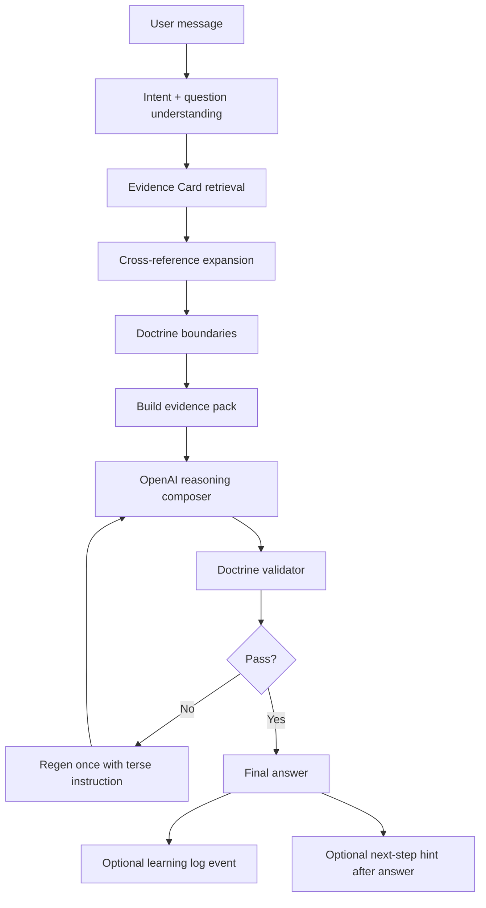

# Bible Learning Engine Plan

**Date:** 2026-06-01  
**Mode:** Planning only — **no implementation until approved.**  
**No beta · No deploy · No push · No Sprint 3**

**Goal:** BibleBuddy as a Scripture-learning AI companion — OpenAI authors; Bible evidence teaches and constrains; validator checks.

---

## Design principles

1. **Listen first** — emotional center and correction ledger before doctrine teaching.
2. **Understand the exact question** — question type (yes/no, HOW, WHERE, history, wording) drives retrieval.
3. **Retrieve Bible evidence** — Evidence Cards, not folder prose.
4. **Reason line upon line** — 2–3 witnesses, precept upon precept, Genesis → Revelation when teaching.
5. **OpenAI authors organically** — evidence is JSON facts, never pasted blocks.
6. **History secondary** — only when user asks how practice changed.
7. **Never canned folder replies** — study paths, witness triplets, and template responders stay off the default path.

---

## PART B — Scripture Learning Engine architecture



### Module map (proposed)

| Stage | Existing module | New / extended module |
|-------|-----------------|----------------------|
| Intent | `questionIntentResolver.js`, `answerGuidance.js` | `scriptureQuestionClassifier.js` (thin wrapper) |
| Evidence Cards | `doctrineEvidenceSnippets.js` (proto) | `services/evidenceCards/` + `evidenceCardRegistry.js` |
| Retrieval | `retrievalEvidencePack.js` | `retrieveEvidenceCards(message, topic)` |
| Cross-ref | `scriptureChainExpansion.js`, `genesisToRevelationContinuityRegistry.js` | Card-level `supportingScriptures` expansion |
| Boundaries | `doctrineBoundaries.js` | Unchanged |
| Compose | `reasonFirstComposer.js` | Upgrade after cards exist (Part D) |
| Validate | `doctrineBoundaryValidator.js`, `ownershipAntiOverrideGuard.js` | Add witness-count + history-gate checks |
| Log | — | `services/bibleLearningLog.js` → `data/bible-learning-events.jsonl` |

### Explicitly excluded from answer path

- Canned witness triplet visible text ("establishes the matter…")
- `personalizedFallback` / `companionLearningLayer` study speaker
- `continueStudyEngine` / `studyConnectionIntent` openers
- `sourceGroundedResponder`, `companionDoctrinePresenter`, `registryStudyPresenter`
- Folder-based direct response ownership
- Learning log **never** overrides live answers

---

## PART C — Evidence Cards

### Schema

```json
{
  "topic": "dietary_law",
  "questionTypes": ["yes_no", "what_scripture_says", "acts_10_clarification", "clean_unclean_list"],
  "primaryScriptures": ["Leviticus 11", "Deuteronomy 14"],
  "supportingScriptures": ["Daniel 1:8", "Acts 10:14", "Acts 10:28", "Acts 11:1-18", "Isaiah 66:17"],
  "cautionPassages": ["Acts 10 — vision context is people/Gentiles, not automatic food permission"],
  "commonMisreadings": [
    "Acts 10 used as pork permission without Peter's explanation in Acts 11"
  ],
  "bibleFirstConclusion": "Clean/unclean distinction remains; swine is unclean per Leviticus and Deuteronomy.",
  "historySecondaryNotes": [],
  "confidence": "high",
  "conflictRisk": "medium",
  "lastReviewed": "2026-06-01"
}
```

### Storage layout (proposed)

```
services/evidenceCards/
  index.js                 # registry + retrieve by topic/questionType
  dietaryLaw.card.js
  sabbath.card.js
  heavens.card.js
  deathState.card.js
  messiahLogos.card.js
  traditions.card.js
  feasts.card.js
  lawCommandments.card.js
  resurrection.card.js
  abominationDesolation.card.js
  ...
```

### Retrieval rules

1. Match **user message + question type** first; prior study topic is context only.
2. Return **max 2 cards** per turn (primary + one adjacent) to avoid evidence dump.
3. Expand `supportingScriptures` via concordance index when approved (Part I).
4. Attach `historySecondaryNotes` only if `explicitHistorical` flag is true.
5. Pass cards to composer as `evidence.cards[]` — never as prose strings.

### P0 cards (v1 — approve first)

| Card | Source files to migrate |
|------|-------------------------|
| `dietaryLaw` | bibleTopicCatalog.dietaryLaw, doctrineEvidenceSnippets, cleanUncleanSymbolismCatalog |
| `sabbath` | bibleTopicCatalog.sabbath, doctrineEvidenceSnippets, registry sabbath |
| `heavens` | deathResurrectionKingdomCatalog.threeHeavens, doctrineEvidenceSnippets |
| `deathState` | deathResurrectionKingdomCatalog.stateOfTheDead |
| `messiahLogos` | jesusInBible, registry messiah, doctrineEvidenceSnippets |
| `traditions` | traditionsOfMen, doctrineEvidenceSnippets |

### P1 cards (v1.1)

| Card | Source |
|------|--------|
| `feasts` | feastsAndProphecyCatalog |
| `lawCommandments` | priesthoodAndLawCatalog |
| `resurrection` | resurrectionReferenceCatalog, resurrectionTimeline |
| `israelCaptivity` | genealogyCaptivityIdentityCatalog (Deut 28:68) |
| `sabbathHistory` | sabbathHistoryDeepResponder facts only — `historySecondaryNotes` |

### P2 cards (v2 — Part G extended topics)

| Card | Source |
|------|--------|
| `abominationDesolation` | feastsAndProphecyCatalog |
| `fornication` | marriageChurchTonguesAndLineageCatalog |
| `tongues` | marriageChurchTonguesAndLineageCatalog.speakingInTongues |
| `esauEdom` | marriageChurchTonguesAndLineageCatalog.esauEdomJacob |
| `gravenImages` | registry graven_images |
| `serpentSatan` | treeOfLifeDoctrineCatalog, prophecyCharacterAndAngelsCatalog |
| `millennium` | deathResurrectionKingdomCatalog.millennium |
| `noahToMessiah` | bibleTopicCatalog noah + abraham + messiah chains |

### Example cards (from spec)

**Dietary law** — as schema above.

**Sabbath:**

```json
{
  "topic": "sabbath",
  "questionTypes": ["how_observe", "what_is", "when_is", "history_change"],
  "primaryScriptures": ["Genesis 2:2-3", "Exodus 20:8-11"],
  "supportingScriptures": ["Isaiah 58:13-14", "Luke 4:16", "Acts 17:2", "Hebrews 4:9"],
  "commonMisreadings": ["Sunday history replacing biblical seventh-day command on HOW questions"],
  "bibleFirstConclusion": "The seventh day is the Sabbath; history is secondary.",
  "historySecondaryNotes": ["Constantine AD 321", "Council of Laodicea — only when user asks who changed practice"]
}
```

**Heaven:**

```json
{
  "topic": "heavens",
  "questionTypes": ["how_many", "third_heaven", "firmament", "where_dead_go"],
  "primaryScriptures": ["2 Corinthians 12:2", "Genesis 1:1", "Genesis 1:20", "Psalm 19:1", "Revelation 21"],
  "commonMisreadings": ["Collapsing sky/firmament, celestial heavens, and Paul's third heaven into one count without distinction"],
  "bibleFirstConclusion": "Scripture uses heaven/heavens in layered ways; answer the user's specific heaven question first."
}
```

---

## PART D — OpenAI instruction upgrade (after Evidence Cards)

**Trigger:** Implement only after P0 Evidence Cards are merged and retrieval wired.

### Answer order (composer system + user payload)

1. **Direct answer** to the latest user question (yes/no, HOW, count, WHERE).
2. **Short companion reflection** if user is emotional (one sentence, anchored to their words).
3. **2–3 Scripture witnesses** — cite naturally, not as labeled blocks.
4. **Line-upon-line explanation** — precept upon precept from card `primaryScriptures` → `supportingScriptures`.
5. **Optional next step** — only after answering; never study-loop opener.

### Hard prohibitions (extend `CORE_RESTORATION_INSTRUCTION`)

- Do not force prayer unless user asked.
- Do not force study continuation.
- Do not force history unless `historySecondaryNotes` present and question type is historical.
- Do not paste Evidence Card fields verbatim (no `bibleFirstConclusion` copy-paste).
- Do not answer a different question than the user asked.

### Evidence payload shape (composer)

```json
{
  "evidence": {
    "cards": [ { "topic": "...", "facts": [...], "references": [...] } ],
    "boundaries": [...],
    "answerGuidance": { "directAnswerFirst": true, "requireWitnessCount": 2 }
  }
}
```

---

## PART E — Continuous learning log

### Purpose

Record what BibleBuddy learned from interactions **without changing live answers**.

### File

`data/bible-learning-events.jsonl` (append-only, one JSON object per line)

### Event schema

```json
{
  "ts": "2026-06-01T12:00:00.000Z",
  "userId": "hash-or-id",
  "message": "Can I eat pork?",
  "topic": "dietary_law",
  "evidenceCardsUsed": ["dietaryLaw"],
  "scripturesCited": ["Leviticus 11", "Deuteronomy 14"],
  "answerQuality": { "directAnswerFirst": true, "witnessCount": 2, "validatorPassed": true },
  "missedScriptures": [],
  "userCorrection": null,
  "doctrineConflictDetected": false,
  "suggestedCardUpdate": null
}
```

### Rules

| Rule | Detail |
|------|--------|
| **No live override** | Log never changes composer input on same turn |
| **Human review** | `suggestedCardUpdate` requires review before merging into cards |
| **Privacy** | Store message hash option for production; full text in dev |
| **Writer** | `bibleLearningLog.js` called from `finalizeBuddyResponse` post-validator |

---

## PART F — Self-review process (post-compose, pre-finalize)

Extend existing `ownershipAntiOverrideGuard` + `doctrineBoundaryValidator`:

| Check | Action if fail |
|-------|----------------|
| 1. Latest question answered? | `low_question_match` |
| 2. Scripture first? | `missing_scripture_grounding` (doctrine Q) |
| 3. ≥2 witnesses when doctrine question? | `insufficient_witnesses` |
| 4. History only when requested? | `unsolicited_history` |
| 5. No contradiction vs boundaries? | `doctrine_violation` |
| 6. No canned folder language? | `study_loop`, `witness_template` |
| 7. No unsafe outside doctrine? | `forbidden_teaching` |

**Regen once** with:

> Answer the latest question directly from Scripture evidence. Do not continue prior study topic. Do not paste evidence labels.

(Already implemented on core path — extend for witness count.)

---

## PART G — Testing plan (`scripts/bibleLearningEngineAudit.js`)

**Status:** Designed only — **do not implement until approved.**

### Scope

≥40 doctrine questions covering all Part G topics listed in user request.

### Assertions per test

| Assertion | Threshold |
|-----------|-----------|
| `openaiCalled` | `true` |
| `finalAnswerAuthor` | `openai` |
| `evidenceUsed` | `true` (≥1 card or snippet in pack) |
| `templateUsed` | `false` |
| `fallbackUsed` | `false` |
| `directAnswerFirst` | `true` (scored) |
| `scriptureWitnesses` | `>= 2` when `category=doctrine` |
| `historyOnlyWhenAsked` | `true` (no Constantine/Laodicea unless historical Q) |

### Test categories (40+)

| Category | Sample IDs | Count |
|----------|------------|-------|
| Dietary yes/no | pork, shrimp, Acts 10 | 4 |
| Sabbath HOW / history | holy, when, Constantine | 4 |
| Traditions | Easter, Christmas, Jeremiah 10 | 3 |
| Heavens | how many, third heaven, search | 4 |
| Logos / Godhead | Yahweh, Jesus OT, Word/Son | 4 |
| Death / sleep | death state, not in heaven | 3 |
| Law / feasts | commandments, Lev 23 | 3 |
| Resurrection / millennium | timeline, 1000 years | 3 |
| Moral doctrine | fornication, lying, homosexuality/Sodom | 3 |
| Prophecy | abomination, graven images, cross | 3 |
| Lineage | Noah, Esau/Edom, Deut 28:68 | 3 |
| Spirit / tongues | Holy Ghost, tongues as languages | 2 |
| Serpent / tree | Satan, tree of knowledge/life | 2 |
| Correction + emotional mix | correction after wrong topic | 3 |

### Output

`docs/regression-trace/bible-learning-engine-results.json`

### Relationship to existing tests

- Builds on `scripts/ownershipAuditBattery.js` (60/60 pass) — adds `evidenceUsed`, `witnessCount`, card-level tracing.
- Reuses `runBuddy` direct path with same env flags.

---

## PART I — Bible Concordance upload (plan only)

### Objective

Add a structured concordance index to expand `supportingScriptures` on Evidence Cards — **retrieval only**.

### Proposed format

```
data/concordance/
  strongs-index.json      # optional
  cross-reference.json    # ref → related refs
  topic-lemma-map.json    # keyword → refs
```

### Integration

1. User message → lemma/topic match → concordance refs.
2. Merge into card `supportingScriptures` (cap at 8 refs per turn).
3. Never inject concordance prose into composer — refs only.

### Prerequisites

- P0 Evidence Cards approved and wired.
- Concordance source/format approved (upload spec TBD).

### Stop

No concordance upload or implementation until this plan is approved.

---

## Implementation phases (for approval)

| Phase | Scope | Risk |
|-------|-------|------|
| **0** | Approve plan + inventory | — |
| **1** | P0 Evidence Cards + `evidenceCardRegistry.js` + wire into `retrievalEvidencePack` | Low |
| **2** | Composer instruction upgrade (Part D) | Medium |
| **3** | Learning log + self-review witness count | Low |
| **4** | `bibleLearningEngineAudit.js` + 40+ tests | Low |
| **5** | P1/P2 cards + concordance index | Medium |

**Do not start Phase 1 until explicit approval.**
