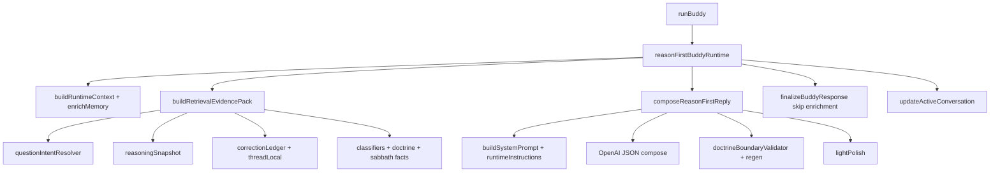

# Complexity Debt Audit

Generated: 2026-06-02  
**Audit only — no code changes.**

## Central Question

> Are accumulated fixes now suppressing natural reasoning and companion behavior — not just failing to fix listening?

**Answer: Yes, partially.** Evidence shows individual fixes solved real bugs (doctrine loops, empty retrieval, Sabbath history bleed) while **stacking constraints that shape OpenAI into a uniform, compliance-first voice**. Listening moved **5.8 → 6.3** (+0.2 on the same human rubric) after RACL — the first gain — but **all 20 turns still score below 8/10**, and prompt-stripping experiments **hurt** listening (−0.3). That pattern indicates **system-level shaping**, not a missing 7.5 feature.

---

## Scope

| Path | Default | This audit |
|------|---------|------------|
| `BUDDY_RUNTIME=legacy` | **Yes** (production) | Referenced for contrast only |
| `BUDDY_RUNTIME=reason_first` | No (flag) | **Primary scope** |

Legacy-only modules (route ownership, `masterBuddyRuntime`, `metaAnswerResponder` compose path, `companionDoctrinePresenter`, `doctrineGuard` intercept) are noted where they **shadow** reason-first via shared imports, but are not on the live reason-first execution chain.

---

# PART A — Influence Map (Reason-First Path)

Execution order: `buddyBrain.runBuddy` → `reasonFirstBuddyRuntime` → evidence → compose → validate → polish → finalize → persist.

| # | Module | Purpose | Inputs | Outputs | Prompt | Retrieval | Routing | Memory | Final answer | Validation | Impact |
|---|--------|---------|--------|---------|--------|-----------|---------|--------|--------------|------------|--------|
| 1 | `buddyBrain.js` (`runBuddy`) | Runtime dispatch via `BUDDY_RUNTIME` | userId, message, mode | Routes to RF or legacy | — | — | **Yes** | — | — | — | **LOW** (RF: pass-through) |
| 2 | `buddyBrain.js` (`classifySafety`) | Crisis / safety tier | message | safety level | — | — | **Yes** | — | **Yes** (crisis template) | — | **MEDIUM** |
| 3 | `buddyBrain.js` (`getRecentSessions`, `getUserCompanionProfile`) | Session + profile | userId | sessions, profile | — | — | — | **Yes** | — | — | **MEDIUM** |
| 4 | `buddyBrain.js` (`enrichRuntimeContextWithMemory`) | Global memory into context | userId, profile, runtimeContext | enriched context | **Yes** (in `buildRuntimeInstructions` JSON) | **Yes** | — | **Yes** | — | — | **MEDIUM** |
| 5 | `runtimeOrchestrator.js` (`buildRuntimeContext`) | Emotion, mode, loop hints | message, sessions, safety | runtimeContext object | **Yes** (embedded in instructions) | **Yes** | — | — | — | — | **MEDIUM** |
| 6 | `runtimeOrchestrator.js` (`buildRuntimeInstructions`) | Legacy policy block (~1.3K chars + full context JSON) | runtimeContext | instruction string | **Yes** | — | — | — | — | — | **HIGH** |
| 7 | `reasonFirstBuddyRuntime.js` | Orchestrator | message, sessions, profile | structured reply | — | — | — | — | — | — | **MEDIUM** |
| 8 | `retrievalEvidencePack.js` (`buildRetrievalEvidencePack`) | Facts-only evidence assembly | message, sessions, context, profile | evidencePack | **Yes** (JSON in system) | **Yes** | — | **Yes** | — | — | **HIGH** |
| 9 | `activeConversationManager.js` (`getActiveConversation`) | Thread lock / correction state | userId | activeConversation | **Yes** (summary in evidence) | **Yes** | — | **Yes** | — | — | **MEDIUM** |
| 10 | `questionIntentResolver.js` | Topic, type, correction, follow-up | message, sessions, activeConversation | questionIntent, followUp | **Yes** (via understanding) | **Yes** | **Yes** | — | — | — | **MEDIUM** |
| 11 | `reasoningSnapshot.js` (`buildReasoningSnapshot`) | Pre-route “understanding” object | message, intent, followUp, safety | understanding snapshot | **Yes** | **Yes** | **Yes** | — | — | — | **HIGH** |
| 12 | `correctionLedger.js` (`buildCorrectionLedger`) | Correction facts, forbidden topics | message, sessions, understanding | ledger object | **Yes** | **Yes** | — | — | — | **Yes** | **HIGH** |
| 13 | `correctionLedger.js` (thread-local helpers) | Entity + snippet extraction | sessions, message | threadLocal fields | **Yes** | **Yes** | — | **Yes** | — | — | **HIGH** |
| 14 | `doctrineBoundaries.js` | Forbidden teachings + topic boundaries | topic | boundaries[], forbidden[] | **Yes** | **Yes** | — | — | — | **Yes** | **MEDIUM** |
| 15 | `sabbathHistoryDeepResponder.js` | Historical chain text (facts) | message focus | chainSteps, sources | **Yes** (history block) | **Yes** | — | — | — | — | **MEDIUM** (Sabbath T1 only) |
| 16 | `sourceGroundedResponder.js` (`detectSourceTopic`) | Topic detection | message | topic key | **Yes** | **Yes** | — | — | — | — | **LOW** |
| 17 | `scriptureChainExpansion` + `bibleTopicCatalog` | Verse chains by topic | topic | references[] | **Yes** | **Yes** | — | — | — | — | **MEDIUM** |
| 18 | Companion classifiers (`healthCompanionResponse`, `griefCompanionResponse`, `prayerCompanionResponse`, `companionDiscernmentResponder`, `continueStudyIntent`) | Boolean topic flags | message corpus | companionContext flags | **Yes** | **Yes** | **Yes** | — | — | — | **MEDIUM** |
| 19 | `relationshipRecallEngine.js` | Global recall hits | userId, message | memory hits (if recall query) | **Yes** | **Yes** | — | **Yes** | — | — | **LOW** (0 hits in validation) |
| 20 | `registryStudyPresenter` + `continueStudyEngine` | Study continuity | userId, topic | studyState | **Yes** | **Yes** | — | — | — | — | **LOW** |
| 21 | `reasonFirstComposer.js` (`buildSystemPrompt`) | Legacy persona + JSON schema | mode, profile | ~3.7K base system | **Yes** | — | — | — | — | — | **HIGH** |
| 22 | `reasonFirstComposer.js` (`COMPOSER_INSTRUCTION` + RACL addendum) | Reason-first + correction rules | — | ~805 chars | **Yes** | — | — | — | — | — | **MEDIUM** |
| 23 | `reasonFirstComposer.js` (`composeReasonFirstReply`) | OpenAI compose + regen loop | evidencePack, history | JSON reply | **Yes** | — | — | — | **Yes** | **Yes** | **HIGH** |
| 24 | `doctrineBoundaryValidator.js` | Post-compose checks | reply, evidencePack | pass/fail, regenHint | — | — | — | — | **Yes** | **Yes** | **HIGH** |
| 25 | `answerMatchGate.js` (`matchAnswerToSnapshot`) | Meta/correction answer shape | reply, understanding | issues[] | — | — | — | — | **Yes** | **Yes** | **MEDIUM** (meta turns only) |
| 26 | `answerVerifier.js` + `responseContract.js` | Loaded via answerMatchGate | reply, snapshot | contract issues | — | — | — | — | **Yes** | **Yes** | **MEDIUM** (indirect) |
| 27 | `correctionLedger.js` (`replyViolatesLoopControl`) | Overlap / opener / Would-you-like | reply, ledger | loop issues | — | — | — | — | **Yes** | **Yes** | **HIGH** |
| 28 | `companionReplyPolish.js` | Phrase cleanup | reply | polished text | — | — | — | — | **Yes** | — | **MEDIUM** |
| 29 | `runtimeResponseSanitizer.js` | Doctrine phrase sanitize | reply | sanitized text | — | — | — | — | **Yes** | — | **MEDIUM** |
| 30 | `runtimeLabelStripper.js` | Strip internal labels | reply | stripped text | — | — | — | — | **Yes** | — | **LOW** |
| 31 | `buddyBrain.js` (`finalizeBuddyResponse`) | Enrichment, next-steps metadata, session | structured | finalized reply | — | — | — | **Yes** | **Yes** | — | **LOW–MEDIUM** (RF sets `skipRelationshipEnrichment`) |
| 32 | `activeConversationManager.js` (`updateActiveConversation`) | Persist thread state | topic, correction flags | stored state | — | — | — | **Yes** | — | — | **MEDIUM** |
| 33 | `runtimeOrchestrator.js` (`scoreCompanionQuality`) | Quality score | reply, context | quality object | — | — | — | — | — | — | **LOW** (score only) |
| 34 | `reasonFirstTrace.js` | Trace logging | turn metadata | jsonl | — | — | — | — | — | — | **LOW** |

### Prompt size pressure (measured + observed)

| Layer | Typical size | Notes |
|-------|--------------|-------|
| `buildSystemPrompt` | ~3,666 chars | Full legacy persona + JSON response rules |
| `buildRuntimeInstructions` | ~1,310 chars + **full `runtimeContext` JSON** | Includes 5-step **RESPONSE STRUCTURE** (biblical → history → interpretation) |
| `COMPOSER_INSTRUCTION` + RACL | ~805 chars | Drowned in long threads |
| Evidence pack JSON | **500 chars – 280K+ chars** | Grows with `conversationHistory` embedded in system; Sabbath T7 hit ~287K tokens in prompt hierarchy live run |

**Finding:** Reason-first changed the **author** (OpenAI) but kept the **brief** (legacy persona + doctrine structure). Prompt hierarchy proved shrinking the brief did not fix listening — but the full brief still **dominates companion tone**.

---

# PART B — Companion Suppression Analysis

Modules or mechanisms that make output sound **less human**, with evidence from validation and prior audits.

| Mechanism | Where | Why added | Still solves a problem? | Creates new problems? |
|-----------|-------|-----------|-------------------------|------------------------|
| **5-step RESPONSE STRUCTURE** in `buildRuntimeInstructions` | Composer system | Doctrine sprint: Scripture before history | **Yes** for Sabbath T1 accuracy | **Yes** — forces essay shape on companion turns (job, grief, health) |
| **Legacy `buildSystemPrompt` persona** | Composer system | Original Bible Buddy voice + JSON contract | **Yes** for schema safety | **Yes** — “companion” turns read like guided study |
| **Evidence JSON in system message** | `reasonFirstComposer` | Keep facts out of user message | **Yes** for grounding | **Yes** — ballooning context; model attends to structure over user |
| **JSON `response_format`** | OpenAI call | Parse reliability | **Yes** | **Yes** — uniform paragraph inside `reply` field |
| **Companion scripture stubs** | `retrievalEvidencePack` | Fix 0-ref companion turns (RACL F) | **Yes** — job thread +0.5 listening | **Yes** — repeated Proverbs/James/Psalm blocks (Job T1–T3, 37–50% overlap) |
| **Classifier fan-in** (health/grief/discernment flags) | Retrieval | Legacy routing accuracy | **Partial** — flags correct, prose weak | **Yes** — buckets user into topic before compose; delays caregiver detection |
| **`reasoningSnapshot` strict modes** | Retrieval → prompt | Meta/correction discipline | **Yes** — suppresses history on wording turns | **Yes** — compresses answer into compliance fields |
| **Correction ledger + forbidden topics** | Retrieval + validation | Stop Sabbath history repeat | **Yes** — gate PASS on history repeat | **Yes** — model substitutes **shorthand rationale loop** (47–55% overlap T3–T7) |
| **Loop-control overlap regen (≥55%)** | `doctrineBoundaryValidator` | Stop paragraph reuse | **Partial** — blocks exact opener | **Yes** — regen homogenizes; threshold too high for rationale loop |
| **Answer match gate + response contract** | Validator (meta turns) | Sprint 2.14C meta-answer quality | **Partial** on legacy meta templates | **Yes** on RF — pulls `verifyAnswer` + contract rules; encourages acknowledgment boilerplate |
| **RACL addendum** (“name misunderstanding…”) | Composer | Correction listening | **Yes** — T7 6.4→6.8 vs pre-RACL regex 3 | **Yes** — longer instruction stack; “I hear your frustration” without new substance |
| **Regen at temperature 0.55** | Composer | Pass validation | **Yes** for doctrine pass | **Yes** — second-pass replies more cautious/generic |
| **`lightPolish` + sanitize + strip** | Post-compose | Remove leaks/labels | **Yes** | **Low** — minor tone flattening |
| **`finalizeBuddyResponse` polish** | Finalize | Legacy path parity | **Redundant** on RF (already polished) | **Yes** — double polish pass |
| **“Would you like…” offers** | Model + loop-control | Legacy companion pattern | **No** for listening — penalized in human rubric | **Yes** — 3 turns premature offer; legacy job T1 outscored with a **question** instead |
| **Reflection phrases (“It sounds like”)** | Model + old regex scorer | Appear empathetic | **No** — human rubric penalizes without details | **Yes** — performative listening; regex **inflated** pre-RACL scores |
| **Global memory enrichment** | `enrichRuntimeContextWithMemory` | Long-term recall | **No** on RF validation (0 global hits used) | **Yes** — noise in `runtimeContext` JSON in every prompt |

### Suppression verdict

| Category | Severity | Evidence |
|----------|----------|----------|
| **Prompt / structure suppression** | **HIGH** | HumanConversationGapReport; ComposerPromptAudit; prompt hierarchy −0.3 listening when stripped |
| **Retrieval-shaped uniformity** | **MEDIUM** | Scripture stubs help grounding but repeat; threadLocal hits 20/20 yet `threadSpecific` avg 5.4 |
| **Validation-shaped uniformity** | **MEDIUM** | Sabbath rationale loop survives loop-control; regen hints push “do not repeat” without requiring new content |
| **Legacy shadow suppression** | **LOW on RF path** | `skipRelationshipEnrichment: true` — major legacy bleed **disabled** on reason-first |

**Net:** Fixes removed template **prose** (0.1% template) but replaced it with **OpenAI-generated template behavior** shaped by doctrine structure, scripture packs, and correction contracts.

---

# PART C — Removal Candidates

## SAFE TO REMOVE (from reason-first path only)

| Item | Reason added | Current benefit | Current cost | Recommendation |
|------|--------------|-----------------|--------------|----------------|
| **`buildRuntimeInstructions` on reason-first composer** | Legacy runtime policy | Doctrine ordering rules | ~1.3K+ chars + 5-step essay structure on companion turns | **Remove from RF** — keep doctrine rules in short `COMPOSER_INSTRUCTION` only |
| **Double `polishCompanionReply`** (composer + finalize) | Legacy polish gate | Consistent cleanup | Redundant pass; minor flattening | **Remove one** — composer-only polish on RF |
| **`answerVerifier` + `responseContract` in RF meta validation** | Sprint 2.14C strict meta answers | Catches contract violations | Encourages boilerplate acknowledgments; legacy-designed | **Remove from RF validator** — keep thin wording check only |
| **Global memory in `enrichRuntimeContextWithMemory` for RF** | Long-term relationship | Theoretical recall | 0 hits in validation; bloats context JSON | **Remove from RF path** — RACL thread-local first already |
| **Separate regex listening scorer (`reasonFirstMigration`)** | Release gate speed | Quick CI signal | Masks gap vs human rubric (5.8 vs 6.1); rewards “I hear” | **Remove as gate authority** — human rubric only for listening gates |

## SAFE TO DEMOTE (keep, reduce authority)

| Item | Reason added | Current benefit | Current cost | Recommendation |
|------|--------------|-----------------|--------------|----------------|
| **`reasoningSnapshot` full object in system prompt** | Pre-route understanding | Rich meta/correction fields | Large JSON; classifier overlap | **Demote** — pass 5 fields max to composer (question, type, strictMode, forbidden[], quote) |
| **`activeConversationManager` read on every turn** | Thread lock | Correction count, strict mode | State drift vs sessions | **Demote** — derive correction state from sessions + ledger only |
| **Companion classifiers in retrieval** | Legacy route ownership | Topic flags | Mis-order vs thread text; grief flag dropped T2 | **Demote** — use threadLocal entity patterns first; classifiers as fallback |
| **Loop-control regen (overlap ≥55%)** | RACL Part D | Blocks history repeat | Rationale loop at 47–55%; regen homogenizes | **Demote** — log-only + trace alert; tighten threshold only after compose-quality fix |
| **Scripture stubs (always inject)** | RACL Part F | Non-zero refs | Generic triplets (Job); verse dumps | **Demote** — inject max 1 ref unless user asks for Scripture |
| **`scoreCompanionQuality` on RF** | Quality telemetry | Numeric score | Unused in gate; extra compute | **Demote** — trace-only |
| **Evidence pack `doctrine` + `studyState` on companion turns** | Completeness | Theoretical study continuity | Noise on non-study threads | **Demote** — omit when `companionContext` active |

## KEEP

| Item | Reason added | Current benefit | Current cost | Recommendation |
|------|--------------|-----------------|--------------|----------------|
| **`BUDDY_RUNTIME` flag** | Safe migration | Legacy default preserved | Two runtimes to maintain | **Keep** |
| **Crisis short-circuit** | Safety | Hard stop, no OpenAI | None significant | **Keep** |
| **`doctrineBoundaryValidator` (forbidden teachings only)** | Doctrine safety | Blocks Sunday-as-Sabbath etc. | Rare regen | **Keep** — narrow to `violatesDoctrineBoundary` only |
| **`correctionLedger` (facts, no prose)** | RACL | priorAssistantQuote; history suppress | Rationale loop if over-constrained | **Keep** — reduce forbidden-topic list verbosity in prompt |
| **`threadLocal` memory (RACL A)** | Empty retrieval fix | 20/20 hits; Alzheimer's +0.3 | Compose gap remains | **Keep** — add compose mandate separately (future; not this audit) |
| **`correctionLedger` history suppress** | Sabbath loop | No Constantine after correction | — | **Keep** |
| **OpenAI primary composer** | Reason-first migration | 100% ownership; 0.1% template | Listening still 6.3 | **Keep** — simplify what surrounds it |
| **`skipRelationshipEnrichment` on RF** | Stop memory bleed | Prevented legacy orchestrator injection | — | **Keep** |
| **Human listening rubric (`raclValidation`)** | Honest measurement | Catches shallow ack | Manual/heuristic | **Keep** as gate scorer |
| **`reasonFirstTrace`** | Debug | Post-mortem | Log volume | **Keep** |

### Legacy-only (do not remove from production; already off RF path)

`routeOwnershipTable`, `masterBuddyRuntime`, `metaAnswerResponder` compose path, `companionDoctrinePresenter`, `doctrineGuard` intercept, `doctrineRuntimePipeline` — **KEEP for legacy default** until legacy retirement.

---

# PART D — Architecture Pressure Scores

Scale **0–100** (higher = more pressure / more suppression). Calibrated from module count, validation data, and audit findings — not arbitrary.

### Method

| Score | Formula (approximate) |
|-------|------------------------|
| **Complexity** | modules touching RF path (34) + dual runtime + 3 scoring systems + regen loop + growing evidence JSON |
| **Reasoning suppression** | doctrine structure weight + classifier bucketing + validation regen + historical chain injection |
| **Companion suppression** | human `feltHeard`/`threadSpecific` deficits + warmth 5.5 + structural empathy pattern |

### Current scores

| Metric | Score | Evidence anchor |
|--------|-------|-----------------|
| **Complexity** | **76 / 100** | 34 modules on RF path; 25+ shared legacy imports in `retrievalEvidencePack` alone |
| **Reasoning suppression** | **64 / 100** | Prompt hierarchy: −0.3 listening when minimized; `answeredLatest` 7.3 but companion dims weak |
| **Companion suppression** | **61 / 100** | Human listening 6.3; feltHeard 5.7; threadSpecific 5.4; warmth 5.5 |

### If top 5 **removal** candidates applied

| Item removed | Expected effect |
|--------------|-----------------|
| `buildRuntimeInstructions` from RF composer | −essay structure pressure |
| Double polish | −flattening |
| answerVerifier + responseContract on RF | −meta boilerplate regen |
| Global memory enrich on RF | −context JSON noise |
| Regex listening as gate | −false confidence |

| Metric | Estimated score | Δ |
|--------|-----------------|-----|
| Complexity | **62** | −14 |
| Reasoning suppression | **52** | −12 |
| Companion suppression | **54** | −7 |

*Listening impact (inferred from audits, not re-run):* room for +0.3–0.5 if model stops defaulting to 5-step structure; **unlikely to reach 7.5 alone**.

### If top 5 **demotion** candidates applied

| Item demoted | Expected effect |
|--------------|-----------------|
| reasoningSnapshot → minimal fields | −prompt bloat |
| activeConversation read → session-only | −state duplication |
| Classifiers second to threadLocal | −topic bucket errors |
| Loop-control → log-only | −regen homogenization |
| Scripture stubs → max 1 ref | −verse dump repetition |

| Metric | Estimated score | Δ |
|--------|-----------------|-----|
| Complexity | **58** | −18 (combined with removals) |
| Reasoning suppression | **46** | −18 |
| Companion suppression | **48** | −13 |

*Listening impact (inferred):* combined removals + demotions → **~6.8–7.1** band per PathTo7Point5 arithmetic; **7.5+** still needs compose-time user-detail mandate (not more guards).

---

# PART E — Historical Review

### Audits cross-walk

| Audit | Core finding | Fixed? | Still broken? |
|-------|--------------|--------|---------------|
| **RuntimeConflictAudit** | 14+ producers; memory/study bleed | Legacy consolidated to `masterBuddyRuntime` | RF bypasses most; enrichment gated off |
| **OverConstraintAudit** | Canned doctrine intercept | Legacy repaired with intent gates | RF doesn't use intercept — but **same classifiers** in retrieval |
| **BuddyReasoningRestorationReport** | Keyword routing; presenter stacking | `questionIntentResolver`, `reasoningSnapshot` added | **New layer** on RF — understanding in JSON, not less machinery |
| **ReasonFirstMigrationReport** | OpenAI 100%; listening 5.8 | Composer owns text | Listening gate still FAIL |
| **ListeningScoreAudit** | Regex rewards “It sounds like”; 0 memory | Documented | **Same regex inflated legacy comparison** |
| **RetrievalLoopControlDecisionReport** | Loop > retrieval > scoring > prompt | RACL built | Loop partially fixed; rationale loop remains |
| **HumanConversationGapReport** | Author changed, brief unchanged | Partial | **Still true after RACL** |
| **RACLImpactAudit** | +0.2 human listening; thread memory 20/20 | Retrieval fixed | **Compose gap** — facts in pack, not prose |
| **TopRemainingListeningFailures** | threadSpecific 5.4; feltHeard 5.7 | Not addressed | Top blockers for 7.5 |
| **PathTo7Point5** | Top 3 fixes → 6.7 only | — | More guards ≠ 7.5 |

### Recurring themes (8 audits)

1. **Listening gate never passed** — every audit since reason-first: 5.8 → 6.3, target ≥7.
2. **Memory retrieval fails or doesn't surface** — 0 hits pre-RACL; 20/20 pack hits post-RACL but **9 turns still threadSpecific ≤4**.
3. **Sabbath / meta correction loops** — wording turns replay history or rationale; RACL stopped history, not rationale.
4. **Scoring lies** — regex +2 for “I hear”; human rubric penalizes shallow ack (ListeningScoreAudit → RACL validation).
5. **Prompt size ≠ root cause** — hierarchy experiment ruled out; **prompt shape** (doctrine essay) still dominates.
6. **Template eliminated, uniformity remains** — 0.1% template chars; structural empathy + scripture triplets persist.
7. **Fixes add layers, rarely remove** — each sprint added resolver, snapshot, ledger, validator; few subtractions.
8. **Legacy outperforms on narrow turns** — job T1 legacy asked diagnostic question; RF/RACL offered prayer (RACLImpactAudit).

### Fixes that repeatedly fail

| Fix attempted | Times | Outcome |
|---------------|-------|---------|
| More prompt instructions (“listen first”) | 3+ | Drowned by 4K–280K system context |
| Meta-answer / correction templates | 2+ | Legacy T2–T7 identical template; RF rationale loop |
| Memory / retrieval expansion | 3+ | Hits exist; prose doesn't use them |
| Validation + regen | 3+ | Passes doctrine; homogenizes voice |
| Loop-control overlap thresholds | 2 | History blocked; 47–55% rationale remains |
| Scripture in evidence pack | 2 | Grounding ↑; generic repetition on job thread |

---

# PART F — Final Recommendation

### If rebuilding the next 10% of BibleBuddy: **remove and simplify before adding anything else**

#### Remove (reason-first path)

1. **`buildRuntimeInstructions` + full `runtimeContext` JSON from the composer system prompt** — largest single suppression of companion voice; doctrine rules belong in a **short** boundary block, not a 5-step essay mandate.
2. **`answerVerifier` / `responseContract` from reason-first validation** — legacy meta machinery; drives acknowledgment boilerplate without improving human listening scores.
3. **Regex-based listening gate** — replace with human rubric only; stop optimizing for “I hear.”

#### Simplify (demote, do not extend)

4. **`retrievalEvidencePack` → thin evidence**: `threadLocal` + `correctionLedger` + **one** scripture ref + doctrine forbidden list. Drop classifier fan-in, studyState, and full `reasoningSnapshot` on companion turns.
5. **Loop-control → observability only** until compose quality improves — regen is suppressing variation; logs already show 47–55% overlap.

#### Do **not** add next

- Listening 7.5 mandate layers (opening sentence validators, more regen rules) **until** the prompt stack above is reduced — PathTo7Point5 estimates top-3 **guard** fixes cap at **6.7**.

### One-sentence verdict

**Accumulated fixes are now part of the problem:** they solved doctrine safety and retrieval emptiness but **replaced canned templates with an equally uniform OpenAI-shaped compliance voice**; the next 10% should be **subtraction on the reason-first composer envelope**, not another control loop.

### Success signal for simplification (no new features)

| Metric | Now | Target after simplification |
|--------|-----|----------------------------|
| System prompt base (no history) | ~5.5K chars + evidence | **<2.5K** fixed + slim user payload |
| Human listening | 6.3 | **≥7.0** without new validators |
| `threadSpecific` dimension | 5.4 | **≥6.5** |
| Sabbath T7 | 6.8 | **≥8.0** with **fewer** regen rules, not more |
| Validator regen rate | Unknown | **↓** or flat; listening **↑** |

---

## Appendix — Reason-First Call Graph (simplified)

---

*End of audit. No implementation. No Listening 7.5 build.*
