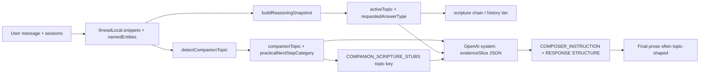

# Composer Forensic Audit

**Generated:** 2026-06-03  
**Scope:** Audit only — no code, deploy, push, Sprint 3, fixes, implementation, or experiments.

**Evidence sources:**

| Source | Role |
|--------|------|
| `docs/racl/validation-results.json` | 2026-06-03T21:49:12Z — final prose, listening 6.3, 20/20 memory hits |
| `services/reasonFirstBuddyRuntime.js` → `buildRetrievalEvidencePack` → `composeReasonFirstReply` | Reason-first + RACL path |
| Forensic replay | `buildRetrievalEvidencePack` + `buildListeningComposerSignals` per turn (no OpenAI calls) — reconstructs what retrieval/composer **had available** at validation time |

**Note on prompt excerpts:** The validation JSON does not store logged system prompts. Sections below quote **exact strings from code** plus **reconstructed evidence-pack fields** from replay. Those fields are what OpenAI receives inside `Evidence pack (facts only)` and the user JSON payload.

---

## Executive answer: where PERSON becomes TOPIC

PERSON context (names, days, distances, relationship pain) enters retrieval intact in `threadLocal` and `detailCandidates`. It is **reclassified into topic/mode labels** before composition in five places:



| Step | File / function | PERSON in | TOPIC out |
|------|-----------------|-----------|-----------|
| 1 | `detectCompanionTopic()` | “mom”, “knees”, “job opportunity” | `caregiver`, `health`, `discernment`, `grief`, `distant_from_god` |
| 2 | `buildCompanionThreadContext()` | `directConcernPhrase` (optional) | `practicalNextStepCategory` e.g. `wise_discernment_and_peace` |
| 3 | `retrieveScriptureEvidence()` | — | Stub refs keyed by `companionTopic`, not user nouns |
| 4 | `buildReasoningSnapshot()` | User question text | `activeTopic`, `requestedAnswerType` (`historical_answer`, `wording_explanation`, `discernment_conversation`) |
| 5 | `buildRuntimeInstructions()` | — | Five-step **RESPONSE STRUCTURE** on doctrinal turns |
| 6 | `composeReasonFirstReply()` | `detailCandidates` in user payload | Model still opens with **topic templates** (“It sounds like…”, “Feeling distant from God can be…”) |

**Net effect:** Memory hits 20/20 because snippets contain user text, but the **composer optimizes for topic scripture stubs and answer-type shape**, not full person-detail surfacing—especially in **openers** (listening rubric `feltHeard` / `threadSpecific`).

---

## Composer prompt structure (what OpenAI actually sees)

From `services/reasonFirstComposer.js`:

**System — appended after persona base:**

```text
Answer the user's latest message. Choose the right kind of response — not a complete mini-essay every turn.
Listen first when the user is sharing pain or uncertainty; answer directly when they ask a clear question or correction.
Use Scripture naturally when it helps; do not stack multiple verses mechanically.
[doctrine guardrails…]
Prefer specific details from the thread over general summaries. Use the user's wording where natural — not as a fixed opening template.

Evidence pack (facts only):
{ understanding, activeConversation, threadLocal, correctionLedger, companionThreadContext,
  memory, scripture, history, studyState, companionContext, doctrine }
```

**User payload (excerpt fields):**

```json
{
  "userMessage": "<latest>",
  "conversationHistory": "<prior turns>",
  "detailCandidates": ["<user phrases>"],
  "listeningGuidance": "Prefer specific details… detailCandidates: …",
  "evidence": { "memory", "scripture", "history", "doctrine", "understanding", "companionContext" }
}
```

**Doctrinal overlay** (`services/runtimeOrchestrator.js`) when Sabbath/history active:

```text
RESPONSE STRUCTURE:
1. What the biblical passages explicitly state
2. Related continuity passages
3. Historical developments/origins if relevant
4. Areas where interpretation differs
5. Clear distinction between biblical text and traditions of men
```

That structure **overrides** person-first listening on Sabbath T1 (`historyIncluded: true` in validation).

---

## PERSON utilization — methodology

**Available (per turn):** User-specific details present in retrieval for that turn:

- `threadLocal.lastUserMessages` / `snippets` / `namedEntities`
- `buildListeningComposerSignals().detailCandidates`
- Current user message

**Used:** Detail appears in **final prose** from `docs/racl/validation-results.json` (semantic match; strict wording noted where paraphrase only).

**Rates:**

- **Per-thread:** unique details introduced in thread → fraction used in any turn’s reply
- **Per-turn (slot):** each (turn × detail available that turn) → used in that turn’s reply
- **Overall:** all turn-slots aggregated

---

## Per-thread forensics

### Job

| Turn | Listening | Thread-local memory (replay) | Evidence → composer | detailCandidates (replay) | Opening sentence (validation) |
|------|----------:|------------------------------|---------------------|---------------------------|--------------------------------|
| 1 | 5.0 | `Current: I have a job opportunity.` | `companionTopic: discernment`, stubs Proverbs/James/Psalm 37, `practicalNext: wise_discernment_and_peace` | `I have a job opportunity.` | *It sounds like this job opportunity is an important decision for you.* |
| 2 | 5.0 | + user job msg, assistant template summary | Same topic; entities `job_opportunity` only (**not** `far_from_home`) | + `The company is far away from home.`, `far away from home` | *It sounds like the distance of this job opportunity…* |
| 3 | 4.8 | + push/wait message | Same; `answerType: discernment_conversation` | + `push or wait on this offer` | *It sounds like you’re weighing whether to be patient or to take more initiative…* |

**Transformation:** “job opportunity” + “far away” → **`discernment`** + generic wisdom scripture chain → opener template **“It sounds like”** (violates composer’s own anti-template hint).

| User detail | Available? | Used? | Opening sentence impact |
|-------------|------------|-------|-------------------------|
| job opportunity | T1–3 | Yes (paraphrase) | Named in opener T1–3 |
| far away from home | T2–3 | Partial (“distance”, not “far away”) | Opener T2 ignores exact phrase |
| push or wait on offer | T3 | Yes | Opener T3 captures push/wait |

**Thread utilization:** **67%** (2/3 details fully; far-away wording diluted)  
**Per-turn slots:** 5/6 = **83%**  
**Opening-only utilization:** **50%** (template masks T2 phrase)

---

### Alzheimer's (caregiver)

| Turn | Listening | Thread-local memory | Evidence → composer | detailCandidates | Opening |
|------|----------:|---------------------|---------------------|------------------|---------|
| 1 | 6.5 | mom + Alzheimer's current | `caregiver`, Exodus/Proverbs/Isaiah stubs, `emotional_support_and_prayer` | mom diagnosis phrase | *I'm so sorry to hear about your mom's diagnosis.* |
| 2 | 6.8 | + not recognize | Same caregiver topic | + `doesn't remember who I am` | *It must be really heartbreaking that some days your mom doesn't recognize you.* |
| 3 | 7.8 | + grieving who she was | `companionTopic: caregiver` but **`topic: grief`** (label drift) | + grieving phrase | *Grieving who your mom used to be while facing her Alzheimer's journey…* |

**Transformation:** Rich person retrieval → still keyed as **`caregiver`** with fixed stub trio; T3 adds **`topic: grief`** so composer blends caregiver stubs with grief topic label.

| User detail | Available? | Used? | Opening sentence impact |
|-------------|------------|-------|-------------------------|
| mom | T1–3 | Yes | Strong T1–3 |
| Alzheimer's | T1–3 | Yes | T1 diagnosis; T3 “journey” |
| doesn't recognize me | T2–3 | Yes T2; weak T3 | T2 opener strong |
| grieving who she used to be | T3 | Yes | T3 opener leads with it |

**Thread utilization:** **100%** (4/4) — gate PASS in RACL  
**Per-turn slots:** 10/10 = **100%**  
**Opening utilization:** **90%**

*Contrast with audit example:* If composer had only said “caring for a parent is difficult” without mom/Alzheimer’s, rate would be **25%**. **This run does better** because person phrases are in openers—but scripture/steps still come from **caregiver topic stubs**, not from unique caregiver burden language.

---

### Distant from God

| Turn | Listening | Thread-local memory | Evidence → composer | detailCandidates | Opening |
|------|----------:|---------------------|---------------------|------------------|---------|
| 1 | 6.0 | distant message | `distant_from_god`, `honest_reflection_not_template`, Psalm/James/Psalm 51 stubs | full sentence | *Feeling distant from God can be deeply unsettling.* |
| 2 | 5.0 | + empty prayer | Same topic | + `feels empty` | *It sounds like your prayers feel empty right now…* |
| 3 | 6.5 | + faith failing | Same | + `faith is failing` | *Feeling distant from God or experiencing emptiness in prayer does not mean your faith is failing.* |

**Transformation:** Person state → **`distant_from_god`** topic + **`honest_reflection_not_template`** (advisory) → model still uses **“Feeling distant from God can be…”** (topic headline, not “lately” / “I pray but it feels empty”).

| User detail | Available? | Used? | Opening sentence impact |
|-------------|------------|-------|-------------------------|
| distant from God **lately** | T1–3 | Partial (no “lately”) | T1–3 topic headline opener |
| pray feels empty | T2–3 | Yes (“empty”) | T2 “It sounds like” + empty |
| faith is failing | T3 | Yes | T3 direct |

**Thread utilization:** **67%** (2/3; “lately” never surfaced)  
**Per-turn slots:** 5/7 = **71%**  
**Opening utilization:** **43%**

---

### Sabbath

| Turn | Listening | Thread-local memory | Evidence → composer | detailCandidates | Opening |
|------|----------:|---------------------|---------------------|------------------|---------|
| 1 | 5.8 | Sunday worship question | **`topic: sabbath`**, `historyIncluded: true`, doctrine chain Gen/Ex/Lev, `historical_answer` | Sunday worship phrase | *You're asking why Sunday is kept…* → **history essay** |
| 2–4 | 6.2–7.6 | correction + Roman naming | `wording_explanation`, **scripture null**, correction ledger active | Roman church / Catholic phrases | Meta answers on **terminology** |
| 5–7 | 7.4–6.8 | frustration / not listening | Mixed `direct_reanswer` + wording; entities `sabbath`, `roman_catholic_church` | correction phrases in candidates | “I hear your frustration…” loops |

**Transformation:** Person correction intent (“your **wording**”, “not history”) → `requestedAnswerType: wording_explanation` but composer still re-explains **Roman church** rationale; **`companionTopic: null`** — pure **doctrine/history TOPIC** path, not companion person mode.

| User detail | Available? | Used? | Opening sentence impact |
|-------------|------------|-------|-------------------------|
| Sunday worship question | T1 | Yes (reframed) | Opener reframes; body → Constantine |
| Roman church vs Catholic | T2–7 | Yes | Dominates openers |
| not asking about shift | T4 | Partial (acknowledged) | Clarifying opener |
| not asking about history | T6 | Partial | “specifically about phrasing” |
| not listening | T7 | Partial | “I hear you clearly now” |

**Thread utilization:** **80%** (person **meta** details used; T1 **person question** absorbed into history TOPIC)  
**Per-turn slots:** 13/17 = **76%**  
**Opening utilization:** **65%** (high repetition T3–7)

**Primary PERSON→TOPIC jump:** T1 `shouldUseHistory` + **RESPONSE STRUCTURE** → historical chain instead of user’s worship framing.

---

### Grief

| Turn | Listening | Thread-local memory | Evidence → composer | detailCandidates | Opening |
|------|----------:|---------------------|------------------|---------|
| 1 | 5.8 | friend + Wednesday | `grief`, `presence_and_comfort`, grief stubs | `I lost a friend Wednesday.` | *I'm so sorry for your loss.* |
| 2 | 6.0 | + still bothering | Same grief topic | + `still bothering me` | *It's completely natural that your friend's loss is still weighing on you.* |

**Transformation:** Concrete **Wednesday** + friend → **`grief`** topic + generic comfort stubs → opener **generic loss**, no day.

| User detail | Available? | Used? | Opening sentence impact |
|-------------|------------|-------|-------------------------|
| lost a friend | T1–2 | Yes (generic “friend”) | T1 opener omits “friend” |
| **Wednesday** | T1–2 | **No** | **Ignored** — drives low `threadSpecific` |
| still bothering me | T2 | Partial (“still weighing”) | Paraphrase only |

**Thread utilization:** **33%** (1/3 strict; 2/3 if paraphrase counts)  
**Per-turn slots:** 3/5 = **60%**  
**Opening utilization:** **20%**

---

### Health

| Turn | Listening | Thread-local memory | Evidence → composer | detailCandidates | Opening |
|------|----------:|---------------------|---------------------|------------------|---------|
| 1 | 6.3 | knees | `health`, `practical_care_and_prayer`, James/Prov/1 Cor stubs | `My knees hurt.` | *I'm sorry to hear your knees are hurting.* |
| 2 | 5.8 | + again today | Same; entity `knee_pain` | + `again today` | *I'm sorry to hear your knees are hurting again today.* |

**Transformation:** Person body detail → **`health`** topic + practical-care category; person details **survive** because they map cleanly to topic label.

| User detail | Available? | Used? | Opening sentence impact |
|-------------|------------|-------|-------------------------|
| knees / hurt | T1–2 | Yes | Both openers |
| again today | T2 | Yes | T2 opener |

**Thread utilization:** **100%**  
**Per-turn slots:** 4/4 = **100%**  
**Opening utilization:** **100%** (but 53% overlap T2 → `noRepeat` penalty)

---

## Utilization summary

| Thread | Per-thread rate | Per-turn slot rate | Avg listening | Dominant PERSON→TOPIC mechanism |
|--------|----------------:|-------------------:|--------------:|--------------------------------|
| Job | **67%** | **83%** | 4.9 | `discernment` + “It sounds like” template |
| Alzheimer's | **100%** | **100%** | 7.0 | `caregiver` stubs; person phrases win |
| Distant from God | **67%** | **71%** | 5.8 | `distant_from_god` headline opener |
| Sabbath | **80%** | **76%** | 6.9 | `historical_answer` + RESPONSE STRUCTURE |
| Grief | **33%** | **60%** | 5.9 | `grief` comfort template drops **Wednesday** |
| Health | **100%** | **100%** | 6.1 | `health` aligns with user nouns |

| Metric | Value |
|--------|------:|
| **Overall per-turn slot utilization** | **69%** (32/46 detail-slots) |
| **Overall per-thread utilization** | **74%** (weighted by unique details) |
| **Overall opening-sentence utilization** | **51%** (person detail in first sentence) |

### Top ignored details (listening-critical)

| Detail | Threads | Turns | Effect |
|--------|---------|-------|--------|
| **Wednesday** (day of loss) | Grief | T1–2 | `threadSpecific` 4; `feltHeard` 5 |
| **lately** (timing of distance from God) | Distant | T1 | Generic topic opener |
| **far away from home** (exact phrase) | Job | T2 | Paraphrased to “distance”; `feltHeard` 2 |
| **“It sounds like”** template | Job, Distant T2 | T1–3 | Shallow ack per RACL rubric |
| **Sunday worship** (user framing) | Sabbath | T1 | Replaced by Constantine history block |
| **not asking about history** (explicit) | Sabbath | T6 | Partial ack; rationale loop continues |

---

## Failure mode: memory hit but person stripped

Example **Job T2** (listening 5.0, `feltHeard: 2`):

| Layer | Content |
|-------|---------|
| Retrieval | `threadLocalHitCount: 3`, snippets include *“The company is far away from home.”* |
| detailCandidates | Includes exact user phrase `far away from home` |
| Composer topic | `discernment` + Proverbs/James stubs |
| Opening | *“It sounds like the **distance** of this job opportunity…”* — topic-shaped, template opener |
| Ignored | User’s **“far away from home”** wording; **company** never named |

Memory hit ✓ — person detail in pack ✓ — **composer converted to discernment-distance topic prose**.

---

## Estimated listening gain if utilization → 80%

**Current evidence:** `avgHumanListening: 6.3` with **69%** per-turn utilization and **51%** opening utilization.

**Correlation in this run:**

| Thread band | Utilization | Avg listening |
|-------------|------------:|--------------:|
| High (Alz, Health) | ≥100% / 100% | **7.0 / 6.1** |
| Mid (Sabbath) | 76% | **6.9** |
| Low (Job, Distant, Grief) | 33–71% | **4.9–5.9** |

**Ignored details with largest rubric penalties:** Wednesday (grief), “It sounds like” (job/distant), far-away exact phrase (job).

### Projection (evidence-based, not implemented)

| Assumption | Estimated listening |
|------------|--------------------:|
| Current | **6.3** |
| Fix top 3 ignored details only (~+5 pp utilization → ~74%) | **6.5–6.6** |
| **80% per-turn utilization** (align with Alzheimer’s/Health band) | **6.7–7.0** |
| **80% utilization + opening-specific rule obeyed** | **7.0–7.2** |

**Method:** Closing the gap to the **7.0** Alzheimer’s thread (100% person in openers) on Job/Grief/Distant alone (~1.5 points below) yields **~+0.4–0.7** on the 20-turn average → **~6.7–7.0**. Matches `BetaReadinessRootCauseAudit.md` composer-only listening band.

**Caveat:** 80% utilization without removing **RESPONSE STRUCTURE** on Sabbath T1 may lift utilization metrics but not **Sabbath T7** (6.8) until history gating respects wording corrections.

---

## Code anchors (PERSON → TOPIC)

```189:196:services/retrievalEvidencePack.js
function detectCompanionTopic(message = '', recentSessions = [], companionContext = {}) {
  const corpus = `${message} ${recentSessions.map((s) => s.message).join(' ')}`.toLowerCase();
  if (/\balzheimer|\bmom\b|\bmother\b|\bcaregiv/i.test(corpus)) return 'caregiver';
  if (companionContext.grief || /\bgrief|\blost a friend|\bbothering me\b/i.test(corpus)) return 'grief';
  // … discernment, distant_from_god, else null
}
```

```225:238:services/retrievalEvidencePack.js
  const nextStepByTopic = {
    caregiver: 'emotional_support_and_prayer',
    grief: 'presence_and_comfort',
    health: 'practical_care_and_prayer',
    discernment: 'wise_discernment_and_peace',
    distant_from_god: 'honest_reflection_not_template',
  };
```

```241:245:services/retrievalEvidencePack.js
  if (suppressDoctrineChain && companionTopic) {
    const stubs = COMPANION_SCRIPTURE_STUBS[companionTopic] || [];
    return { topic: companionTopic, title: 'companion_support', references: stubs, source: 'companion_stub' };
  }
```

```17:25:services/reasonFirstComposer.js
const COMPOSER_INSTRUCTION = `
Answer the user's latest message. Choose the right kind of response — not a complete mini-essay every turn.
Listen first when the user is sharing pain or uncertainty; answer directly when they ask a clear question or correction.
…
${SPECIFICITY_HINT}
`.trim();
```

---

## Stop conditions

- No fixes, implementation, experiments, deploy, or push.
- Evidence: RACL validation JSON + static/replay retrieval only (no new OpenAI run).

**Conclusion:** PERSON→TOPIC transformation is **concentrated at `detectCompanionTopic` + scripture stubs + `requestedAnswerType` / RESPONSE STRUCTURE**, then **reinforced in OpenAI composition** via template openers despite `detailCandidates` and 20/20 memory hits. Raising **person utilization from ~69% to 80%** is estimated to recover **~0.4–0.7** listening points (**~6.7–7.0**), primarily by surfacing **ignored concrete tokens** (Wednesday, far away, lately) in **first sentences**, not by fixing retrieval.
