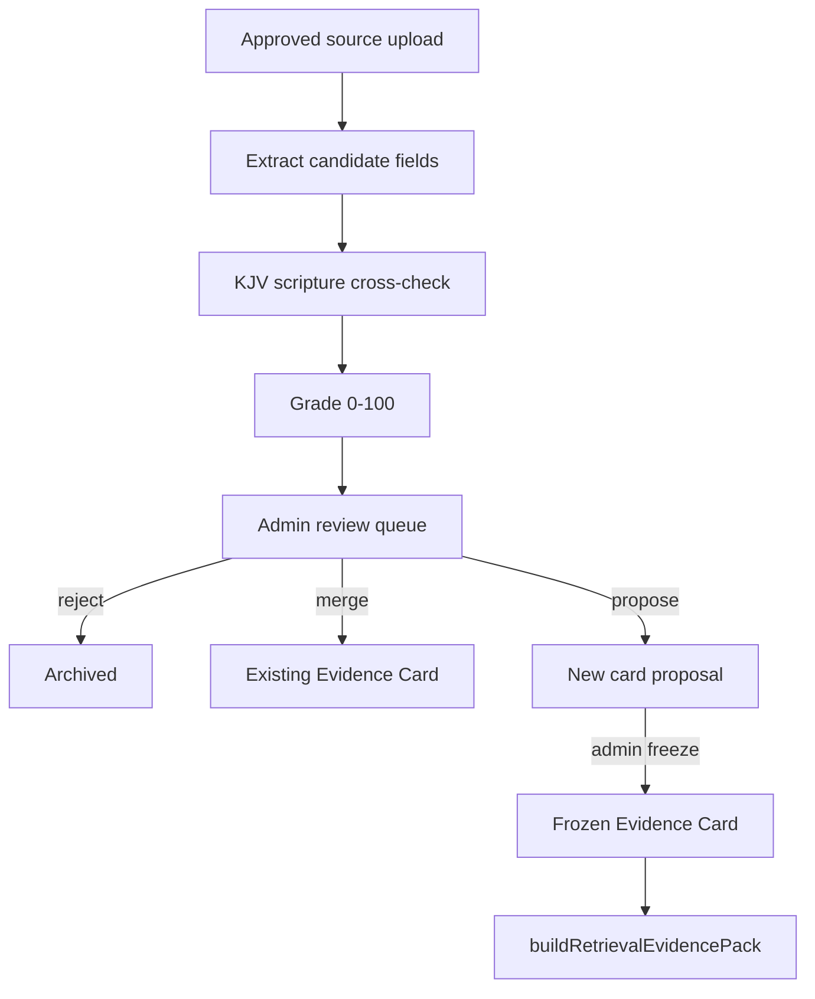

# External Teaching Candidate Pipeline Report

**Date:** 2026-06-07  
**Phase:** 1A (plan + schema only — no scraping, no ingestion)  
**Status:** NOT DEPLOYED — Scripture remains final authority

---

## Principle

External teaching (IOG Q&A, licensed transcripts, creator-permitted lessons) is **Evidence Candidate** material only. It never becomes live doctrine until an admin promotes it to a frozen Evidence Card after Scripture cross-check.

**Scripture is final authority. External teaching is research input.**

---

## Approved source types only

| Source type | Allowed | Notes |
|-------------|---------|-------|
| Official transcripts (licensed) | ✅ | Written permission on file |
| Manually uploaded transcripts | ✅ | Admin attests rights |
| Creator-permitted materials | ✅ | `copyrightStatus: licensed` |
| Public website text allowed by ToS | ✅ | Legal review required |
| User-provided study notes | ✅ | `reviewRequired: true` always |
| YouTube auto-scrape | ❌ | No unauthorized scraping |
| Copyrighted books/sermons | ❌ | Unless explicit license |
| Denominational catechisms | ❌ | Tradition — not auto-ingested |

---

## Evidence Candidate schema

```json
{
  "candidateId": "uuid",
  "sourceName": "Israel of God Q&A",
  "sourceUrl": "https://example.com/lesson/123",
  "question": "What is the third heaven?",
  "scripturesCited": ["Genesis 1:6-8", "2 Corinthians 12:2", "John 3:13"],
  "scriptureOrder": ["Genesis 1:6-8", "2 Corinthians 12:2", "John 3:13", "Matthew 6:9-10"],
  "doctrineConclusion": "Admin summary after review — not OpenAI script",
  "confidenceScore": 0,
  "copyrightStatus": "unknown",
  "reviewRequired": true,
  "status": "pending_admin_review",
  "submittedAt": "ISO-8601",
  "reviewedBy": null,
  "reviewedAt": null,
  "promotedToCardId": null,
  "crossCheckGrade": null,
  "crossCheckIssues": []
}
```

### Extraction rules (per IOG Q&A / lesson)

Extract **only**:

- `sourceName`, `sourceUrl`, `question`
- `scripturesCited` (verbatim refs from material)
- `scriptureOrder` (teaching sequence as presented)
- `doctrineConclusion` (stated conclusion — admin-reviewed)
- `confidenceScore` (0 until admin grades)
- `copyrightStatus`, `reviewRequired: true`

**Never extract:** verbatim sermon prose for composer prompts, tradition as binding rules, or conclusions without Scripture list.

---

## Pipeline architecture



**Never:** Candidate → OpenAI prompt automatically.

---

## Part E — Scripture cross-check (per candidate)

| Step | Action |
|------|--------|
| 1 | Normalize all `scripturesCited` to KJV tokens |
| 2 | Verify each ref exists in KJV corpus |
| 3 | Walk `scriptureOrder` — flag gaps (unsupported leaps between verses) |
| 4 | Flag tradition language ("most Christians believe", "church teaches") |
| 5 | Compare conclusion to scripture chain — flag overreach |
| 6 | Assign grade |

### Grading scale

| Score | Label | Action |
|-------|-------|--------|
| 95–100 | Strong Bible support | Eligible for card merge proposal |
| 80–94 | Probable | Admin review with chain notes |
| 60–79 | Review carefully | Research only; no promotion |
| Below 60 | Research only | Reject or archive |

### Cross-check output (stored on candidate)

```json
{
  "crossCheckGrade": 72,
  "crossCheckIssues": [
    "leap: Acts 10 → pork clean without Acts 11 witness",
    "tradition_language: commonly taught"
  ],
  "kjvRefsValid": true,
  "unsupportedLeaps": 1
}
```

---

## Integration with BAE Phase 1A claim validator

| Layer | Role |
|-------|------|
| Evidence Cards (frozen) | Only promoted path into `approvedEvidenceGraph` |
| Candidates | Admin UI / jsonl queue — **not** in `buildRetrievalEvidencePack` |
| Claim validator | Judges OpenAI claims against **cards + catalog only** |
| External conclusions | Never cited as `derivedFrom` until card promotion |

When a candidate is promoted:

1. Admin maps `scriptureOrder` → card `primaryScriptures` / catalog `teachingOrder`
2. Admin writes `bindingRules` from cross-check issues (negations)
3. Card frozen in `approvedDoctrineRegistry`
4. Claim validator automatically picks up new rules — no composer change

---

## Copyright guardrails

| Rule | Enforcement |
|------|-------------|
| Default `copyrightStatus` | `unknown` → blocks auto-processing |
| Promotion requires | `licensed` \| `public_domain` \| `owned` |
| User-facing answers | Never paste external prose |
| Attribution | `sourceName` / `sourceUrl` in admin metadata only |

---

## Phase 1B implementation (future — not started)

1. `data/evidence-candidates.jsonl` store
2. Admin CLI: `scripts/ingestTeachingCandidate.js` (manual paste only)
3. `services/teachingCandidateCrossCheck.js` — KJV verify + grade
4. Admin review queue in existing admin routes

**Not in scope for Phase 1A.**

---

## Related documents

- `BibleAuthorityEnginePhase1Design.md`
- `ExternalBibleTeachingIngestionPlan.md`
- `BibleAuthorityEnginePhase1AImplementationReport.md`

**End of External Teaching Candidate Pipeline Report.**
