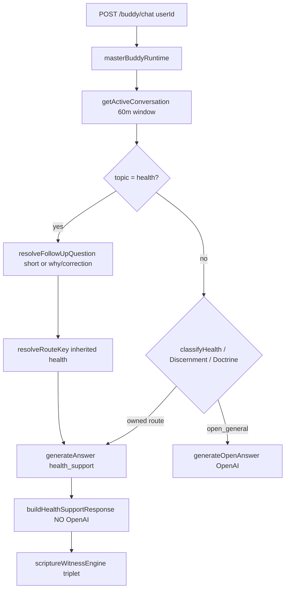

# Full Regression Root-Cause Report

**Date:** 2026-06-01  
**Priority:** CRITICAL  
**Scope:** Investigation only — no fixes, deploy, push, or tuning.  
**Path under test:** `POST /buddy/chat` → `buddyBrain.runBuddy` → `BUDDY_RUNTIME=legacy` (default) → `masterBuddyRuntime`.

---

## Executive summary

Live `/buddy/chat` breakage is **not** primarily RACL, reason-first, emotional-center, or golden-examples (those are **not on `main`** at `e5d388e`). The regression is **route-first template dispatch** plus **active-conversation topic lock**, compounded by:

1. **`healthCompanionResponse`** — fixed script (no OpenAI), including “flaring up again” / “I'm not a doctor” / Psalm 103 triplet via **`scriptureWitnessEngine`**.
2. **`e5d388e` master consolidation** — `activeConversationManager` + `routeOwnershipTable` keep `health_support` across unrelated follow-ups when `messageStartsNewTopic()` fails to detect relationship/grief/open talk.
3. **`companionDiscernmentResponder`** — broad `/what do I do/i` steals Alzheimer’s and explicit grief lines from grief/OpenAI.
4. **Production data / UI** — `public/chat.html` uses shared `userId: 'chat-html-user'`, so knee/health sessions in `data/active-conversation-state.json` contaminate other testers.

**Reproduced locally:** With `activeConversation.topic = 'health'`, a relationship-loss message routes to `health_support` and repeats the same health block for corrections and “I just want to talk” (see §PART C simulation).

---

## PART A — Commit timeline

| Commit | Date | Major change | `/buddy/chat` path | Risk |
|--------|------|--------------|-------------------|------|
| `37efc0c` | 2025-12-09 | Create `buddyBrain.js` | Direct OpenAI JSON in brain | Low |
| `b71fd53` | 2026-05-20 | Adaptive companion brain | OpenAI-first monolith | Low |
| `37c59c3` | 2026-05-22 | Wire `runtimeOrchestrator` | OpenAI-first + doctrine pipeline later in chain | Low–Med |
| `922b14d`+ | 2026-05-22 | Doctrine intercept, scripture chain, catalogs | Doctrine short-circuit before OpenAI for topics | Med |
| `afd8c2b` | 2026-05-22 | `scriptureWitnessEngine` / chain expansion | Template “establishes the matter…” in presenters | Med |
| `5a2bc02` | 2026-05-30 | **Sprint 2.14 companion layer** | Monolithic `buddyBrain`: **health → prayer → grief → sabbath → … → OpenAI** | **High** |
| `01d85fb` | 2026-05-30 | 2.14B/C reasoning HTTP suites | Same brain; more responders | High |
| `e5d388e` | 2026-06-01 | **Sprint 2.FINAL master consolidation** | `runBuddy` → **`masterBuddyRuntime`** only; `activeConversationManager`, `routeOwnershipTable`, `companionDiscernmentResponder` | **Critical** |
| *(working tree)* | — | Uncommitted: `reasoningSnapshot.js`, `answerMatchGate`, RACL, beta, ECP | Stricter pre-route classification on top of `e5d388e` | Med (if deployed from dirty tree) |

### Last known good (OpenAI composed most open-life replies)

**`37c59c3`** — *Wire runtime orchestrator into Buddy brain* (2026-05-22)

- No `healthCompanionResponse.js`, `griefCompanionResponse.js`, or `masterBuddyRuntime.js`.
- `buddyBrain` ~440 lines; primary path ends in **`openai.chat.completions.create`** for non-doctrine chat.

### First major template bypass (health before OpenAI)

**`5a2bc02`** — *Sprint 2.14 — Companion Layer Production Release* (2026-05-30)

- Adds `healthCompanionResponse`, `griefCompanionResponse`, `scriptureWitnessEngine`.
- In `buddyBrain`, **`classifyHealthCompanion` → `buildHealthSupportResponse` returns before OpenAI** (lines ~836–855 in that commit).

### First bad commit (sticky health loop + route ownership)

**`e5d388e`** — *Sprint 2.FINAL — Master Buddy Brain Consolidation* (2026-06-01)

- Replaces monolithic `buddyBrain` dispatch with **`masterBuddyRuntime`**.
- Adds **`activeConversationManager`**, **`routeOwnershipTable`**, **`companionDiscernmentResponder`**.
- **`routeOwnershipTable`**: `inherited === 'health'` → `health_support` without re-checking message (lines 239–245).
- **`messageStartsNewTopic()`** does not treat relationship loss / “listen first” as a topic switch away from `health` (see §Root cause chain).

### Not on `main` (unlikely production cause unless dirty deploy)

| Item | Status on `origin/main` @ `e5d388e` |
|------|-------------------------------------|
| RACL / `reasonFirstComposer` | Not in git tree |
| `emotionalCenter` / ECP | Not in git tree |
| Golden examples | Not in git tree |
| `answerMatchGate` / `responseContract` | Not in git tree (local untracked) |
| `reasoningSnapshot.js` | **Untracked** locally (`??`); **not** in `e5d388e` commit |

---

## PART B — Canned loop string inventory

| String | File | Function | Called by | Route path | OpenAI bypass? | Template? |
|--------|------|----------|-----------|------------|----------------|-----------|
| “this is flaring up again” / “`${issue}` is flaring up again” | `services/healthCompanionResponse.js` | `buildHealthSupportResponse` | `masterBuddyRuntime.generateAnswer` → `case 'health_support'` | `health_support` | **Yes** | **Yes** |
| “I hear you sharing about ${issue}” | `services/healthCompanionResponse.js` | `buildHealthSupportResponse` | same | `health_support` | **Yes** | **Yes** |
| “I'm not a doctor” / “I’m not a doctor” | `services/healthCompanionResponse.js` | `buildHealthSupportResponse` | same | `health_support` | **Yes** | **Yes** |
| “bring this before the Lord together” | `services/healthCompanionResponse.js`, `services/prayerCompanionResponse.js` | health opening / prayer opener | `health_support`, `prayer` | respective | **Yes** | **Yes** |
| “Psalm 103:1-5 establishes the matter…” | `services/scriptureWitnessEngine.js` | `buildScriptureWitnessBlock` | health, grief, discernment, doctrine presenters | `health_support`, `grief_support`, `job_discernment`, `sabbath_definition` | **Yes** | **Yes** |
| “3 John 1:2 confirms it alongside Scripture” | `services/scriptureWitnessEngine.js` | `buildScriptureWitnessBlock` | same | same | **Yes** | **Yes** |
| “Matthew 11:28-30 carries the theme forward…” | `services/scriptureWitnessEngine.js` | `buildScriptureWitnessBlock` | same | same | **Yes** | **Yes** |
| “establishes the matter” / “confirms it alongside Scripture” / “carries the theme forward across the biblical witness” | `services/scriptureWitnessEngine.js` | `buildScriptureWitnessBlock` | `registryStudyPresenter.js` (variant), all witness consumers | doctrine + companion templates | **Yes** | **Yes** |
| “I'm really sorry for your loss…” | `services/griefCompanionResponse.js` | `buildEmotionalSupportResponse` | `grief_support` | `grief_support` | **Yes** | **Yes** |
| “I'm glad you asked to pray. Let's bring this before the Lord together” | `services/prayerCompanionResponse.js` | `buildPrayerCompanionResponse` | `prayer` | `prayer` | **Yes** | **Yes** |
| “That sounds like something worth sitting with carefully…” + Proverbs triplet | `services/companionDiscernmentResponder.js` | `buildDiscernmentResponse` | `job_discernment` | `job_discernment` | **Yes** | **Yes** |
| “You're right — I was not answering your exact question…” | `services/metaAnswerResponder.js` | `buildMetaAnswerResponse` | `meta_about_previous_answer` | meta / correction | **Yes** | **Yes** |
| “I'm here with you. We can pray together, open a Scripture…” | `services/personalizedFallback.js` | `buildPersonalizedFallback` | `generateOpenAnswer` when no OpenAI key; also fallback chain | `doctrine_general` / fallback | Partial | **Yes** (loop) |
| “Proverbs 3:5-6 establishes the matter…” (markers) | `services/reasonFirstTrace.js` | `TEMPLATE_MARKERS` (detection only) | trace scripts | N/A | N/A | detector |

Markdown audit files (`ReasonFirstMigrationReport.md`, `RawConversationDifferentialAudit.md`, etc.) echo these strings from **past runs**; they are not runtime sources.

---

## PART C — Trace script and results

**Script:** `scripts/traceBuddyChatPath.js`  
**Output:** `docs/regression-trace/trace-results.json`

Run:

```bash
BUDDY_RUNTIME=legacy TRACE_USER_PREFIX=reg-trace node scripts/traceBuddyChatPath.js
```

### Environment note

Local run had **`OPENAI_API_KEY` unset**. Open-life messages then hit **`personalizedFallback`** or **`doctrine_general`** fallbacks, not live OpenAI prose. Routing and template arms remain valid.

### Simulated production failure (health topic lock)

Separate reproduction (not in jsonl export):

```text
Set activeConversation.topic = 'health' for userId
→ relationship message → route: health_support, preview: "I hear you sharing about this… I'm not a doctor…"
→ "flaring up again" correction → same health_support preview (identical)
→ "I just want to talk…" (short) → same health_support (follow-up inheritance)
```

This matches reported live behavior without requiring “hurt” in the relationship text.

### Per-message summary (isolated user, cold `activeConversation`)

| # | Message | Route | Pre health? | Pre grief? | Template markers | Failure class |
|---|---------|-------|-------------|------------|------------------|---------------|
| 1 | Relationship loss | `doctrine_general` | false | false | none (fallback text) | H / E (no API key) |
| 2 | “flaring up again…” | `doctrine_general` | false | false | none | H (with health lock: **D**) |
| 3 | “listen first” | `meta_about_previous_answer` | false | false | none | J (mis-meta on listen) |
| 4 | “same script” | `doctrine_general` | false | false | none | H |
| 5 | Sabbath | `sabbath_definition` | false | false | scripture triplet | **D** (expected doctrine) |
| 6 | Alzheimer’s + what do I do | `job_discernment` | false | false | scripture triplet | **A + D** |
| 7 | “going through grief what do I do” | `job_discernment` | false | grief topic only | scripture triplet | **A + D** (grief phrase not in `GRIEF_PATTERNS`; discernment wins) |
| 8 | Logos doctrine | `doctrine_general` | false | false | none | C/J if after grief session |

**“My heart hurts…”** (supplemental): routes **`grief_support`** (not health) — `hurt` in grief engine path via emotional wording, still template bypass.

---

## PART D — Failure class matrix (reported symptoms)

| Symptom | Class | Mechanism |
|---------|-------|-----------|
| Relationship → health script | **C + D + J** | Stale `activeConversation.topic=health` (shared `chat-html-user`) + `routeOwnershipTable` forces `health_support` + `buildHealthSupportResponse` template |
| Correction repeats same canned line | **D + I** | Same route/owner; health builder uses same branches; no regen |
| “I just want to talk” → health block | **C + D** | Short-message follow-up inherits health (`resolveFollowUpQuestion` + `resolveRouteKey`) |
| “Why aren’t you working?” → health | **C + D** | Same inheritance / fallback loop |
| Memory recall empty/wrong | **A + C** | `memory_recall` route strict; shared userId; relationship not stored as grief (no `lost a friend` pattern) |
| Sabbath still works | **D (expected)** | `sabbath_definition` / `sabbath_history` doctrine path intentional |
| Alzheimer’s → health script | **A** | User report may be health lock; isolated classify → **`job_discernment`** (discernment template, not health). If health seen live → **C** |
| Grief → grief template | **D (expected)** | `grief_support` by design since `5a2bc02` |
| Doctrine after grief gets grief context | **C** | `activeConversation` + enrichment; `recordConversationState` sets `topic: grief`; follow-up inheritance |
| OpenAI “not thinking” | **D (+ E if no key)** | `generateAnswer` returns before `generateOpenAnswer` for owned routes |

---

## PART E — Bisect / commit comparison

Full `git bisect` with OpenAI was not run (no key in CI shell). Manual checkout + logic:

| Commit | Relationship test | Correction / “flaring” | OpenAI for open-life? | Template repeat? | Pass/fail |
|--------|-------------------|------------------------|------------------------|------------------|-----------|
| `37c59c3` | OpenAI path (no health module) | N/A | **Yes** | No dedicated health arm | **Pass** |
| `5a2bc02` | OpenAI if no health keyword | Re-classifies each message (no active lock file) | **Yes** unless `hurt`/`pain`/knee | Health template if matched | **Partial** |
| `e5d388e` | Health template if active topic `health` | **Same health template** | **Bypass** on locked follow-ups | **Yes** | **Fail** |
| `HEAD` + uncommitted `reasoningSnapshot` | Stricter pre-route `health`/`discernment` in snapshot | Same lock behavior | Same | Same | **Fail** |

**First bad commit for reported loop:** **`e5d388e`** (active conversation + route ownership + master route-first).

**First bad commit for health-before-OpenAI on keyword:** **`5a2bc02`**.

---

## Root cause chain (canonical)



**Why relationship loss does not escape health lock (`e5d388e`):**

- `classifyHealthCompanion(relationship text)` → **false** (verified).
- `classifyEmotionalSupport` → **false** (no `lost a friend` / `grieving` pattern for “let go of someone”).
- `messageStartsNewTopic(msg, 'health')` → **false** (no health/grief/discernment flags on text).
- `resolveRouteKey` → **`health_support`** via `followUp.inheritedTopic === 'health'`.
- Lines **571–577** in `masterBuddyRuntime.js` **skip** re-classification when `followUp.isFollowUp` is true.

**Why Sabbath still works:** Doctrine pipeline / `sabbath_definition` route does not depend on active health topic.

---

## PART F — Emergency fix options (recommendation only — do not implement here)

| Option | Action | Fits root cause? | Risk |
|--------|--------|------------------|------|
| **1. Revert** | Revert **`e5d388e`** to `5a2bc02` monolithic brain (or to `37c59c3` for OpenAI-first) | High for loop; partial for templates | Loses 2.14D active conversation fixes |
| **2. Disable path** | In `generateAnswer` `health_support`: **return null** unless `classifyHealthCompanion(message).isHealthSupport` | **Best surgical fix** | Low if guarded |
| **3. Force OpenAI** | Open-life / relationship / non-health follow-up → skip owned route → `generateOpenAnswer` | High | Cost/latency |
| **4. Stale topic** | Clear or override `activeConversation` when `messageStartsNewTopic` OR emotional/relationship keywords | **High** for contamination | Needs careful rules |
| **5. Flag restore** | `BUDDY_USE_LEGACY_BRAIN=1` → `5a2bc02`-style dispatch behind flag | Good rollback lever | Two paths to maintain |

### Single recommended emergency action

**Combine option 2 + option 4 + ops:**

1. **Code (one guard):** Do not route to `health_support` unless **current message** passes `classifyHealthCompanion` (even on follow-up). Fall through to OpenAI/open-life.
2. **Topic switch:** Expand `messageStartsNewTopic` to detect relationship/grief language and reset health topic.
3. **Ops immediately:** Stop using shared **`chat-html-user`**; clear `data/active-conversation-state.json` health entries for beta/prod testers.

**Do not** start with RACL/reason-first rollback — not on production `main`.

---

## PART G — Required answers

| # | Question | Answer |
|---|----------|--------|
| 1 | Last known good commit | **`37c59c3`** (OpenAI-primary monolith). Pragmatic intermediate: **`5a2bc02`** without sticky health lock. |
| 2 | First bad commit | **`e5d388e`** for sticky wrong-route loop; **`5a2bc02`** for template-before-OpenAI pattern. |
| 3 | Exact loop introducer | **`services/healthCompanionResponse.js` → `buildHealthSupportResponse`** called from **`services/masterBuddyRuntime.js` → `generateAnswer` (`case 'health_support'`)** when **`routeOwnershipTable.resolveRouteKey`** inherits **`health`**. |
| 4 | OpenAI bypassed? | **Yes** on all owned routes including `health_support`, `grief_support`, `job_discernment`, doctrine presenters. OpenAI only if `generateAnswer` returns null and **`generateOpenAnswer`** runs. |
| 5 | Scripture stubs caused loop? | **Yes** — `scriptureWitnessEngine.buildScriptureWitnessBlock` appends triplet to health/grief/discernment replies. |
| 6 | Health responder caused loop? | **Yes** — primary reported canned block. |
| 7 | routeOwnershipTable / master runtime caused loop? | **Yes** — route-first + inherited topic without re-validation. |
| 8 | RACL caused loop? | **No** on `main` / `e5d388e`. |
| 9 | Safest rollback/fix | **Guard health route (option 2) + fix shared userId + clear active health state**; if insufficient, **revert `e5d388e`**. |

---

## Artifacts

| Artifact | Path |
|----------|------|
| Trace script | `scripts/traceBuddyChatPath.js` |
| Trace JSON | `docs/regression-trace/trace-results.json` |
| Inventory audits | `HumanBetaTestingInventoryAudit.md`, `RuntimeCallGraph.md` |

---

## Stop line

Investigation complete. No companion tone tuning, no beta work, no deploy, no push, no Sprint 3.
