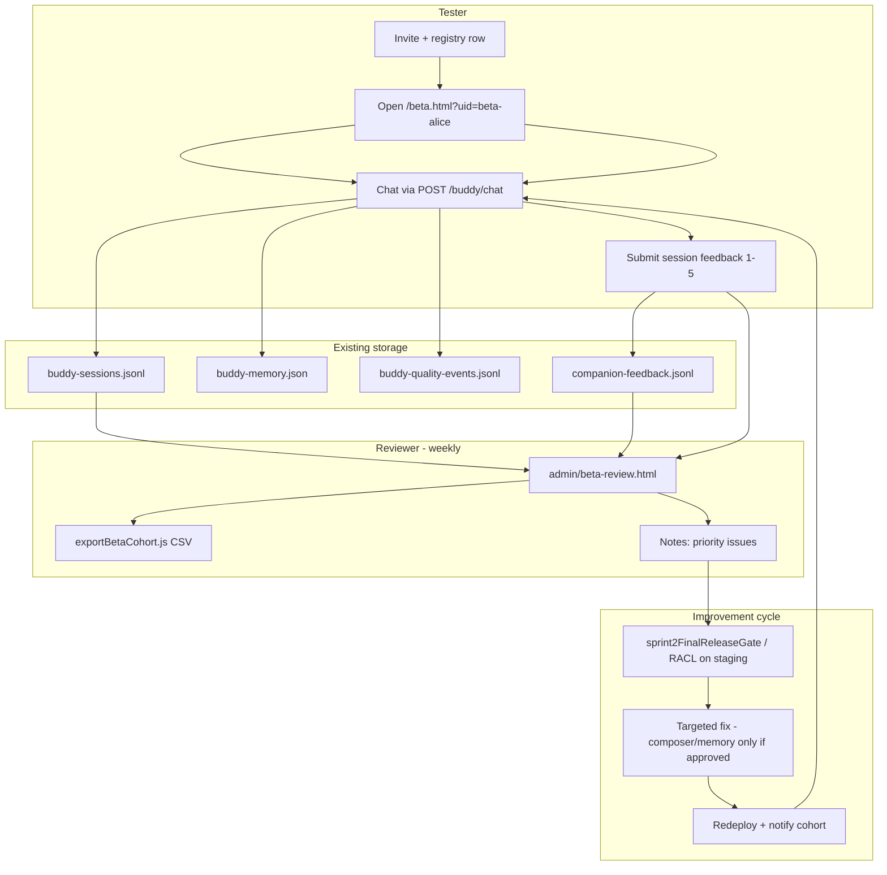

# Bible Buddy — Human Beta Enablement Implementation Plan

**Date:** 2026-06-01  
**Type:** Planning only (no code, deploy, push, or Sprint 3).  
**Basis:** [HumanBetaTestingInventoryAudit.md](./HumanBetaTestingInventoryAudit.md)  
**Constraints:** No redesign of Bible Buddy runtime, memory, composer, or doctrine. Extend and wire existing paths only.

---

## Principles

1. **Beta path = production path:** `POST /buddy/chat` → `buddyBrain.runBuddy` → `data/buddy-sessions.jsonl`.
2. **Identity = existing `userId`:** No new user database required for v1; add a small registry file for ops mapping only.
3. **Feedback = extend `companionIntelligence.recordCompanionFeedback` + jsonl** (not a new analytics platform).
4. **Review = read existing jsonl** behind auth; no new transcript store.
5. **Export = one Node script** over existing files; no ETL pipeline.
6. **Do not use** `lab.html` / `POST /api/ai/tester-chat` for beta cohort data.

---

## PART A — Beta-readiness checklist

### 1. Must have before beta

| # | Item | Why | Existing base |
|---|------|-----|----------------|
| M1 | **Stable per-tester `userId`** on every chat turn | Attribution in `buddy-sessions.jsonl` | `routes/buddy.js` already accepts `userId` |
| M2 | **Beta-only chat entry** (or fixed `chat.html`) | Today `chat.html` uses `chat-html-user` | `public/chat.html` |
| M3 | **Client `sessionId` per visit** passed into chat + feedback | Tie ratings to a session without new DB | Pattern in `public/js/lab.js` (`sessionId`) |
| M4 | **`sessionId` stored on session log lines** | Join feedback ↔ transcript | Extend `appendSession` payload only |
| M5 | **Post-session feedback UI** (1–5 × 5 + comment) | Human signal collection | Wire to `recordCompanionFeedback` |
| M6 | **HTTP route for beta feedback** | Function exists, not mounted | `services/companionIntelligence.js` |
| M7 | **Protect `data/` from public HTTP** | PII in jsonl; audit flagged static `/data` | `server.js` `express.static(DATA_DIR)` |
| M8 | **Ops beta tester registry** | Map real name ↔ `userId`, consent, cohort | New `data/beta-testers.json` (ops-maintained) |
| M9 | **Reviewer read API + minimal admin page** | Review without SSH | Read `buddy-sessions.jsonl` + `companion-feedback.jsonl` |
| M10 | **Beta ops runbook (1 page)** | Consent, incident, who reviews weekly | Markdown in `docs/beta/` |
| M11 | **Release gate green on deploy candidate** | No regressions while humans test | `scripts/sprint2FinalReleaseGate.js` |
| M12 | **Explicit beta runtime flag** | Avoid accidental `reason_first`/ECP in prod beta | Env: `BUDDY_RUNTIME=legacy` (document only) |

### 2. Should have before beta

| # | Item | Why | Existing base |
|---|------|-----|----------------|
| S1 | **Export script** (jsonl → CSV by cohort/date) | Weekly reviewer offline analysis | `buddy-sessions.jsonl`, `companion-feedback.jsonl` |
| S2 | **Simple auth on review/export** | Shared secret or basic admin gate | Admin static shell exists |
| S3 | **Mount broken admin API router** (optional) | `activity` 404 today | `admin/admin/routes/index.js` |
| S4 | **Consent checkbox on feedback submit** | Align with `learningSignals` policy | `consentForAggregateReview` field exists |
| S5 | **`recordCompanionEvent` on legacy path** (one call per turn) | Latency/error rollups in `buildTestingSummary` | Import in `buddyBrain.js`, unused |
| S6 | **Beta onboarding page** (`/beta` or query param) | Issue `userId`, store in `localStorage` | New thin HTML, copy from `chat.html` |
| S7 | **Cohort tag on session lines** | Filter `beta-2026-06` exports | Optional field on `appendSession` |
| S8 | **Weekly review cadence doc** | Who triages, SLA | Link to `buildTestingSummary()` output |

### 3. Nice to have later

| # | Item | Why defer |
|---|------|-----------|
| N1 | Postgres/Redis for sessions | 10–20 users fit file jsonl on single instance |
| N2 | Full review queue (assign, status, priority) | Spreadsheet + export sufficient for v1 |
| N3 | In-app human rubric scoring per turn | Automated `buddy-quality-events.jsonl` + free-text feedback enough |
| N4 | User self-service delete API | Manual ops delete by `userId` file edit until scale |
| N5 | Dashboard charts / Datadog | JSON + CSV weekly review |
| N6 | Email invite automation | Manual invite link with `?uid=` |
| N7 | Wire `POST /api/learning/signals` in parallel | Redundant if companion feedback extended |
| N8 | Multi-instance Render without sticky disk | Only if traffic &gt; one dyno |

---

## PART B — Smallest implementation design

### B.1 Tester registration

**Reuse:** None required in runtime; ops process + optional static registry.

**Design:**

- **Registry file:** `data/beta-testers.json`
  ```json
  {
    "cohort": "beta-2026-06",
    "testers": [
      { "userId": "beta-alice", "displayName": "Alice", "invitedAt": "...", "consentAt": null, "active": true }
    ]
  }
  ```
- **Registration flow (v1):** Ops adds row when invite sent. Tester opens **`/beta.html?uid=beta-alice`** (or enters code once); page validates `uid` against registry via **`GET /api/beta/whoami?uid=`** (read-only) or trusts query + stores in `localStorage`.
- **No accounts/passwords** for v1 — invite link + secret cohort URL is enough for 10–20 trusted users.

**Not building:** Sign-up DB, OAuth, email verification service.

---

### B.2 Tester identity

**Reuse:** `userId` in `POST /buddy/chat`; `buddy-memory.json` keyed by same id.

**Design:**

| Layer | Behavior |
|-------|----------|
| Client | `localStorage.bibleBuddyBetaUserId` set from onboarding |
| Chat | Every `fetch('/buddy/chat')` sends `{ userId, sessionId, betaCohort }` |
| Server | `routes/buddy.js` forwards `sessionId`, `betaCohort` to `runBuddy` → `appendSession` |
| Prefix | Require `beta-` prefix in registry validation (ops discipline) |

**Not building:** New identity service or profile schema changes.

---

### B.3 Transcript review

**Reuse:** `data/buddy-sessions.jsonl` as source of truth; read logic similar to `getRecentSessions` in `buddyBrain.js`.

**Design:**

- **Service:** `services/betaSessionReader.js` — functions: `listSessionsByUser(userId, limit)`, `listSessionsByCohort(cohort, since)`, `getSessionTurns(sessionId)`.
- **Route:** `routes/betaReview.js` (admin-only)
  - `GET /api/beta/review/sessions?userId=&since=`
  - `GET /api/beta/review/session/:sessionId`
- **UI:** `admin/beta-review.html` + `admin/js/beta-review.js` — table of testers from registry, click → turn list (message/reply/timestamp/quality.score).
- **Auth:** `Authorization: Bearer ${BETA_REVIEW_TOKEN}` or reuse env `ADMIN_REVIEW_TOKEN`; reject if missing.

**Not building:** New transcript database, search engine, or real-time websocket monitor.

---

### B.4 Feedback collection

**Reuse:** `recordCompanionFeedback` → `data/companion-feedback.jsonl`.

**Design:**

- **Extend entry shape** (backward compatible — new optional numeric fields):
  - `feltHeard`, `usefulness`, `biblicalFaithfulness`, `naturalness`, `wouldUseAgain` (each 1–5)
  - `comment` (maps to existing `issue` or new `comment` field)
  - `sessionId`, `userId`, `betaCohort`, `consentForAggregateReview`
- **Route:** `POST /api/beta/feedback` → calls `recordCompanionFeedback` (thin wrapper in `routes/betaFeedback.js`).
- **UI:** Modal or panel on `beta.html` / end of `chat.html` after N turns or explicit “End session” — five 1–5 controls + optional textarea + consent checkbox.

**Alternative avoided:** Building a separate feedback store; duplicating `learning-signals.jsonl` unless ops want aggregate-only signals later (S8 optional).

---

### B.5 Export

**Reuse:** Files on disk; no `csv-parse` write needed (manual string join is fine for v1).

**Design:**

- **Script:** `scripts/exportBetaCohort.js`
  - Args: `--cohort beta-2026-06`, `--since 2026-06-01`, `--out docs/beta/exports/`
  - Reads: `beta-testers.json`, `buddy-sessions.jsonl`, `companion-feedback.jsonl`
  - Writes: `sessions.csv`, `feedback.csv`, optional `sessions-by-user.json` bundle
- **Optional admin:** `GET /api/beta/review/export?cohort=` same logic, returns CSV attachment (should-have S1).

**Not building:** Scheduled ETL, S3 pipeline, or BI tool integration.

---

### B.6 Security minimum (bundled with above)

| Change | File |
|--------|------|
| Remove or gate `app.use('/data', express.static(DATA_DIR))` | `server.js` |
| Never expose jsonl via public URL | Deploy checklist |

---

## PART C — Exact implementation tasks

Effort: **S** ≤ half day, **M** ~1 day, **L** &gt;1 day. Risk: **Low / Med / High**.

### Phase 0 — Ops-only (no code) — can start beta in dev immediately

| ID | Task | File(s) | Effort | Risk | Dependencies |
|----|------|---------|--------|------|--------------|
| P0-1 | Write beta runbook (invite, consent script, review weekly) | `docs/beta/BetaOpsRunbook.md` | S | Low | Audit |
| P0-2 | Create cohort registry for 10–20 testers | `data/beta-testers.json` | S | Low | P0-1 |
| P0-3 | Verify gate on deploy branch | `scripts/sprint2FinalReleaseGate.js` | S | Low | CI |
| P0-4 | Manual curl/chat with unique `userId` (prove storage) | — | S | Low | Deploy |

### Phase 1 — Must-have wiring (minimum beta)

| ID | Task | File(s) | Effort | Risk | Dependencies |
|----|------|---------|--------|------|--------------|
| T1 | Add `sessionId`, `betaCohort` to `appendSession` entry | `services/buddyBrain.js` | S | Low | — |
| T2 | Accept `sessionId`, `betaCohort` in chat route → `runBuddy` | `routes/buddy.js`, `services/buddyBrain.js` (param pass-through) | S | Low | T1 |
| T3 | Beta onboarding + chat page with `localStorage` userId | `public/beta.html` (or `public/chat.html` patch) | M | Low | P0-2 |
| T4 | Extend `recordCompanionFeedback` for 1–5 rubric fields | `services/companionIntelligence.js` | S | Low | — |
| T5 | `POST /api/beta/feedback` route + mount | `routes/betaFeedback.js`, `server.js` | S | Low | T4 |
| T6 | Post-session feedback UI (5 ratings + comment + consent) | `public/beta.html` or shared `public/js/beta-feedback.js` | M | Low | T5, T3 |
| T7 | Disable public static `/data` or restrict to non-PII files | `server.js` | S | **Med** (break if something relied on `/data`) | Audit deploy |
| T8 | `betaSessionReader` read helpers | `services/betaSessionReader.js` | M | Low | T1 |
| T9 | Review API with token auth | `routes/betaReview.js`, `server.js` | M | Med | T8, T7 |
| T10 | Minimal review HTML | `admin/beta-review.html`, `admin/js/beta-review.js` | M | Low | T9, P0-2 |
| T11 | Optional registry validate endpoint | `routes/betaRegistry.js` → read `beta-testers.json` | S | Low | P0-2 |
| T12 | Call `recordCompanionEvent` once per `runBuddy` success | `services/buddyBrain.js` | S | Low | — |

### Phase 2 — Should-have (first week of beta)

| ID | Task | File(s) | Effort | Risk | Dependencies |
|----|------|---------|--------|------|--------------|
| T13 | Export cohort script | `scripts/exportBetaCohort.js` | M | Low | T1, T4, P0-2 |
| T14 | `GET /api/beta/review/export` (CSV download) | `routes/betaReview.js` | S | Med | T13, T9 |
| T15 | Mount `admin/admin/routes/index.js` at `/admin/api` | `server.js` | S | Low | — |
| T16 | Document env vars | `docs/beta/Environment.md` | S | Low | T9 (`BETA_REVIEW_TOKEN`) |
| T17 | Extend `buildTestingSummary` for 1–5 averages | `services/companionIntelligence.js` | S | Low | T4 |

### Phase 3 — Nice to have (post-beta)

| ID | Task | File(s) | Effort | Risk | Dependencies |
|----|------|---------|--------|------|--------------|
| T18 | Delete-by-userId script | `scripts/purgeBetaUserData.js` | M | Med | Legal review |
| T19 | Review queue statuses in json | `data/beta-review-queue.json` | M | Low | T10 |
| T20 | Postgres adapter | new module | L | High | Infra decision |

**Suggested implementation order:** P0 → T7 → T1–T2 → T3 → T4–T6 → T8–T11 → T10 → T12 → (beta start) → T13–T17.

**Total must-have engineering:** ~**4–6 person-days** (one developer, focused, no composer/memory changes).

---

## PART D — Feedback protocol

### When to show

- After tester taps **“End session”**, or after **≥3 turns** in one browser session (configurable in UI).
- Not after every single turn (reduces fatigue).

### Copy (short)

> Your feedback helps us improve Bible Buddy. Ratings are reviewed in aggregate. Conversations are stored on our server for quality review. By submitting, you consent to aggregate review (not public sharing).

### Fields (1–5 each, required unless noted)

| # | Label | Maps to storage |
|---|--------|-----------------|
| 1 | **Felt heard** | `feltHeard` (1–5) |
| 2 | **Usefulness** | `usefulness` (1–5) |
| 3 | **Biblical faithfulness** | `biblicalFaithfulness` (1–5) |
| 4 | **Naturalness** | `naturalness` (1–5) |
| 5 | **Would use again** | `wouldUseAgain` (1–5) |
| — | **Comment** (optional, max 800 chars) | `comment` or `suggestion` |
| — | **Consent** (required checkbox) | `consentForAggregateReview: true` |

### Request payload (example)

```json
{
  "userId": "beta-alice",
  "sessionId": "sess-abc123",
  "betaCohort": "beta-2026-06",
  "feltHeard": 4,
  "usefulness": 5,
  "biblicalFaithfulness": 5,
  "naturalness": 4,
  "wouldUseAgain": 4,
  "comment": "Felt warm on grief turn; wanted more Scripture on job thread.",
  "consentForAggregateReview": true
}
```

### Storage record (`data/companion-feedback.jsonl`)

One line per submission, e.g.:

```json
{
  "sessionId": "sess-abc123",
  "userId": "beta-alice",
  "betaCohort": "beta-2026-06",
  "feltHeard": 4,
  "usefulness": 5,
  "biblicalFaithfulness": 5,
  "naturalness": 4,
  "wouldUseAgain": 4,
  "comment": "...",
  "consentForAggregateReview": true,
  "createdAt": "2026-06-01T12:00:00.000Z",
  "privacy": { "aggregateReview": true, "rawConversationStored": false }
}
```

### Join rule (session ↔ feedback ↔ turns)

| Key | On feedback | On each chat turn (`buddy-sessions.jsonl`) |
|-----|-------------|---------------------------------------------|
| `sessionId` | Required | Required (after T1) |
| `userId` | Required | Already present |
| `createdAt` | Auto | Auto |

Reviewer filters turns: `entry.sessionId === feedback.sessionId`.

### Legacy field mapping (optional)

For compatibility with `buildTestingSummary`, map for aggregates only:

- `feltHeard` ≥ 4 → `feltUnderstood: true`
- `usefulness` ≥ 4 → `helpful: true`
- `biblicalFaithfulness` ≤ 2 → flag in weekly notes (no auto doctrine action)

**No composer or doctrine changes** from feedback in v1 — human review only.

---

## PART E — Reviewer workflow



### Role responsibilities

| Role | Action | Tool |
|------|--------|------|
| **Ops** | Maintain `beta-testers.json`, send links, record consent date | Spreadsheet + json |
| **Tester** | Chat + end-of-session feedback | `beta.html` |
| **Reviewer** (1–2 people) | Scan low scores, read comment, open transcript by `sessionId` | `beta-review.html` |
| **Engineering** | Fix regressions; run gate before redeploy | Existing scripts |
| **Product/theology** | Escalate biblical faithfulness ≤ 2 | Manual flag in review notes |

### Weekly review checklist (15–30 min for 10–20 users)

1. Export or open review UI filtered to last 7 days.
2. Sort feedback by lowest `feltHeard` or `biblicalFaithfulness`.
3. Open linked `sessionId` transcript (3–10 turns typical).
4. Cross-check `buddy-quality-events.jsonl` auto score if present.
5. Log action items in `docs/beta/ReviewLog-YYYY-MM-DD.md` (new file per week, ops only).
6. Run `companionIntelligenceValidationSuite` or release gate if shipping a fix.

**Explicitly out of scope for v1 workflow:** Auto-tuning composer from feedback, ML training, public leaderboard.

---

## PART F — Go / No-Go recommendation

### Can Bible Buddy begin a controlled 10–20 user beta after these changes?

**Yes — Go**, with conditions.

**Blocker today (without changes):** Not architectural. The runtime already stores conversations. The gaps are **operational wiring** (shared `userId`, public `data/`, no feedback HTTP/UI, no reviewer surface). None require redesigning memory, composer, or doctrine.

**Cannot responsibly start** a *monitored* beta without at least **Phase 1 must-haves (M1–M11)** — especially **M7** (secure data), **M3–M6** (session + feedback), **M2/M8** (identity + registry), **M9** (review).

### Minimum implementation required (smallest Go package)

| # | Deliverable | Tasks |
|---|-------------|-------|
| 1 | Per-tester identity in UI | T3, P0-2, T11 optional |
| 2 | `sessionId` on turns | T1, T2 |
| 3 | Feedback API + UI | T4, T5, T6 |
| 4 | Secure transcripts | T7 |
| 5 | Reviewer read UI | T8, T9, T10 |
| 6 | Ops runbook + registry | P0-1, P0-2 |
| 7 | Gate verified on build | P0-3 |

**Optional for Go but strongly recommended before first prod tester:** T12 (events), T13 (export), T7 verification on Render.

### No-Go scenarios (only if true)

| Blocker | Mitigation |
|---------|------------|
| Deploy cannot persist `data/` between restarts | Use Render disk or accept “sessions lost on redeploy” for dev-only beta |
| OpenAI key missing on prod | Fix env before invite |
| Refuse to remove public `/data` | **No-Go for real users** — PII exposure |
| Testers forced through `lab.html` | **No-Go for cohort metrics** — use `beta.html` only |

### Staged Go recommendation

| Stage | Who | Requirements |
|-------|-----|----------------|
| **Go-0 (internal)** | 2–3 team members | P0 + manual `userId` via curl; SSH jsonl review |
| **Go-1 (closed beta)** | 10–20 invited | Full Phase 1 (T1–T12, P0) |
| **Go-2 (comfortable ops)** | Same cohort scaled | Phase 2 (T13–T17) |

---

## Summary

| Area | Approach |
|------|----------|
| Registration | `data/beta-testers.json` + invite URL |
| Identity | Existing `userId` + `localStorage` |
| Transcripts | Existing `buddy-sessions.jsonl` + `sessionId` |
| Feedback | Extend `recordCompanionFeedback` + `POST /api/beta/feedback` |
| Export | `scripts/exportBetaCohort.js` |
| Review | Thin read API + `admin/beta-review.html` |
| Improvement | Existing release gate + human triage |

**Do not build for v1:** New DB, queue product, composer feedback loop, CSV platform, or Sprint 3 scope.

---

## Related documents

- [HumanBetaTestingInventoryAudit.md](./HumanBetaTestingInventoryAudit.md)
- [docs/sprint213/MemoryPersistenceAudit.md](./docs/sprint213/MemoryPersistenceAudit.md) (storage caps)
- [BetaReadinessRootCauseAudit.md](./BetaReadinessRootCauseAudit.md) (listening/runtime context)
