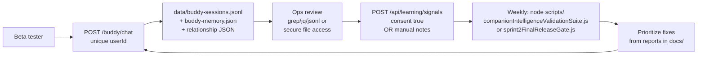

# Bible Buddy — Human Beta Testing Inventory Audit

**Date:** 2026-06-01  
**Scope:** Full-repository inventory (audit only). No code changes, deploy, or new architecture proposed.  
**Assumption for Parts D–E:** Beta testers use production path `POST /buddy/chat` (`routes/buddy.js` → `services/buddyBrain.js`), default `BUDDY_RUNTIME=legacy` unless ops sets `reason_first`.

---

## Executive summary

The repo has **strong automated validation** (HTTP suites, release gate, RACL/reason-first benchmarks) and **server-side conversation logging** (`data/buddy-sessions.jsonl` + memory JSON). It has **weak human-beta operations**: no conversation review UI, no session export/CSV pipeline, companion feedback APIs exist in code but are **not HTTP-mounted**, and the admin dashboard does not surface buddy transcripts. A 10–20 person beta is **technically storable today** if each tester gets a stable `userId`; **review, scoring, and export** are mostly manual file/ops work unless small wiring is added later (listed in Part E as gaps only).

---

## PART A — Validation systems

### A.1 Release gates and CI

| System | Purpose | Inputs | Outputs | Files generated |
|--------|---------|--------|---------|-----------------|
| `scripts/sprint2FinalReleaseGate.js` | Blocks “release ready” when any suite fails or score &lt; 95 | Spawns 5 child scripts (master runtime, meta-question, reasoning-first thread, active conversation, companion intelligence) | `docs/release-gate/latest-gate-results.json`; console tail per suite | `docs/release-gate/latest-gate-results.json` |
| `.github/workflows/companion-release-gate.yml` | CI on push/PR to main/master | Same gate script on GitHub runner | Artifact upload of gate JSON | `docs/release-gate/latest-gate-results.json` (artifact) |

**Policy (gate script):** `autoModifyCode: false`, `blockReleaseOnFailure: true`, min score 95.

---

### A.2 Sprint / production HTTP acceptance suites

These POST to `/buddy/chat` (local `runBuddy` or remote `DEPLOY_URL`).

| Script | Purpose | Inputs | Outputs | Files generated |
|--------|---------|--------|---------|-----------------|
| `scripts/sprint214AcceptanceHttp.js` | Sprint 2.14 companion acceptance (memory, warmth, listening, continue study) | Fixed test messages, `userId` prefix | Pass/fail per test, category scores | `docs/sprint214/acceptance-results.json` |
| `scripts/sprint214bSabbathHistoryHttp.js` | Sabbath history depth | Sabbath thread messages | Scoring object | `docs/sprint214b/sabbath-history-depth-results.json` |
| `scripts/sprint214cNaturalReasoningHttp.js` | Natural reasoning restoration | Meta/historical prompts | Scoring object | `docs/sprint214c/natural-reasoning-results.json` |
| `scripts/sprint214dActiveConversationHttp.js` | Active conversation integrity (60m window) | Multi-turn threads | Per-turn results | `docs/sprint214d/active-conversation-results.json` |
| `scripts/sprint2FinalMasterRuntimeHttp.js` | Master runtime stabilization | Named scenarios (Sabbath, grief, etc.) | `evaluate` / `scoreResults` | `docs/sprint2final/master-runtime-results.json` |
| `scripts/sprint2FinalBMetaQuestionHttp.js` | Meta-question / transparency | Press-back prompts | Category scores | `docs/sprint2finalb/meta-question-results.json` |
| `scripts/sprint2FinalCReasoningFirstHttp.js` | Reasoning-first thread | Long Sabbath correction thread | Route previews | `docs/sprint2finalc/reasoning-first-thread-results.json` |
| `scripts/sprint214ProductionAcceptance.js` | Production smoke (10 tests) | `DEPLOY_URL` / `RENDER_URL` | Scorecard | `docs/sprint214/acceptance-results.json` (when run) |
| `scripts/sprint213AcceptanceHttp.js` | Sprint 2.13 acceptance | HTTP to deploy | JSON under `docs/sprint213/` | `docs/sprint213/acceptance-results.json` |
| `scripts/sprint2DeployValidation.js` | Deploy/route validation | Deploy URL | Markdown reports in `docs/precommit/`, `docs/sprint2deployment/` | Various `.md` audit files |

---

### A.3 Unified / aggregated validation

| Script | Purpose | Inputs | Outputs | Files generated |
|--------|---------|--------|---------|-----------------|
| `scripts/companionIntelligenceValidationSuite.js` | Aggregates 214 + 214B + 214C into intelligence dimensions | Child suite JSON | Overall/min category; gate `COMPANION_INTEL_MIN_SCORE` (default 95) | `docs/companion-intelligence/validation-results.json`; optional markdown report via suite |
| `services/companionIntelligence.js` → `buildCompanionIntelligence()` | **Schema/metadata** for testing phases and admin outputs (not a runner) | Optional `includeSummary` | Config object + optional `buildTestingSummary()` | Reads `data/companion-intelligence-events.jsonl`, `data/companion-feedback.jsonl` when summary requested |

---

### A.4 Reason-first / listening benchmark runners (synthetic threads)

| Script | Purpose | Inputs | Outputs | Files generated |
|--------|---------|--------|---------|-----------------|
| `scripts/reasonFirstMigration.js` | A/B legacy vs `reason_first`; OpenAI/template/listening gates | 6 fixed threads, `OPENAI_API_KEY` for reason_first | Report + JSON | `ReasonFirstMigrationReport.md`, `docs/reason-first-migration/validation-results.json` |
| `scripts/raclValidation.js` | RACL architecture validation (reason_first only) | Same thread corpus + retrieval pack metrics | Report + JSON | `RACLImplementationReport.md`, `docs/racl/validation-results.json` |
| `scripts/emotionalCenterPreservationValidation.js` | ECP A/B (control vs `BUDDY_ECP=1`) | RACL corpus | Report + JSON | `EmotionalCenterPreservationReport.md`, `docs/emotional-center-preservation/results.json` |
| `scripts/goldenCompanionExamplesValidation.js` | Golden exemplars (`BUDDY_EXAMPLES=golden`) | RACL corpus | Report + JSON | `GoldenCompanionExamplesReport.md`, `docs/golden-companion-examples/results.json` |
| `scripts/companionTurnIntentValidation.js` | Turn-intent experiment gate | Experiment runtime | Markdown + JSON | `CompanionTurnIntentImplementationReport.md`, `docs/companion-turn-intent/validation-results.json` |
| `scripts/companionConversationExperiment.js` | Conversation-shape / listening experiments | Configurable threads | JSON | `docs/companion-conversation-experiment/results.json` |
| `scripts/promptHierarchyExperiment.js` | Prompt hierarchy conflicts | Many variants | JSON | `docs/prompt-hierarchy-experiment/results.json` |
| `scripts/companionOperatingModelExperiment.js` | Operating-model variants | Threads | JSON | `docs/companion-operating-model/results.json` |
| `scripts/responseStructureRemovalExperiment.js` | Structure removal A/B | Threads | JSON | `docs/response-structure-removal/results.json` |
| `scripts/reasonFirstLiteExperiment.js` | Lite runtime compare | Threads | JSON | `docs/reason-first-lite-experiment/results.json` |
| `scripts/shadowRuntimeComparison.js` | Shadow vs primary | Threads | JSON | `docs/shadow-runtime/comparison-results.json` |
| `scripts/bibleBuddyLiteBaselineExperiment.js` | Lite baseline | Threads | JSON | `docs/baseline-experiment/results.json` |

**Scoring note:** RACL/reason-first scripts use **listening 1–10** (and OpenAI %, template %). Companion intelligence suite uses **0–100 category scores** with min gate 95 — different rubric than RACL.

---

### A.5 In-process validators (runtime, not full suites)

| Module | Purpose | When used |
|--------|---------|-----------|
| `services/doctrineBoundaryValidator.js` | Doctrine/safety boundary on composed reply | `reason_first` path |
| `services/emotionalCenterValidator.js` | ECP soft/hard checks on opening vs emotional center | `BUDDY_ECP=1` |
| `services/companionPostureValidator.js` | Companion posture rules | Turn-intent / experiment paths |
| `services/listeningSpecificityValidator.js` | Listening specificity heuristics | Experiments / quality |
| `services/answerMatchGate.js` | Answer-match / intent alignment | Registry / grounded responders |
| `services/answerVerifier.js` | Answer verification | Meta-question flows |
| `render/runtimeValidationHooks.js` | Module load flags for deploy | Render hook only |

---

### A.6 Automated test harnesses (`tests/`)

| File | Purpose |
|------|---------|
| `tests/sprint2FinalVerification.js` | Sprint 2 final verification |
| `tests/openaiProductionSmokeTest.js` | OpenAI production smoke |
| `tests/sprint2RepairRoute.test.js` | Repair route regression |
| `tests/postSprint2FinalPolish.test.js` | Post-final polish |
| `tests/phase2Sprint*.test.js` | Phase 2 sprint unit tests |
| `tests/doctrineReplay.test.js`, `doctrineContinuityRegression.test.js`, `continuityRegression.test.js` | Doctrine/continuity regression |
| `tests/automatedDoctrineQaHarness.js` | Doctrine QA harness |

**Run:** `node tests/<file>.js` or project test convention (no `npm test` script in `package.json`).

---

### A.7 Trace / quality logging (validation-adjacent)

| System | Purpose | Storage |
|--------|---------|---------|
| `services/reasonFirstTrace.js` | Template vs prose breakdown for reason_first | `data/reason-first-trace.jsonl` (append) |
| `buddyBrain.appendQualityEvent` | Per-turn quality score/issues | `data/buddy-quality-events.jsonl` |
| `services/runtimeOrchestrator.scoreCompanionQuality` | In-process quality score on each turn | Fed into QA jsonl |

---

### A.8 Markdown audit reports (human-written evidence, not runners)

Examples: `CompanionIntelligenceValidationReport.md`, `BetaReadinessRootCauseAudit.md`, `ListeningScoreAudit.md`, `docs/precommit/PreCommitScorecard.md`, `docs/sprint213/MemoryPersistenceAudit.md`, sprint deployment audits under `docs/sprint2deployment/`. These document past runs; they do not execute validation.

---

## PART B — Conversation storage systems

All paths under `data/` unless noted. **Retention:** most files are **append-only or rolling caps with no TTL purge** (disk grows until manual cleanup). **Render/ephemeral disk:** data is process-local unless external DB is configured (not present in this repo).

### B.1 Chat history (full turns)

| System | Where stored | Format | Retention behavior |
|--------|--------------|--------|-------------------|
| `buddyBrain.appendSession` | `data/buddy-sessions.jsonl` | JSONL: `userId`, `mode`, `message`, `reply`, `structured`, `safety`, `runtime`, `quality`, `createdAt` | Append-only file; in-process `RECENT_SESSION_CACHE` last **12** turns per `userId`; `getRecentSessions` reads last **8** from file on cold start |
| `server.js` | `app.use('/data', express.static(DATA_DIR))` | HTTP static serve of entire `data/` | **Security:** transcripts reachable if server exposed and filenames known |

**Production UI:** `public/chat.html` uses fixed `userId: 'chat-html-user'` (all generic chat users collapse to one id unless changed).

---

### B.2 Memory storage (summaries, not full transcript archive)

| System | File | Format | Retention |
|--------|------|--------|-----------|
| `buddyBrain.updateUserMemory` | `data/buddy-memory.json` | Per-user `profile`, `summaries[]`, `lastEmotion`, `lastTopics` | Last **30** summaries per user |
| `continuityMemoryRuntime` | `data/continuity-memory.json` | Continuity snapshots | Documented in sprint213 audit |
| `activeConversationManager` | `data/active-conversation-state.json` | Live thread topic/subtopic; **not** long-term memory | **60 minutes** active window per user |
| `runtimeConversationStateEngine` | `data/runtime-conversation-state.json` | Conversation state engine | Sync read/write |
| `companionLearningLayer` | `data/companion-learning-profiles.json` | Learning profiles | Per-user learning record |
| `open-loops`, `emotional-arc`, `life-timeline` | `data/open-loops-memory.json`, `data/emotional-arc-memory.json`, `data/life-timeline-memory.json` | Structured memory facets | File-based, no TTL in code |

---

### B.3 User profile storage

| System | File | Format | Retention |
|--------|------|--------|-----------|
| `getUserCompanionProfile` | `data/buddy-memory.json` → `store[userId].profile` | Scripture depth, tone, reminder style, flags | Merged with `DEFAULT_COMPANION_PROFILE`; persists until file edit |
| `companion-learning-profiles.json` | Same dir | Companion learning preferences | Updated on learning events |

---

### B.4 Relationship intelligence storage

| System | File | Format | Retention |
|--------|------|--------|-----------|
| `relationshipMemoryBridge` → `runtimeRelationshipMemoryEngine` | `data/runtime-relationship-memory.json` | Tiered relationship facts (grief, health, prayer, etc.) | Max **500** stored, **80** after ranking (per `docs/sprint213/MemoryPersistenceAudit.md`) |
| `runtimePersonalityContinuity` | `data/runtime-personality-continuity.json` | Personality continuity | File-based |
| `runtimePrayerContinuityEngine` | `data/runtime-prayer-continuity.json` | Prayer continuity | Last **300** per user |
| `continuityStudySessionRuntime` | `data/continuity-study-sessions.json`, `data/buddy-study-continuity.json` | Study sessions | Last **250** sessions per user (audit doc) |
| `runtime-line-upon-line-traversal.json` | Study traversal state | JSON | File-based |

---

### B.5 Admin / review / signals storage (not full chat by default)

| System | File | Format | Retention |
|--------|------|--------|-----------|
| `companionIntelligence.recordCompanionEvent` | `data/companion-intelligence-events.jsonl` | Metadata: latency, mode, safety; **`rawConversationStored: false`** | Append; read last 250 for summary |
| `companionIntelligence.recordCompanionFeedback` | `data/companion-feedback.jsonl` | Thumbs-style booleans + issue/suggestion text | Append; no HTTP route in `server.js` |
| `routes/learningSignals.js` | `data/learning-signals.jsonl` | Opt-in aggregate signals (`consent: true` required) | Append; no raw conversation |
| `buddyBrain.appendQualityEvent` | `data/buddy-quality-events.jsonl` | `score`, `issues`, intent/emotion | Append-only |
| `companionIntelligence` (events) | `data/companion-events.jsonl` | (if written by other paths) | Check file presence on deploy |
| Admin module (unmounted router) | `data/activity.json`, `data/dismisses.json`, `data/rbac.json` | Admin UI actions, not buddy chat | JSON arrays |
| `contentInsight` | No dedicated transcript store | Analyzes notes/images via OpenAI | Returns API response only |
| `reason-first-trace.jsonl` | Reason-first diagnostics | JSONL | Append |

**Important:** `recordCompanionEvent` is wired in `reasonFirstBuddyRuntime` and `masterBuddyRuntime`, but **`buddyBrain.js` imports it and does not call it** on the main `runBuddy` return path. Legacy/default beta traffic may **not** populate `companion-intelligence-events.jsonl` unless runtime routes through master/reason-first helpers that call it.

---

## PART C — Existing human-review capabilities

| Capability | Exists? | Notes |
|------------|---------|-------|
| **Admin console** (`/admin`, `admin/index.html`, `admin/js/dashboard.js`) | Partial | Self-test, providers, AI helper cards. **Does not list buddy sessions or transcripts.** |
| **Admin activity log** (`admin/activity.html`, `admin/js/activity.js`) | Partial | Expects `GET /admin/api/activity` — router in `admin/admin/routes/index.js` is **not mounted** in `server.js` (only `/admin/api/selftest` and `/admin/api/providers` are). Activity API likely **404** in current server. |
| **Admin content review** (`POST /admin/content/analyze-note`, `analyze-image`) | Yes | For tester notes/outlines/images, **not** live buddy chat threads. Tags like `tester` supported in API. |
| **Admin assistant** (`GET /admin/project-brain`, `POST /admin/assistant`) | Yes | Project snapshot for human paste into external tools; not conversation queue. |
| **Tester lab** (`public/lab.html`, `public/js/lab.js`) | Yes | `POST /api/ai/tester-chat` — **raw OpenAI**, bypasses `runBuddy` / memory / session log. Not suitable as beta production path. |
| **Review queues** | No | No queue DB or assignment workflow. |
| **Conversation dashboard** | No | No UI over `buddy-sessions.jsonl`. |
| **CSV generation** | No | `csv-parse` in `package.json` but **no `.js` usage** found for export. |
| **Markdown/JSON reports** | Yes | Many under `docs/` and repo root (`*Report.md`, `*Audit.md`) from automated suites — synthetic threads, not beta cohort. |
| **Resource ingestion review** (`services/resourceIngestionReview.js`) | Spec only | Workflow description for uploaded resources, not user chat. |
| **Static data directory** | Yes (risk) | `GET /data/...` can expose jsonl/json if deployed without access control. |
| **Companion feedback summary** | Code only | `buildTestingSummary()` aggregates jsonl files; **no public API** exposing it. |
| **Learning signals endpoint** | Yes | `POST /api/learning/signals` with consent — **not wired** in `chat.html` / `lab.js` from grep. |

---

## PART D — Can a beta tester conversation currently be…?

Assumption: tester uses **`POST /buddy/chat`** with a **unique stable `userId`** (not default `anonymous` or shared `chat-html-user`).

| Capability | Answer | Evidence |
|------------|--------|----------|
| **1. Stored** | **Yes** | Every `runBuddy` completion calls `appendSession` → `data/buddy-sessions.jsonl` (+ memory side effects). |
| **2. Reviewed later** | **Partial → treat as Yes with manual ops** | Transcripts exist in jsonl; no productized review UI. Ops can read/filter by `userId` on server filesystem or via static `/data` (not recommended without auth). |
| **3. Scored** | **Partial** | **Automated:** in-process `quality.score` → `buddy-quality-events.jsonl`. **Human rubric:** no UI. **Batch listening scores:** only synthetic scripts (RACL, etc.), not wired to real `userId` sessions. |
| **4. Exported** | **No** (first-class) | No export script, CSV, or admin download. Manual copy of jsonl lines only. |

If tester uses **`lab.html` / tester-chat** or shared **`chat-html-user`**: stored/scored/reviewed **unreliably or conflated** → effectively **No** for cohort analysis.

---

## PART E — Human beta readiness (10–20 users)

**Already sufficient for a minimal closed beta (with ops discipline):**

- Chat endpoint and session logging
- Per-user memory and relationship files (when `userId` is stable)
- Opt-in learning signals API (`POST /api/learning/signals`)
- Automated regression suites for post-change verification (not per-tester)
- Precommit/deploy markdown checklists

**Truly missing for a *real* human beta (only gaps):**

1. **Beta tester registry** — no canonical list mapping real person → `userId`, consent, cohort tag.
2. **Enforced per-tester `userId` in production UI** — `chat.html` hardcodes one id; easy to lose attribution.
3. **HTTP surface for companion feedback** — `recordCompanionFeedback` exists but no route; feedback jsonl stays empty without custom script.
4. **In-app feedback UI** wired to `/api/learning/signals` or companion feedback (post-session thumbs + free text).
5. **Conversation review dashboard** — browse/filter `buddy-sessions.jsonl` by `userId`, date, `admin_flags`, safety — without SSH/file access.
6. **Secure access to transcripts** — static `/data` is unsafe for production beta; need auth or disable static serve for PII.
7. **Export pipeline** — jsonl/CSV export by cohort for offline review (no implementation found).
8. **Human scoring workflow** — link a reviewed turn to reviewer notes and priority (no queue).
9. **Durable multi-instance storage** — file-based `data/` on single Render instance; no Postgres/Redis conversation store in repo.
10. **Retention / deletion policy implementation** — privacy flags claim `canDeleteOnUserRequest` on learning signals but no delete-by-`userId` API for sessions/memory.
11. **Cohort tagging in session log** — no `betaCohort`, `buildLabel`, or `testerVersion` field in `appendSession` payload.
12. **Reliable companion event telemetry on legacy path** — `recordCompanionEvent` not called from main `buddyBrain` path; weekly summary undercounts unless fixed or ops accept session jsonl only.

*Not listed as missing (already exist in some form):* automated validation runners, quality jsonl, memory persistence, admin ops shell, content-note analysis for qualitative feedback outside chat.

---

## PART F — Recommended beta workflow (existing systems only)

### Step-by-step (no new architecture)

| Step | Actor | Action | Existing system |
|------|--------|--------|-----------------|
| 1 | Ops | Assign each tester `userId` (e.g. `beta-alice-2026-06`) and document in spreadsheet | Convention only |
| 2 | Tester | Chat via app or curl against `/buddy/chat` with that `userId` | `routes/buddy.js` |
| 3 | Storage | Server appends turn | `data/buddy-sessions.jsonl`, memory files |
| 4 | Review | Ops filters jsonl by `userId`; optional read `buddy-quality-events.jsonl` for scores | Filesystem / jq |
| 5 | Feedback | Tester submits opt-in signal after session | `POST /api/learning/signals` `{ consent: true, helpful, issue, suggestion }` → `learning-signals.jsonl` |
| 6 | Qualitative | Tester sends outline/screenshot | `POST /admin/content/analyze-note` with `tags: ["tester"]` |
| 7 | Improvement cycle | After code changes, run gate locally/CI | `scripts/sprint2FinalReleaseGate.js`, RACL if on `reason_first` staging |
| 8 | Evidence | Compare to baseline JSON | `docs/racl/validation-results.json`, `docs/companion-intelligence/validation-results.json` |

### Explicitly avoid for beta cohort metrics

- `public/lab.html` / `POST /api/ai/tester-chat` (not `runBuddy`, no session alignment).
- Shared `userId` in `chat.html` without change.
- Treating automated RACL listening **6.4** as per-tester score (synthetic corpus only).

### Optional env for staging subset only

- `BUDDY_RUNTIME=reason_first` for testers on candidate runtime — still logs to same jsonl; trace in `reason-first-trace.jsonl`. Production default remains **legacy** per project policy.

---

## Appendix — Quick reference: `data/` files relevant to beta

| File | Role |
|------|------|
| `buddy-sessions.jsonl` | **Primary transcript log** |
| `buddy-memory.json` | User profile + summaries |
| `buddy-quality-events.jsonl` | Automated per-turn quality |
| `runtime-relationship-memory.json` | Relationship recall |
| `companion-feedback.jsonl` | Human feedback (if populated) |
| `companion-intelligence-events.jsonl` | Session metadata events |
| `learning-signals.jsonl` | Opt-in aggregate feedback |
| `active-conversation-state.json` | 60m active thread |
| `reason-first-trace.jsonl` | Reason-first diagnostics |

---

## Audit constraints observed

- No code changes, implementation, deploy, push, or Sprint 3 work performed.
- Inventory derived from repository search and file reads on 2026-06-01.
