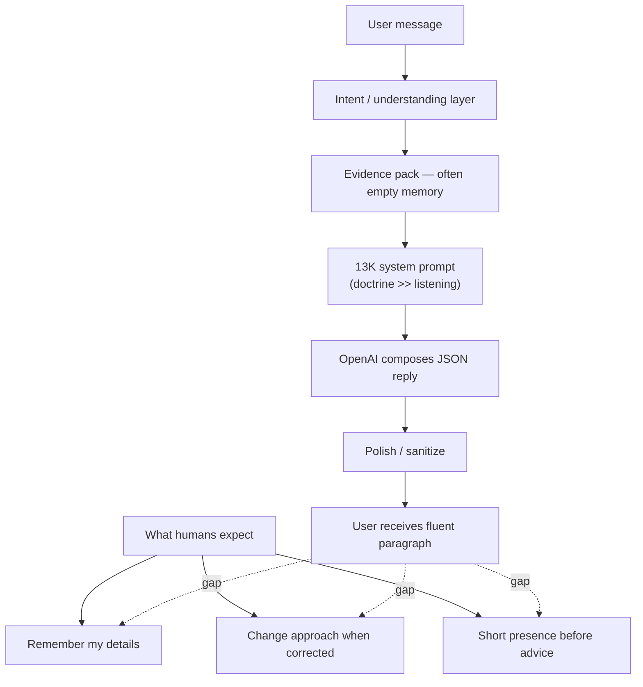

# Human Conversation Gap Report

**Question:** If OpenAI is composing 100% of replies, why does the conversation still feel robotic?

**Short answer:** OpenAI ownership solved *who generates text*, not *what shapes the conversation*. The reason-first path still feeds the model a ~13K-character legacy instruction stack, empty memory, thin scripture evidence, and no loop-breaking contract. The model reliably produces polite, doctrinally safe, structurally uniform paragraphs — which humans read as "template," not "presence."

---

## Validation Snapshot

| Metric | Legacy | Reason-first |
|--------|--------|--------------|
| OpenAI usage | 0% | **100%** |
| Template prose | 4.1% | 0.1% |
| Listening (heuristic) | 5.7 | **5.8** |
| Release gate | — | **FAIL** (need ≥7) |

The +0.1 listening delta is within noise of a regex scorer. Human-perceived roboticness did not materially change.

---

## Root Causes (ordered by impact)

### 1. Same persona, new author

Reason-first swapped the **prose generator** (template/responder → OpenAI) but kept:

- `buildSystemPrompt()` — full legacy Bible Buddy persona
- `buildRuntimeInstructions()` — thousands of chars of runtime policy
- JSON response envelope
- Post-compose polish/sanitize pipeline

The model was told "don't be robotic" inside a prompt structure designed for a different architecture. Changing the author without changing the brief produces **better-written templates**, not conversations.

### 2. Listening instructions are drowned out

The entire reason-first-specific guidance is **7 lines** (~450 characters):

> Answer the user's exact question. Listen first. Be warm and human…

It appends after ~12,000 characters of doctrine, safety, mode rules, and JSON schema. LLMs weight recent and salient tokens, but also fall back to dominant patterns in long system prompts. Doctrine compliance wins over "listen first" in practice — especially on Sabbath and theological turns.

### 3. Reflection ≠ listening

Nine of twenty turns score 7/10 primarily because they start with "It sounds like" or "I hear" — triggering +2 in the heuristic scorer.

Humans do not experience:

> "It sounds like you're standing at an important crossroads…"

as deep listening when every turn in a thread uses the same syntactic opener. **Structural empathy** without **specific mirroring** ("your mom not knowing you," "Wednesday," "again today") feels performative.

### 4. Retrieval provides labels, not relationship

Across all 20 turns:

- **0 memory hits**
- Grief/scripture topics often have **0 verse references**
- Health T2 does not retrieve prior knee pain as memory
- Alzheimer's never gets caregiver classification until turn 3

OpenAI composes 100% of replies from **generic evidence**. A human friend remembers what you said last turn; reason-first mostly remembers via raw `conversationHistory` text buried in the user JSON — no structured "you mentioned Wednesday" fact.

### 5. Meta-question catastrophic loop (Sabbath thread)

The most human-listening-sensitive test — "why did you use that word?" — failed completely:

| Turn | User | Assistant behavior |
|------|------|-------------------|
| 2–3 | Ask about "Roman church" wording | Same "informal shorthand" answer |
| 4 | "Not asking about the shift" | Acknowledges, repeats same rationale |
| 5 | "Why are you not answering?" | "I hear your concern," same rationale |
| 6 | "Not history — wording" | Same rationale |
| 7 | "Are you not listening?" | Score **3/10**; same rationale again |

Retrieval **correctly** excluded history chains and flagged `wording_explanation`. OpenAI **still** looped. This proves robotic feel is a **composer prompt + evidence gap**, not template bypass failure.

The user wanted a system-level honest answer. The model invented a plausible human reason ("keep it conversational") and stuck to it — **confident hallucination of intent**, which is more robotic than a transparent template.

### 6. Emotional threads get intake-form responses

**Alzheimer's (5/5/5):** Sympathy + optional prayer offer. Never names Alzheimer's after turn 1, never addresses ambiguous grief of a living parent, never grounds in retrieved scripture.

**Health (5/5):** Two nearly identical advice blocks. "Again today" doesn't change the care shape.

**Grief T1 (5):** Ignores "Wednesday" as temporal detail.

These are **companion-intake scripts** — correct tone, zero specificity. OpenAI at 100% generates them fluently, which can feel *more* robotic because the polish exceeds the understanding.

### 7. JSON reply shape encourages essay mode

The system prompt requires JSON with a single `reply` string. The model fills it with balanced paragraphs: validate → teach → suggest next step → offer optional follow-up.

Humans in pain often need:

- One short sentence of presence
- Silence or a single question

The architecture asks for a **complete assistant turn** every time — structurally unlike human chat.

### 8. Relationship enrichment disabled

Reason-first finalize uses `skipRelationshipEnrichment: true`. Whatever warmth/personalization that layer added is gone. Trade-off for pure OpenAI ownership may have removed one anti-robotic signal without replacing it in the composer prompt.

### 9. Scorer masks the problem

The listening heuristic rewards regex reflection phrases, not:

- Specific detail mirroring
- Non-repetition across turns
- Meta-question resolution
- Memory continuity

Reason-first "passes" OpenAI gate at 100% while human listening gate fails at 5.8. The metrics measure different things — **generation path** vs **felt understanding**.

---

## Why 100% OpenAI ≠ Human Conversation

| Human conversation signal | Reason-first status |
|---------------------------|---------------------|
| Remembers prior turns meaningfully | Weak — text history only |
| Adjusts when corrected | Failed — Sabbath thread |
| Uses your specific words | Rare |
| Varied sentence openings | Collapsed — "It sounds like" |
| Admits limitation honestly | Absent on meta turns |
| Scripture feels chosen for you | Model-invented citations |
| Doesn't repeat prior paragraph | 4+ identical blocks |

---

## Thread-Level Roboticness Ranking

| Thread | Robotic feel | Primary driver |
|--------|--------------|----------------|
| Sabbath wording | **Severe** | Answer loop despite correct retrieval |
| Alzheimer's | **High** | Generic empathy, no domain specificity |
| Health | **High** | Duplicate turn structure, no memory |
| Grief T1 | **Moderate** | Missed temporal detail |
| Job / Distant from God | **Moderate** | Formulaic but on-topic |
| Grief T2 | **Lower** | Connected to prior loss explicitly |

Best threads still score only 7/10 — "acceptable companion chatbot," not "someone who knows me."

---

## Architectural Diagnosis

**Hypothesis before migration:** Template/responder bypass prevents OpenAI from listening.  
**Result after migration:** OpenAI composes everything; listening unchanged.

**Revised diagnosis:**

1. **Listening is a prompt + evidence + loop-control problem**, not primarily a routing problem.
2. **Legacy system prompt volume** encodes doctrine-first behavior; composer tail cannot override.
3. **Empty retrieval** caps emotional intimacy regardless of model.
4. **Meta/correction turns** need a different prompt contract, not the same mega-prompt.
5. **100% OpenAI** makes failures *harder to see in metrics* (no template % signal) but *easier to hear in prose* (smooth repetition).

---

## What Would Need to Change (conceptual — out of scope for this audit)

Not implementing — listed for clarity on the gap:

| Layer | Change |
|-------|--------|
| Evidence | Memory hits, prior-reply quotes, scripture refs for grief/health |
| Prompt | Split by answer type; listening block first; anti-repetition on correction |
| Composer | Short-reply mode for grief; lower temperature on meta turns |
| Validation | Human or LLM-judge listening rubric, not regex |
| Post-process | Re-enable selective relationship enrichment |

---

## Conclusion

OpenAI at 100% means every word is model-generated — it does **not** mean every word is **grounded in this user's thread, corrected by their frustration, or shaped for presence over completeness.**

The conversation feels robotic because:

1. **Prompts optimize for doctrine and completeness, not mirroring and repair.**
2. **Retrieval sends empty or mis-timed evidence.**
3. **Correction loops expose that "listening" instructions are not enforced.**
4. **Uniform paragraph shape mimics customer-service chat, not friendship.**

Until listening is designed as a first-class contract — with evidence, metrics, and prompt hierarchy to match — switching the prose owner from template to OpenAI will continue to move **OpenAI %** without moving **human trust**.
