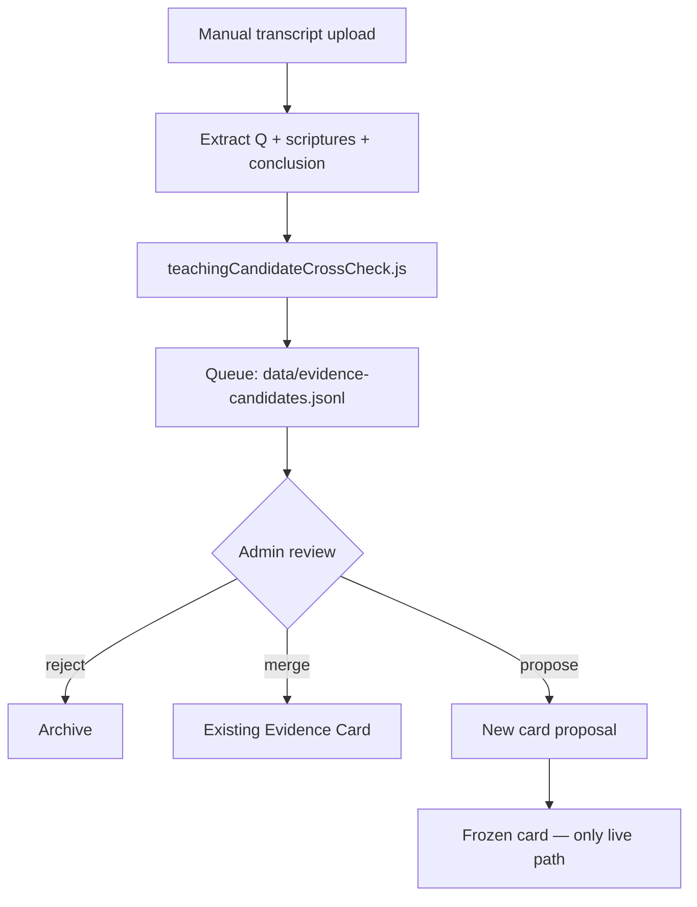

# IOG Ingestion Pilot Plan

**Date:** 2026-06-07  
**Status:** PILOT ONLY — admin review required; **blocked until live claim validation passes**

---

## Principle

**Scripture is authority. IOG / external teaching is Evidence Candidate only.**

Nothing from Israel of God, YouTube, or third-party lessons enters live retrieval until an admin promotes a frozen Evidence Card after Scripture cross-check.

**No automatic video scraping.**

---

## Approved source types

| Source | Allowed | Method |
|--------|---------|--------|
| Official IOG transcripts (licensed) | ✅ | Manual upload |
| Creator-permitted materials | ✅ | Written permission on file |
| Public website text (ToS allows) | ✅ | Legal review |
| Manually provided transcripts | ✅ | Admin paste |
| User-provided study notes | ✅ | `reviewRequired: true` |
| YouTube auto-scrape | ❌ | Prohibited |
| Copyrighted sermons without license | ❌ | Prohibited |

---

## Candidate schema (per lesson / Q&A)

```json
{
  "candidateId": "uuid",
  "sourceName": "Israel of God",
  "sourceUrl": "https://example.com/lesson/123",
  "title": "Third Heaven Q&A",
  "speaker": "Speaker Name",
  "date": "2024-01-15",
  "question": "What is the third heaven?",
  "scripturesCited": ["Genesis 1:6-8", "2 Corinthians 12:2", "John 3:13"],
  "scriptureOrder": ["Genesis 1:6-8", "2 Corinthians 12:2", "John 3:13", "Matthew 6:9-10"],
  "doctrineConclusion": "Admin-reviewed summary — not OpenAI script",
  "confidenceScore": 0,
  "copyrightStatus": "unknown",
  "reviewRequired": true,
  "status": "pending_admin_review"
}
```

---

## Pilot pipeline



### Pilot tooling (implemented)

| Tool | Path |
|------|------|
| Cross-check engine | `services/teachingCandidateCrossCheck.js` |
| Manual ingest CLI | `scripts/ingestTeachingCandidatePilot.js` |
| Candidate store | `data/evidence-candidates.jsonl` |

### Pilot usage

```bash
# 1. Create candidate.json from permitted transcript (manual)
# 2. Ingest (no scrape):
node scripts/ingestTeachingCandidatePilot.js --file path/to/candidate.json
# 3. Admin reviews jsonl + crossCheckGrade
# 4. Promote to Evidence Card manually — never auto
```

---

## Scripture cross-check (Part E)

For each candidate, `crossCheckTeachingCandidate()`:

1. Verify KJV book names and chapter:verse format
2. Flag chain gaps in `scriptureOrder`
3. Flag tradition language
4. Flag overconfident conclusions with weak chains
5. Grade:

| Score | Label |
|-------|-------|
| 95–100 | Strong — eligible for merge proposal |
| 80–94 | Probable — admin review |
| 60–79 | Review carefully |
| Below 60 | Research only |

**Promotable only if:** score ≥ 95, all KJV refs valid, no tradition language, `copyrightStatus` ≠ `unknown`.

---

## Video / lesson scrubbing (manual pilot)

For IOG video lessons — **admin workflow only:**

1. Obtain creator-permitted transcript (not auto-scraped)
2. Segment by Q&A boundaries
3. Extract per segment: `question`, `scripturesCited`, `scriptureOrder`, stated conclusion
4. **Discard** sermon prose — keep refs and admin conclusion only
5. Run cross-check → queue → review

---

## Expansion gate (Part G)

IOG pilot **must not scale** until:

- [ ] `bae-phase1a-results.json` → `allPass: true`
- [ ] Unsupported doctrine claims blocked in live tests
- [ ] Render stability verified under live load
- [ ] Admin review workflow documented

---

## Copyright defaults

| `copyrightStatus` | Behavior |
|-------------------|----------|
| `unknown` | Queue only; not promotable |
| `licensed` | Eligible for review |
| `public_domain` | Eligible for review |
| `owned` | Eligible for review |
| `denied` | Reject |

**End of IOG Ingestion Pilot Plan.**
