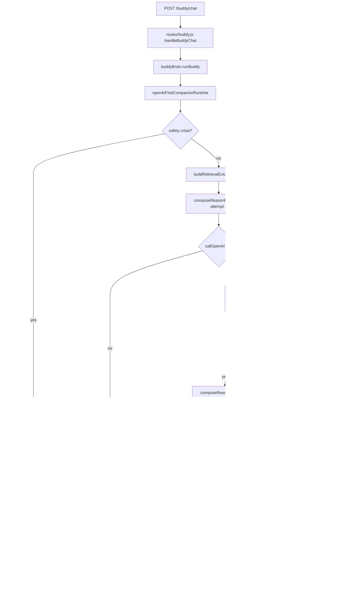
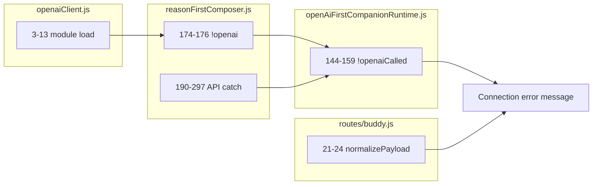

# OpenAI Call Flow Map

**Date:** 2026-06-07  
**Purpose:** Trace every OpenAI invocation and failure branch on the live `/buddy/chat` path  
**Status:** Diagnosis only

---

## High-level flow



---

## Module-level map

| Stage | Module | Function | OpenAI? |
|-------|--------|----------|---------|
| HTTP | `routes/buddy.js` | `handleBuddyChat` | No |
| Router | `services/buddyBrain.js` | `runBuddy` | No |
| Runtime | `services/openAiFirstCompanionRuntime.js` | `runOpenAiFirstCompanionRuntime` | Orchestrates |
| Retrieval | `services/retrievalEvidencePack.js` | `buildRetrievalEvidencePack` | No |
| Compose | `services/reasonFirstComposer.js` | `composeReasonFirstReply` | **Yes** |
| HTTP client | `services/openaiClient.js` | singleton export | **Yes** |
| API | `services/reasonFirstComposer.js` | `callOpenAI` → `chat.completions.create` | **Yes** |
| Error surface | `services/coreResponseGuards.js` | `buildConnectionErrorReply` | No |
| Finalize | `services/buddyBrain.js` | `finalizeBuddyResponse` | No |

---

## `callOpenAI` detail (`reasonFirstComposer.js` 173–192)

```
Inputs:
  systemPrompt  ← buildComposerSystemPrompt (includes JSON.stringify(evidenceSlice))
  userPayload   ← message, history, evidence duplicate, regenInstruction

API:
  model: process.env.OPENAI_MODEL || 'gpt-4.1-mini'
  temperature: 0.72 (0.55 on internal regen attempt > 0)
  response_format: { type: 'json_object' }

Outcomes:
  ok: true  → raw JSON string → normalizeStructured → claims[]
  ok: false → { error: e.message } → immediate return openaiCalled: false
```

**No timeout. No retry. No circuit breaker.**

---

## Attempt budget (current production code)

| Phase | Location | `maxAttempts` / calls | `coreRestoration` |
|-------|----------|----------------------|-------------------|
| Initial compose | `openAiFirstCompanionRuntime.js:118–128` | `maxAttempts: 1` | `true` |
| Internal compose cap | `reasonFirstComposer.js:211` | `attemptCap = 1` | forces 1 |
| Guard regen | `openAiFirstCompanionRuntime.js:219–238` | `maxAttempts: 1` | `true` |
| **Total HTTP max** | — | **2** | — |

Prior audits referenced `maxAttempts: 4` + `2` regen (**6 calls**). Current code has been **reduced** to 1+1.

---

## `openaiCalled` flag propagation

| Location | Field name | Set `false` when |
|----------|------------|------------------|
| `reasonFirstComposer.js:291–293` | `structured.runtime.openaiCalled` | API error |
| `reasonFirstComposer.js:293` | return `openaiCalled: false` | API error |
| `openAiFirstCompanionRuntime.js:133` | `openaiCalled` | `!composed.openaiCalled` |
| `openAiFirstCompanionRuntime.js:339` | `runtime.openAiCalled` | same |
| `coreRestorationDebug.js:52` | `coreDebug.openaiCalled` | attached in `attachDebug` |
| `coreResponseGuards.js:83` | `runtime.openAiCalled` | connection error reply |
| `liveRequestTrace.js:31` | trace `openaiCalled` | reads debug/runtime |

**User-visible connection message only when row reaches `buildConnectionErrorReply` (`openAiFirstCompanionRuntime.js:147`).**

---

## Failure branch map (file:line)



| Node | File:line | Condition |
|------|-----------|-----------|
| C1 | `openaiClient.js:11–13` | require/init throws |
| C2 | `reasonFirstComposer.js:174–176` | `openai` falsy |
| C3 | `reasonFirstComposer.js:190–297` | any `create()` exception |
| C4 | `openAiFirstCompanionRuntime.js:144–159` | compose returned `openaiCalled: false` |
| C5 | `routes/buddy.js:21–24` | `reply` not object |

---

## Parallel OpenAI surfaces (not `/buddy/chat`)

These modules call `chat.completions.create` but are **not** on the hard-cutover chat path:

| Module | Use |
|--------|-----|
| `adminBrain.js` | Admin assistant |
| `contentInsight.js` | Content analysis |
| `masterBuddyRuntime.js` | Legacy (bypassed) |
| `*Experiment*.js` | Offline experiments |
| `server.js` `/api/analyze/note` fallback | Direct `fetch` to OpenAI |

Under load, admin/analyze routes can **add concurrent OpenAI traffic** on the same process and API key quota.

---

## Phase 1B measurement path

```
baePhase1bLiveMeasurement.js
  → runBuddy (same as production)
  → openAiFirstCompanionRuntime
  → composeReasonFirstReply
```

Sequential loop — **no HTTP**, no Render proxy. Failures reflect **direct API/client** errors, not Render restart (unless local OOM, which did not occur at 137 MB RSS).

---

## Debug signals to inspect on a failing turn

| Field | Path | Meaning |
|-------|------|---------|
| `reply.coreDebug.openaiCalled` | HTTP body when debug enabled | false = no successful compose |
| `reply.coreDebug.errorMessage` | same | API error text (401, 429, etc.) |
| `reply.coreDebug.finalAnswerAuthor` | same | `connection_error` |
| `reply.coreDebug.buildConnectionErrorReplyUsed` | same | true |
| `reply.runtime.connectionError` | same | truncated error in connection reply |
| `reply.runtime.masterRoute` | same | `core_connection_error` |
| `reply.admin_flags` | same | includes `core_connection_error` |

Enable debug locally: `BUDDY_DEBUG=1` or `NODE_ENV=development` (`coreRestorationDebug.js:5–11`).

---

## Related audits

- `OpenAIExecutionStabilityAudit.md` — ranked causes, timeout/retry/concurrency analysis
- `RenderRestartRootCauseAudit.md` — OOM/restart correlation

**No fixes implemented.**
