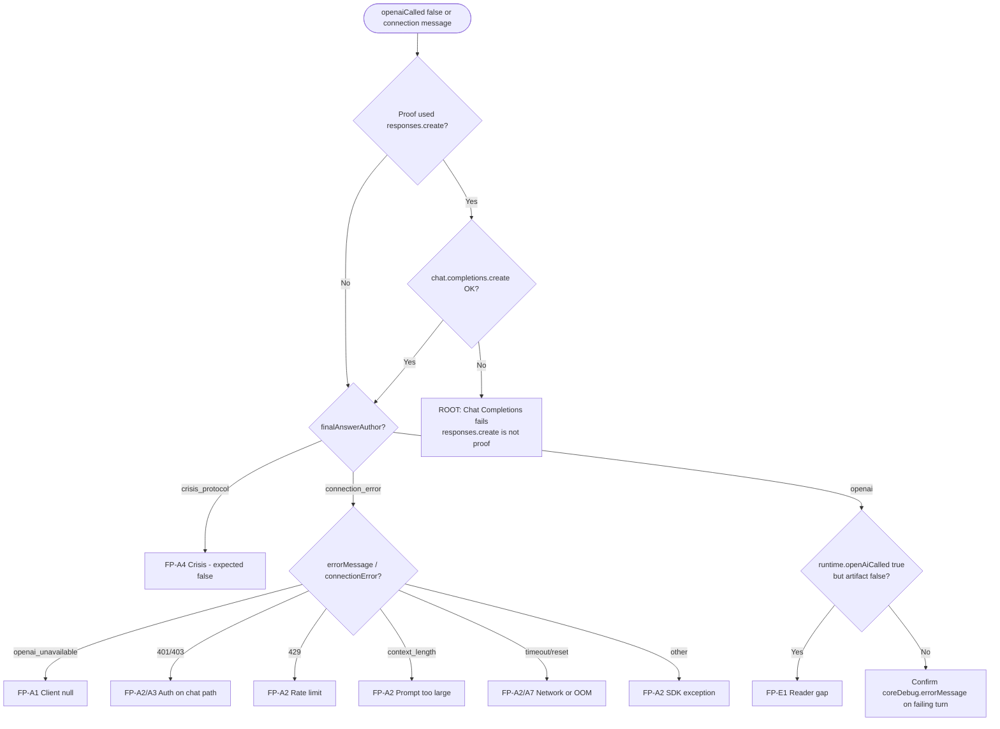

# OpenAI Execution Decision Tree

**Date:** 2026-06-07  
**Use:** Operator diagnosis when direct SDK works but BibleBuddy reports `openaiCalled: false`  
**Status:** Diagnosis only

---

## Decision tree (text)

```
START: User reports openaiCalled: false OR connection fallback message
│
├─ Q1: Was OpenAI proof test using responses.create?
│   ├─ YES → Q2 (API surface check)
│   └─ NO  → Q3
│
├─ Q2: Does chat.completions.create with json_object succeed in same shell?
│   ├─ NO  → ROOT: Chat Completions path failure (NOT disproven by responses.create)
│   │         Check coreDebug.errorMessage / runtime.connectionError
│   └─ YES → Q3
│
├─ Q3: What is reply.finalAnswerAuthor / coreDebug.finalAnswerAuthor?
│   ├─ crisis_protocol → FP-A4: Crisis path, no OpenAI (expected false)
│   ├─ connection_error → Q4
│   └─ openai → openaiCalled SHOULD be true; check Q8 (observability)
│
├─ Q4: What is coreDebug.errorMessage or runtime.connectionError?
│   ├─ openai_unavailable → FP-A1: openaiClient module null
│   ├─ 401 / 403 → FP-A2/A3: Auth (key invalid FOR singleton OR wrong project)
│   ├─ 429 / quota → FP-A2: Rate limit (no retry)
│   ├─ context_length → FP-A2: Prompt too large
│   ├─ ETIMEDOUT / ECONNRESET → FP-A2/A7: Network or process kill
│   └─ empty / openai_unavailable → Q5
│
├─ Q5: Was OPENAI_API_KEY set BEFORE node process started?
│   ├─ NO (dotenv missing in script) → FP-A3: Stale singleton client
│   └─ YES → Q6
│
├─ Q6: Does log show "✅ OpenAI client ready" at process start?
│   ├─ YES → Client loaded; error is at chat.completions.create (FP-A2)
│   └─ NO  → FP-A1: Module init failed
│
├─ Q7: Correlated with Render "memory limit exceeded" restart?
│   ├─ YES → FP-A7: Infrastructure; separate from API key validity
│   └─ NO  → FP-A2 most likely (Chat Completions error)
│
└─ Q8: runtime.openAiCalled true BUT measured openaiCalled false?
    └─ YES → FP-E1: Measurement/reader bug (baePhase1bLiveMeasurement.js:173)
```

---

## Decision tree (mermaid)



---

## Branch reference table

| Decision node | If true → | If false → |
|---------------|-----------|------------|
| Q1: `responses.create` proof | Must run Q2 | Skip to Q3 |
| Q2: `chat.completions` OK | Continue Q3 | **ROOT: surface mismatch** |
| Q3: `connection_error` | Q4 | Crisis or observability |
| Q4: error string | See FP-A* row | Q5 |
| Q5: key before process start | Q6 | **FP-A3 stale client** |
| Q7: Render restart | **FP-A7** | **FP-A2** |
| Q8: `openAiCalled` mismatch | **FP-E1** | Inspect `errorMessage` |

---

## Per-stage expected signals (healthy turn)

| Stage | Signal | Healthy value |
|-------|--------|---------------|
| Retrieval | `runtime.evidenceTopic`, cards in pack | Topic + cardIds present |
| Compose call | `runtime.openAiCalled` | `true` |
| Compose call | `coreDebug.errorMessage` | `null` |
| OpenAI response | `structured.claims` | Array (may be empty — still `openaiCalled: true`) |
| Post validation | `runtime.claimValidation` | passed or degraded |
| Final | `finalAnswerAuthor` | `openai` |
| Final | `reply` text | Doctrine prose — not connection message |
| Route | `runtime.masterRoute` | `core_openai_compose` or `reason_first_openai` |

---

## Per-stage signals (false path)

| Stage | Signal | False-path value |
|-------|--------|------------------|
| `callOpenAI` | `composed.apiError` | Non-null string |
| Compose return | `composed.openaiCalled` | `false` |
| Runtime | `runtime.masterRoute` | `core_connection_error` |
| Runtime | `runtime.connectionError` | Truncated SDK error |
| Debug | `coreDebug.buildConnectionErrorReplyUsed` | `true` |
| Debug | `coreDebug.openaiCalled` | `false` |
| HTTP | `admin_flags` | includes `core_connection_error` |
| User text | `reply` | Connection message |

---

## Exact flip point (SDK success → BibleBuddy false)

```
                    ┌─────────────────────────────────────┐
  YOUR TEST         │  client.responses.create()          │
  (SUCCESS)         │  NOT INVOKED BY BIBLEBUDDY          │
                    └─────────────────────────────────────┘
                                      ✗ no code path
                    ┌─────────────────────────────────────┐
  BIBLEBUDDY        │  openaiClient singleton             │
  ENTRY             │  services/openaiClient.js:6-8       │
                    └─────────────────┬───────────────────┘
                                      ▼
                    ┌─────────────────────────────────────┐
  FLIP POINT        │  callOpenAI()                       │
                    │  reasonFirstComposer.js:173-192     │
                    │                                     │
                    │  openai.chat.completions.create({   │
                    │    response_format: json_object,    │
                    │    messages: [large system, user]   │
                    │  })                                 │
                    └─────────────────┬───────────────────┘
                                      │
                         throw / !openai
                                      ▼
                    ┌─────────────────────────────────────┐
  RESULT            │  ok: false                          │
                    │  composeReasonFirstReply            │
                    │    openaiCalled: false  (line 293)  │
                    └─────────────────┬───────────────────┘
                                      ▼
                    ┌─────────────────────────────────────┐
                    │  openAiFirstCompanionRuntime:133    │
                    │  buildConnectionErrorReply:147      │
                    └─────────────────────────────────────┘
```

---

## Commands by branch

### Branch R1 — Chat Completions fails (most important after `responses.create` proof)

```bash
node -e "
require('dotenv').config();
const openai=require('./services/openaiClient');
openai.chat.completions.create({
  model:process.env.OPENAI_MODEL||'gpt-4.1-mini',
  response_format:{type:'json_object'},
  messages:[{role:'user',content:'{\"reply\":\"OK\"}'}]
}).then(r=>console.log('OK',r.choices[0].message.content)).catch(e=>console.error('FAIL',e.status,e.message));
"
```

### Branch R4 — Auth on singleton

```bash
node -e "console.log('key set:',!!process.env.OPENAI_API_KEY,'len:',(process.env.OPENAI_API_KEY||'').length)"
node -e "require('dotenv').config(); const o=require('./services/openaiClient'); console.log('client:',!!o);"
```

Compare: export key → run **without** prior requires in same process.

### Branch R9 — Observability mismatch

On failing turn inspect:

```javascript
reply.runtime.openAiCalled
reply.runtime.coreDebug?.openaiCalled
reply.coreDebug?.openaiCalled
reply.runtime.connectionError
reply.coreDebug?.errorMessage
```

---

## Related documents

- `BibleBuddyOpenAIExecutionTrace.md` — full execution map and return paths
- `OpenAIFalsePathInventory.md` — complete false-path catalog

**No fixes implemented.**
