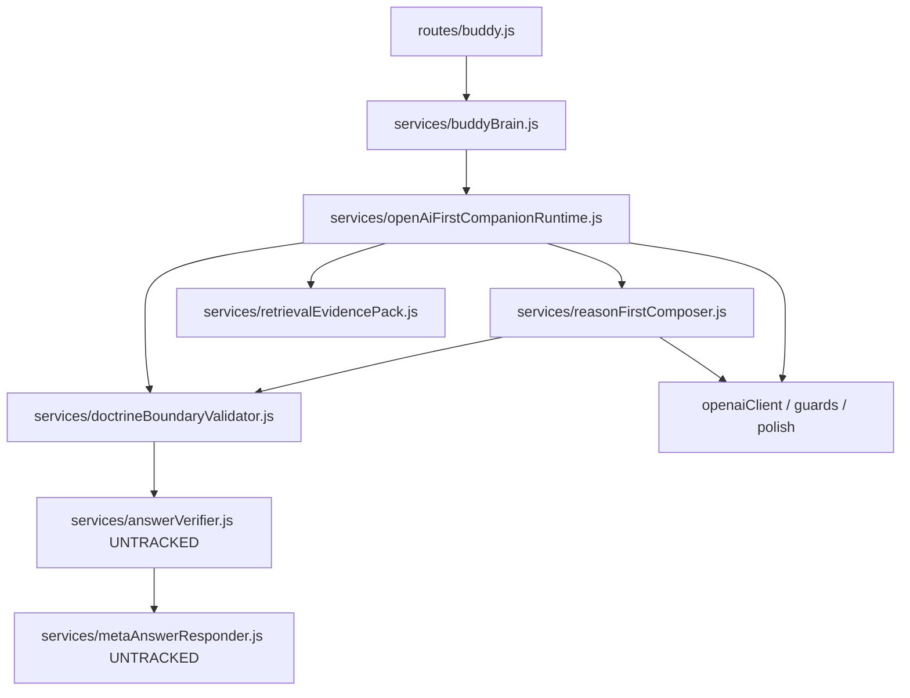

# OpenAI-First Runtime Completeness Report

**Date:** 2026-06-06  
**Deploy baseline:** `57b3f96` (Render crash: missing `./answerVerifier`)  
**Audit script:** `scripts/openAiFirstCompletenessAudit.js`  
**Machine-readable output:** `docs/regression-trace/openai-first-completeness-audit.json`  
**Scope:** Pre-deploy audit only — no code changes, commit, push, or deploy.

---

## Executive summary

| Metric | Count |
|--------|------:|
| **TOTAL MODULES** (in tree) | **123** |
| **TRACKED MODULES** | **120** |
| **UNTRACKED MODULES** (local only) | **3** |
| **MISSING MODULES** (on disk) | **0** |
| **RUNTIME CRITICAL** (reachable from entry roots) | **121** |
| **DEPLOY BLOCKERS** | **3** |

Render parity requires committing **at minimum** two service files. A third blocker appears only if local `routes/buddy.js` instrumentation is included in the commit.

---

## TASK 1 — Dependency tree (entry roots)

### Entry roots

```
routes/buddy.js
  → services/buddyBrain.js
      → services/openAiFirstCompanionRuntime.js (runBuddy path)
          → services/reasonFirstComposer.js
              → services/doctrineBoundaryValidator.js
                  → services/answerVerifier.js  ✗ untracked
                      → services/metaAnswerResponder.js  ✗ untracked
                          → services/questionIntentResolver.js  ✓
          → services/retrievalEvidencePack.js  ✓
              → services/sabbathHistoryDeepResponder.js  ✓ (local diff adds metaAnswerResponder)
              → services/evidenceCards/index.js  ✓
              → … (see JSON for full 123-node tree)
```

### High-level layers (runtime-critical path)



**Full edge list:** 320 `require()` edges, 123 unique modules — `docs/regression-trace/openai-first-completeness-audit.json` → `edges` / `nodes`.

---

## TASK 2 — Deploy blockers (every untracked / missing dependency)

| File | Git tracked? | Exists locally? | Imported by | Runtime critical? | Blocker reason |
|------|:------------:|:---------------:|-------------|:-----------------:|----------------|
| `services/answerVerifier.js` | **No** | **Yes** | `doctrineBoundaryValidator.js` | **Yes** | untracked — **Render crash today** |
| `services/metaAnswerResponder.js` | **No** | **Yes** | `answerVerifier.js`, `sabbathHistoryDeepResponder.js` (local diff) | **Yes** | untracked — **next crash** after answerVerifier-only fix |
| `services/liveResponseCapture.js` | **No** | **Yes** | `routes/buddy.js` (local uncommitted diff) | **Yes** | untracked — **only if route instrumentation committed** |

### All other modules in tree (120)

| Status | Count |
|--------|------:|
| Tracked + exists + runtime-critical | 118 |
| Tracked + exists + not in blocker set | 2 (`routes/buddy.js` at 57b3f96 state when route diff excluded) |

**No `missing_on_disk` modules** in the 123-node tree (including `evidenceCards/index.js` resolved correctly).

---

## TASK 3 — Summary tables

### TOTAL MODULES

**123** unique local `require()` targets from the five entry roots (includes `routes/` + `services/`).

### TRACKED MODULES

**120** present in `git ls-files`.

### UNTRACKED MODULES

**3** (all deploy blockers in current workspace):

1. `services/answerVerifier.js`
2. `services/metaAnswerResponder.js`
3. `services/liveResponseCapture.js`

### MISSING MODULES

**0** on local disk within the audited tree.

### DEPLOY BLOCKERS

| Priority | File | Render at `57b3f96` | After minimal 2-file add |
|----------|------|---------------------|--------------------------|
| P0 | `services/answerVerifier.js` | **CRASH** | Fixed |
| P0 | `services/metaAnswerResponder.js` | Not reached until P0 fixed | Required |
| P1 | `services/liveResponseCapture.js` | Not required (route unchanged) | Required only if `routes/buddy.js` local diff is committed |

---

## TASK 4 — Exact commit set for Render parity

### Required (minimum — fixes `57b3f96` OpenAI-first load)

```
services/answerVerifier.js
services/metaAnswerResponder.js
```

**Do not** include modified `routes/buddy.js` or `services/sabbathHistoryDeepResponder.js` in this minimal commit unless intentional.

### Required if committing local route instrumentation

```
services/liveResponseCapture.js
routes/buddy.js          (modified — emitBuddyChatJson / capture hook)
```

### Optional (not on OpenAI-first hot path — do not add for this fix)

| File | Why optional |
|------|----------------|
| `services/answerMatchGate.js` | `masterBuddyRuntime` only |
| `services/companionPostureValidator.js` | Scripts / posture validation |
| `services/responseContract.js` | `masterBuddyRuntime` / match gate |
| `services/reasonFirstBuddyRuntime.js` | Not wired to `runBuddy` |
| `services/shadowReasonFirstRuntime.js` | Experiment |
| Other untracked experiment/lite/beta services (20 files) | Not reachable from audited tree |

### Documented git commands (NOT EXECUTED)

**Minimal safe commit:**

```bash
git add services/answerVerifier.js services/metaAnswerResponder.js
git commit -m "$(cat <<'EOF'
Add missing answerVerifier and metaAnswerResponder for OpenAI-first doctrine validation.

Required by doctrineBoundaryValidator on the production hot path; absent from 57b3f96.

EOF
)"
```

**If also shipping capture instrumentation:**

```bash
git add services/answerVerifier.js services/metaAnswerResponder.js \
        services/liveResponseCapture.js routes/buddy.js
```

---

## TASK 5 — Local load verification

Run from repository root:

| Command | Result |
|---------|--------|
| `node -e "require('./services/doctrineBoundaryValidator')"` | **PASS** |
| `node -e "require('./services/reasonFirstComposer')"` | **PASS** |
| `node -e "require('./services/openAiFirstCompanionRuntime')"` | **PASS** |
| `node -e "require('./services/buddyBrain')"` | **PASS** |

Local workspace loads fully because untracked files exist on disk. **Render at `57b3f96` fails** because those files are absent in git checkout.

---

## TASK 6 — SAFE TO COMMIT?

## **NO** (whole workspace as-is)

### Explanation

The working tree is **not** safe for a blind `git add .` or commit of all current changes:

1. **`routes/buddy.js` is modified** (uncommitted) to `require('./liveResponseCapture')` — deploying that diff **without** `services/liveResponseCapture.js` causes immediate `MODULE_NOT_FOUND` at route load.
2. **`services/sabbathHistoryDeepResponder.js` is modified** (uncommitted) to `require('./metaAnswerResponder')` — committing that diff without `metaAnswerResponder.js` would crash `retrievalEvidencePack` load **before** compose.
3. Three runtime-critical files are **untracked**; only two are required for the **`57b3f96`** parity fix.

### **YES** — minimal isolated commit (recommended)

Safe **only** when the commit is **limited to**:

```
services/answerVerifier.js
services/metaAnswerResponder.js
```

and **excludes**:

- Modified `routes/buddy.js` (capture instrumentation), unless `liveResponseCapture.js` is added too
- Modified `services/sabbathHistoryDeepResponder.js`, unless `metaAnswerResponder.js` is included (it would be in minimal set anyway)

With that two-file commit on top of `57b3f96`, the audited OpenAI-first chain has **zero remaining deploy blockers** in the 123-module tree.

---

## Appendix — Render vs local workspace

| Item | Render `57b3f96` | Local workspace |
|------|------------------|-----------------|
| `doctrineBoundaryValidator` requires `answerVerifier` | Yes | Yes |
| `answerVerifier.js` in repo | **No** | Yes (untracked) |
| `metaAnswerResponder.js` in repo | **No** | Yes (untracked) |
| `routes/buddy.js` requires `liveResponseCapture` | **No** | Yes (local diff) |
| `sabbathHistoryDeepResponder` requires `metaAnswerResponder` | **No** | Yes (local diff) |
| Local `require()` smoke tests | N/A (files missing) | **All PASS** |

---

**STOP — report only. No code changes. No commit. No push. No deploy.**

**End of report.**
