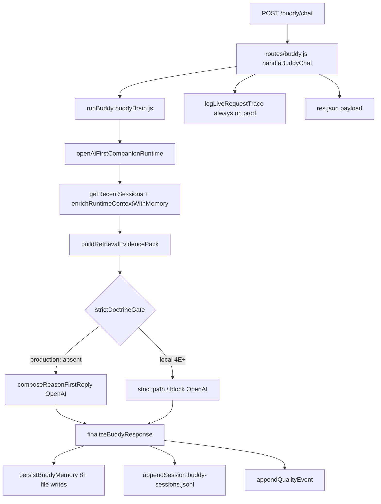

# Phase 4J — Render OOM Trace

Generated: 2026-06-12  
Trace: Request → `runBuddy` → runtime → state → logs → response  
Baseline: **production code** (`origin/main` @ `1095f921`) unless noted.

---

## End-to-end path

---

## Stage-by-stage allocation map

| Stage | Largest allocations | Retained after response? | Production risk |
|-------|---------------------|--------------------------|-----------------|
| **HTTP ingress** | `req.body` message string | No | Low |
| **getRecentSessions** | 512 KB buffer + parsed lines | Cache entries **retained** | Medium — fat cache entries on prod |
| **enrichRuntimeContextWithMemory** | Reads `buddy-memory.json`, learning profiles, relationship context | File contents briefly in heap | Medium — scales with file size |
| **buildRetrievalEvidencePack** | Evidence cards, scripture chains, thread memory, reasoning snapshot | `evidencePack` until GC | **High** — 2–8 MB transient typical |
| **composeReasonFirstReply** | OpenAI request/response bodies, regeneration buffers | Hung promises if timeout weak | **High** — latency + connection retention |
| **finalizeBuddyResponse** | Full `structured` object, polish/enrichment copies | Slimmed only in local 4H logs | High on prod — full object in log + cache |
| **persistBuddyMemory** | Parse/write **entire** continuity + relationship JSON files | File buffers | **High** — 4.7 MB continuity parse per call when large |
| **appendSession** | `JSON.stringify(entry)` — **full structured on prod** | Log line + cache push | **Critical** |
| **logLiveRequestTrace** | ~1 KB trace object | File append | Medium — every request on prod |
| **Response JSON** | `reply` payload to client | No | Low |

---

## Largest memory allocations (ranked)

### #1 — Session log serialization (`appendSession`)

Production passes complete `structured` and `runtimeContext` into `JSON.stringify`:

- Scripture arrays, `relationshipIntelligence`, `companionNextSteps`, `coreDebug`, nested `runtime`.
- Local stress evidence: rotated backup **1.0 GB** from session JSONL alone.
- **OOM mechanism**: huge string allocation + V8 heap exhaustion; also disk fill on Render.

### #2 — `buildRetrievalEvidencePack`

Pulls in:

- Evidence card payloads (`retrieveEvidenceCards`, `buildEvidenceCardPayload`)
- Scripture discovery, concordance hints, correction ledger
- Thread-local memory from up to 8 recent sessions
- Active conversation, relationship recall, reasoning snapshot

Single largest **per-request transient** object on the hot path. On production, **always runs** before OpenAI — no strict gate short-circuit.

### #3 — `continuity-memory.json` full RMW

`saveContinuityMemory({ userId, message, response: structured })` passes full `structured` into continuity store.

- Local file: **4.7 MB**
- Each chat: `readFileSync` → `JSON.parse` → mutate → `JSON.stringify` → `writeFileSync`
- **OOM mechanism**: duplicate large object in heap during parse; RSS spike under concurrent requests.

### #4 — OpenAI `composeReasonFirstReply`

- Evidence pack + conversation history embedded in prompt
- Multiple attempt paths in `openAiFirstCompanionRuntime` (regeneration on doctrine strict miss locally; always on prod for doctrine)
- Default timeouts: request-level 55s (`responseGuarantee` local only), OpenAI 45s in composer
- **OOM mechanism**: slow requests pile up; each holds evidence pack + reply buffers until timeout

### #5 — `RECENT_SESSION_CACHE` (heap retention)

Production: unbounded distinct `userId` keys × 12 turns × merged runtime objects.

Estimate: **~40–80 KB/user** retained → **40–80 MB** at 1000 distinct users without restart.

---

## Largest retained objects (post-GC baseline drift)

| Retained structure | Growth driver |
|--------------------|---------------|
| `RECENT_SESSION_CACHE` | Every new `userId` |
| Parsed JSON state files | Not retained globally, but RSS does not return to baseline after large parses |
| Node/OpenAI HTTP agent pools | Connection pooling under load |
| `companion-intelligence` / quality JSONL | Disk only, but read paths pull tails into heap |

---

## Highest-risk structures

| Structure | Why |
|-----------|-----|
| Production `appendSession` entry | Unbounded size per line |
| `RECENT_SESSION_CACHE` | Unbounded keys on production |
| `evidencePack` | Always built; large nested trees |
| `continuity-memory.json` | Largest single JSON state file |
| OpenAI in-flight requests | No strict gate on production for doctrine |

---

## Local vs production OOM evidence

| Signal | Local Phase 4H stress (1650 turns) | Production (inferred) |
|--------|--------------------------------------|-------------------------|
| Peak RSS | 288 MB (with caps + rotation) | Likely **>450 MB** under same load without caps |
| Strict OpenAI blocked | 0 calls | OpenAI on every doctrine turn |
| Session JSONL | Rotates at 5 MB | **No rotation** |
| Health endpoint | `GET /api/runtime-health` 200 | **404** — no visibility |
| Render plan | N/A | `standard` in `render.yaml` (~512 MB RAM) |

---

## OOM crash sequence (most likely)

1. Instance serves traffic; `buddy-sessions.jsonl` and continuity files grow over days.
2. Each chat: evidence pack allocation + full memory persist + full structured log line.
3. `RECENT_SESSION_CACHE` accumulates unique users across beta/test traffic.
4. RSS crosses Render limit (~512 MB on standard plan).
5. Render kills process (OOM) or health check fails during GC pause.
6. Redeploy restarts process — **cache clears** but **disk files persist** on ephemeral volume until redeploy wipe.
7. Cycle repeats; intermittent crashes correlate with traffic spikes and doctrine-heavy sessions (largest payloads).

---

## Trace conclusion

The OOM trace points to **session logging + session cache + continuity RMW** as the **sustained** growth vector, with **evidence pack + OpenAI** as the **per-request spike** vector. These occur on the **production** code path today; Phase 4H local fixes address logging/cache/JSONL but are **not deployed**.
