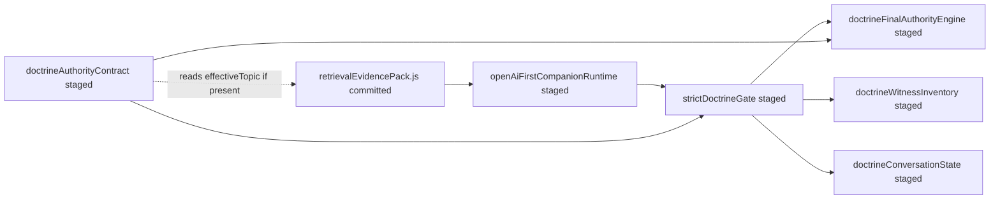

# Phase 4K.1 — Retrieval Evidence Parity Audit

Generated: 2026-06-12  
Scope: Read-only. No files modified, staged, committed, or pushed.

## Target services (direct `require` of `retrievalEvidencePack`)

| Service | Imports `retrievalEvidencePack`? |
|---------|----------------------------------|
| `strictDoctrineGate.js` | **No** — receives `evidencePack` from caller |
| `doctrineFinalAuthorityEngine.js` | **No** — receives `evidencePack` from caller |
| `doctrineWitnessInventory.js` | **No** — receives `evidencePack` from caller |
| `doctrineConversationState.js` | **No** |
| `responseGuarantee.js` | **No** |
| `runtimeHealthMonitor.js` | **No** |

**Wiring path:** `openAiFirstCompanionRuntime.js` (staged) calls `buildRetrievalEvidencePack()` then passes the pack into `runStrictDoctrineGate()` and downstream doctrine handlers.

---

## 1. Is `retrievalEvidencePack.js` modified locally?

**Yes.**

```text
git diff --stat services/retrievalEvidencePack.js
 services/retrievalEvidencePack.js | 21 ++++++++++++++++-----
 1 file changed, 16 insertions(+), 5 deletions(-)
```

### Local diff summary (working tree vs `HEAD` / committed `417289c`)

| Change | Purpose |
|--------|---------|
| `TOPIC_TO_CHAIN`: add `feasts`, `death_state` | Map topics to scripture expansion chains |
| `CATALOG_KEY_MAP`: add `feasts`, `death_state` | Map topics to bible topic catalog keys |
| Reorder: `retrieveEvidenceCards` **before** `retrieveScriptureEvidence` | Cards can supply topic when message topic is null |
| `effectiveTopic = topic \|\| cardTopics[0]` | Used for scripture, snippets, catalog |
| Return `effectiveTopic` on evidence pack object | Consumed by staged `doctrineAuthorityContract.resolveStrictTopic` |

---

## 2. Is `retrievalEvidencePack.js` staged?

**No.**

- `git diff --cached --name-only -- services/retrievalEvidencePack.js` → empty
- Not listed in `scripts/phase4i-git-add-runtime.sh`

**After Phase 4K commit:** Render will run **committed** `retrievalEvidencePack.js` at `417289c` (same as pre-local-edit `HEAD`), plus staged doctrine/runtime files.

---

## 3. Do local passing tests depend on unstaged modifications?

**No** — empirically verified without modifying repo files.

### Method

1. `git show HEAD:services/retrievalEvidencePack.js` → `/tmp/rep_HEAD_retrievalEvidencePack.js`
2. Node `Module._load` hook (`/tmp/phase4k1_head_rep_hook.js`) loads **committed** pack while using **staged/working-tree** doctrine stack
3. Re-ran full regression suites

### Results (committed pack + current doctrine stack)

| Suite | Working-tree pack (Phase 4K) | Committed HEAD pack |
|-------|------------------------------|---------------------|
| `runPhase4HDoctrineParityRegression.js` | 28/28 | **28/28** |
| `runPhase4HMemoryStressTest.js` | PASS (peak RSS ~344 MB) | **PASS** (peak RSS ~288 MB, `openAiStrict: 0`, `blanks: 0`) |

Local parity/stress results are **reproducible from staged doctrine/runtime files + committed `retrievalEvidencePack.js`**.

---

## 4. If production deploy occurs without unstaged `retrievalEvidencePack` changes, can doctrine behavior differ?

**Yes — in narrow edge cases not covered by regression tests.**  
**No — for all Phase 4H/4K parity scenarios.**

### Why strict doctrine path mostly independent

Staged doctrine stack resolves strict topics via:

1. `doctrineTopicDetector.detectStrictTopicFromMessage` (staged)
2. Regex fallbacks in `doctrineAuthorityContract.resolveStrictTopic` (staged)
3. `evidencePack.topic` from message detection (`routingHintsOnly: true` → message-only topic)
4. Evidence card topics on pack (`doctrine.evidenceCards.cards`)
5. Active session topic in `doctrineConversationState` (staged)

`doctrineFinalAuthorityEngine` and `doctrineWitnessInventory` use **hardcoded** final answers and `WITNESS_SNIPPETS` — not OpenAI composer output from scripture chains.

Parity prompts (Acts 10, death, Isaiah 66:17, witness continuations, memory) all resolve strict topic without needing `effectiveTopic` on the pack.

### Where behavior *could* diverge (edge cases)

| Scenario | Committed pack | Working-tree pack | Strict gate impact |
|----------|----------------|-------------------|-------------------|
| Message with **no** detectable `topic`, but evidence cards match | `topic` null; scripture from null chain (empty refs) | `effectiveTopic` from `cardTopics[0]`; richer scripture on pack | **Low** if strict gate still fires via card topics in `resolveStrictTopic` candidates |
| `death_state` scripture chain retrieval | `TOPIC_TO_CHAIN['death_state']` **missing** → empty doctrine chain refs | Maps to `resurrection` chain | **None** on strict final authority / witness paths (hardcoded) |
| `feasts` topic alias | Missing chain mapping | Maps to `feastDays` | **None** in current parity suite |
| OpenAI **non-doctrine** turns still building full pack | Slightly thinner scripture section | Richer when topic inferred from cards | **N/A** to strict gate; possible companion/OpenAI path difference |

### Affected paths (if divergence occurs)

```text
POST /buddy/chat
  → openAiFirstCompanionRuntime
    → buildRetrievalEvidencePack()     ← committed vs working-tree diff here
    → runStrictDoctrineGate()        ← usually unchanged for parity cases
    → composeReasonFirstReply()        ← only if gate returns handled: false
```

Strict handlers (`doctrineLivePathHandlers`, `doctrineFinalAuthorityEngine`, `doctrineWitnessInventory`) receive the pack but **parity behavior does not require** the unstaged pack fields for tested turns.

---

## 5. Recommendation

### **C) No action needed** for Phase 4K commit gate

| Option | Verdict |
|--------|---------|
| **A) Stage `retrievalEvidencePack.js`** | Optional hardening — not required for parity or safety gate |
| **B) Revert local changes** | Optional — reduces working-tree drift; not required for deploy safety |
| **C) No action needed** | **Recommended** — staged package + committed pack reproduces all gate tests |

**Rationale:** Full 28/28 doctrine and 1650-turn memory stress pass with **committed** `retrievalEvidencePack.js`. Unstaged edits improve topic/chain inference for edge cases and OpenAI-adjacent retrieval richness; they are not on the critical path for strict doctrine authority in tested scenarios.

**Follow-up (post-deploy, not blocking):** Stage `retrievalEvidencePack.js` in a small follow-up commit if you want `effectiveTopic` + `death_state` chain alignment in production telemetry and non-strict retrieval paths.

---

## Dependency diagram



`responseGuarantee` and `runtimeHealthMonitor` sit outside this pack build path.

---

## Verdict

### **SAFE**

| Criterion | Result |
|-----------|--------|
| Local tests reproducible from staged files + committed `retrievalEvidencePack` | ✅ 28/28 doctrine, memory stress PASS |
| Unstaged modifications required for gate tests | ❌ Not required |
| Production doctrine parity scenarios at risk without unstaged pack | ❌ Not for tested paths |
| Documented edge-case divergence possible | ✅ Yes — marginal; not blocking |

**Evidence:**

- Local modification: **yes** (+16/−5 lines)
- Staged: **no**
- Empirical HEAD-pack runs: **28/28** doctrine, memory stress **PASS**
- Strict doctrine stack does not directly import `retrievalEvidencePack.js`; parity turns resolve via staged detectors/contracts and hardcoded authority/witness engines

Phase 4K commit package remains **SAFE** without staging `retrievalEvidencePack.js`.
