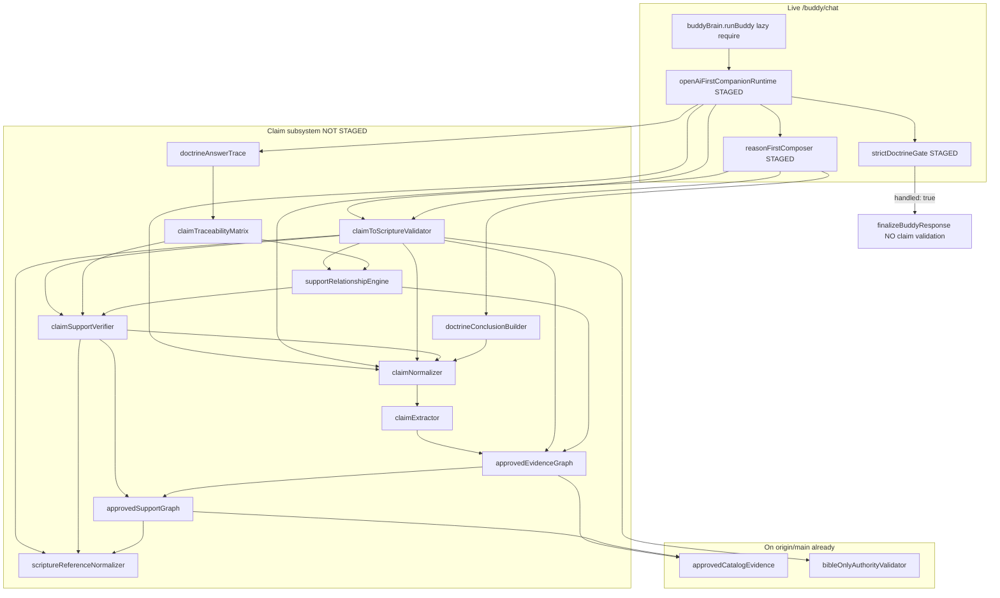

# Phase 4L — Claim Subsystem Dependency Audit

Generated: 2026-06-12  
Scope: Read-only. No deploy, push, corpus, doctrine pack, evidence card, or witness chain modifications.

## Executive summary

| Question | Answer |
|----------|--------|
| Required for Phase 4 runtime package? | **Yes — for module load and OpenAI/companion path** |
| Required for strict doctrine gate answers? | **No — logic bypasses claim validation on early return** |
| Safe to exclude from deploy? | **No — `MODULE_NOT_FOUND` on first `/buddy/chat`** |
| Smallest safe production fix | **A) Deploy missing claim subsystem chain** (11 files + existing `approvedCatalogEvidence` on origin) |

**Verdict:** Phase 4K staged package is **incomplete without the claim chain**. Local tests pass only because claim files exist as **untracked** local files. `origin/main` already `require()`s claim modules in `openAiFirstCompanionRuntime.js` but **zero claim files exist in the git tree** — a pre-existing deploy gap.

---

## A vs B decision

| Option | Description | Audit conclusion |
|--------|-------------|----------------|
| **A) Deploy missing claim subsystem** | Add claim chain files to commit/staging | **Recommended — smallest safe fix, no code changes** |
| **B) Remove runtime dependency** | Stub or delete `require()` in staged composers | Requires **code changes** (out of scope); would drop OpenAI claim guardrails on companion path |

Option B is not “audit only” safe without editing `openAiFirstCompanionRuntime.js` and `reasonFirstComposer.js`.

---

## Dependency graph (live runtime path)



**Strict doctrine short-circuit:** When `runStrictDoctrineGate()` returns `handled: true`, execution never reaches `runGuards()` / `validateClaimToScripture()` — but `openAiFirstCompanionRuntime` is still **loaded**, so all top-level `require()` must resolve.

---

## Per-file audit

### `services/claimNormalizer.js` (~1.8 KB)

| # | Finding |
|---|---------|
| 1. Imported by | `openAiFirstCompanionRuntime.js` (staged), `reasonFirstComposer.js` (staged), `claimToScriptureValidator.js`, `claimSupportVerifier.js`, `doctrineConclusionBuilder.js`, scripts (`phase1cClaimGenerationCompliance.js`) |
| 2. Imports | `claimExtractor.js` |
| 3. Runtime path usage | **Module load:** always when first chat loads OpenAI runtime. **Runtime logic:** `normalizeClaims()` on OpenAI compose path and post-compose guards |
| 4. Doctrine answers (strict gate)? | **No** — strict early return skips claim guards |
| 5. Companion answers? | **Yes** — when OpenAI composes or regenerates |
| 6. Validation only? | **No** — live post-compose degradation path |
| 7. Bible Authority tooling only? | **No** — wired into live composers |
| 8. Required for production runtime? | **Yes** — top-level require in staged runtime |
| 9. Safe to exclude? | **No** |
| 10. Safe replacement? | Inline stub returning `[]` claims — **requires code change** |

**Git:** untracked locally; **missing** from `origin/main` tree.

---

### `services/claimExtractor.js` (~5 KB)

| # | Finding |
|---|---------|
| 1. Imported by | `claimNormalizer.js` (transitive); scripts (`phase2aClaimExtractor*`) |
| 2. Imports | `approvedEvidenceGraph.js` |
| 3. Runtime path usage | When OpenAI returns no `claims[]`, `normalizeClaims` falls back to `extractClaims({ reply, scripture, evidencePack })` |
| 4. Doctrine answers (strict gate)? | **No** |
| 5. Companion answers? | **Yes** — OpenAI path fallback claim extraction |
| 6. Validation only? | **No** — feeds live validation |
| 7. Bible Authority tooling only? | **No** |
| 8. Required for production runtime? | **Yes** — transitive from staged composers |
| 9. Safe to exclude? | **No** |
| 10. Safe replacement? | Stub `extractClaims` → `[]` in claimNormalizer — **code change** |

**Git:** untracked; missing from `origin/main`.

---

### `services/claimSupportVerifier.js` (~9 KB)

| # | Finding |
|---|---------|
| 1. Imported by | `claimToScriptureValidator.js`, `claimTraceabilityMatrix.js`, `supportRelationshipEngine.js` |
| 2. Imports | `claimNormalizer`, `scriptureReferenceNormalizer`, `approvedSupportGraph` |
| 3. Runtime path usage | Citation-vs-support checks inside `validateClaimToScripture()` |
| 4. Doctrine answers (strict gate)? | **No** |
| 5. Companion answers? | **Yes** — OpenAI post-compose validation |
| 6. Validation only? | **Primarily validation** — but invoked on live OpenAI path |
| 7. Bible Authority tooling only? | Also used by BAE scripts; **not** tooling-only |
| 8. Required for production runtime? | **Yes** — transitive |
| 9. Safe to exclude? | **No** |
| 10. Safe replacement? | Stub `verifyCitationSupportsClaim` always pass — **code change** |

**Git:** untracked; missing from `origin/main`.

---

### `services/claimToScriptureValidator.js` (~12 KB)

| # | Finding |
|---|---------|
| 1. Imported by | `openAiFirstCompanionRuntime.js` (staged), `reasonFirstComposer.js` (staged), 30+ BAE/phase scripts, `supportRelationshipEngine.js` |
| 2. Imports | `bibleOnlyAuthorityValidator` (origin), `approvedEvidenceGraph`, `claimNormalizer`, `scriptureReferenceNormalizer`, `claimSupportVerifier`, `supportRelationshipEngine` |
| 3. Runtime path usage | `validateClaimToScripture`, `applyClaimDegradation` after OpenAI compose; regen trigger in composer when `coreRestoration` |
| 4. Doctrine answers (strict gate)? | **No** on successful gate exit |
| 5. Companion answers? | **Yes** |
| 6. Validation only? | **No** — can force regen/degrade live replies |
| 7. Bible Authority tooling only? | **No** |
| 8. Required for production runtime? | **Yes** — direct staged import |
| 9. Safe to exclude? | **No** |
| 10. Safe replacement? | Stub `{ passed: true, skipped: true }` — **code change** |

**Git:** untracked; missing from `origin/main` (but **required in origin `openAiFirstCompanionRuntime.js`**).

---

### `services/claimTraceabilityMatrix.js` (~2 KB)

| # | Finding |
|---|---------|
| 1. Imported by | `doctrineAnswerTrace.js`, phase2 scripts, `candidatePromotionEngine.js` |
| 2. Imports | `claimSupportVerifier`, `supportRelationshipEngine` |
| 3. Runtime path usage | Builds matrix inside `buildDoctrineAnswerTrace()` when `openaiCalled` |
| 4. Doctrine answers (strict gate)? | **No** — trace only when OpenAI called |
| 5. Companion answers? | **Indirect** — audit JSONL when OpenAI used |
| 6. Validation only? | **Yes** — trace/audit artifact |
| 7. Bible Authority tooling only? | **Mostly** — live trace when `BAE_TRACE=1` / OpenAI path |
| 8. Required for production runtime? | **Yes** — transitive via `doctrineAnswerTrace` import in staged `openAiFirstCompanionRuntime` |
| 9. Safe to exclude? | **No** — breaks module load |
| 10. Safe replacement? | Remove `doctrineAnswerTrace` import — **code change** |

**Git:** untracked; missing from `origin/main`.

---

### `services/approvedEvidenceGraph.js` (~2 KB)

| # | Finding |
|---|---------|
| 1. Imported by | `claimExtractor`, `claimToScriptureValidator`, `supportRelationshipEngine`, many BAE scripts |
| 2. Imports | `approvedCatalogEvidence` (origin), `approvedSupportGraph` |
| 3. Runtime path usage | Builds graph from evidence pack for claim classification |
| 4. Doctrine answers (strict gate)? | **No** |
| 5. Companion answers? | **Yes** — OpenAI claim validation |
| 6. Validation only? | **No** — live validation input |
| 7. Bible Authority tooling only? | **No** |
| 8. Required for production runtime? | **Yes** — transitive |
| 9. Safe to exclude? | **No** |
| 10. Safe replacement? | None without validator rewrite |

**Git:** untracked; missing from `origin/main`.

---

### `services/approvedSupportGraph.js` (~39 KB)

| # | Finding |
|---|---------|
| 1. Imported by | `approvedEvidenceGraph`, `claimSupportVerifier`, 40+ BAE/corpus scripts, `bibleAuthorityAdminCenter.js` |
| 2. Imports | `approvedCatalogEvidence` (origin), `scriptureReferenceNormalizer` |
| 3. Runtime path usage | Frozen `APPROVED_SUPPORT_EDGES` — graph lookup for claim support classes |
| 4. Doctrine answers (strict gate)? | **No** |
| 5. Companion answers? | **Yes** — via claim validation on OpenAI path |
| 6. Validation only? | **Primarily** — but live OpenAI guard |
| 7. Bible Authority tooling only? | **Heavy BAE usage** — also live runtime transitive |
| 8. Required for production runtime? | **Yes** |
| 9. Safe to exclude? | **No** |
| 10. Safe replacement? | Large static data file — must ship or stub graph |

**Note:** Contains approved support **edges** (metadata), not evidence card corpus mutations. Audit does not modify it.

**Git:** untracked; missing from `origin/main`.

---

### `services/scriptureReferenceNormalizer.js` (~3 KB)

| # | Finding |
|---|---------|
| 1. Imported by | `claimToScriptureValidator`, `claimSupportVerifier`, `approvedSupportGraph`, BAE review scripts |
| 2. Imports | None (pure helpers) |
| 3. Runtime path usage | Reference normalization for graph matching during claim validation |
| 4. Doctrine answers (strict gate)? | **No** |
| 5. Companion answers? | **Yes** — OpenAI path |
| 6. Validation only? | **Mostly** |
| 7. Bible Authority tooling only? | **No** — live transitive |
| 8. Required for production runtime? | **Yes** |
| 9. Safe to exclude? | **No** |
| 10. Safe replacement? | Duplicate `normalizeRef` inline — **code change** |

**Git:** untracked; missing from `origin/main`.

---

## Additional transitive files (not in user list but required for load)

| File | Why required |
|------|----------------|
| `services/supportRelationshipEngine.js` | Required by `claimToScriptureValidator`, `claimTraceabilityMatrix` |
| `services/doctrineAnswerTrace.js` | Top-level require in staged `openAiFirstCompanionRuntime.js` |
| `services/doctrineConclusionBuilder.js` | Required by staged `reasonFirstComposer.js`; imports `SAFE_DENIAL_RE` from `claimNormalizer` |

All three: untracked locally, missing from `origin/main`.

---

## Runtime path matrix

| Path | Claim subsystem invoked? |
|------|--------------------------|
| `strictDoctrineGate` → early return | **Module load only** — no `validateClaimToScripture` |
| `doctrineFinalAuthorityEngine` / witness inventory | **No** claim imports |
| `doctrineConversationState` / correction memory | **No** |
| `responseGuarantee` | **No** |
| `runtimeHealthMonitor` | **No** |
| OpenAI `composeReasonFirstReply` | **Yes** — normalize + validate claims |
| OpenAI post-compose `runGuards()` | **Yes** — validate + degrade |
| `doctrineAnswerTrace` write | **Yes** when `openaiCalled` (optional `BAE_TRACE` file write) |

---

## Phase 4K staging gap

Current `scripts/phase4i-git-add-runtime.sh` stages:

- `openAiFirstCompanionRuntime.js` ✅ imports claim chain
- `reasonFirstComposer.js` ✅ imports claim chain

Does **not** stage any `claim*` / `approved*Graph` / `scriptureReferenceNormalizer` files.

**Local regression pass explanation:** untracked claim files on disk satisfy `require()` during tests.

**Deploy without claim files:** first `runBuddy()` → `require('./openAiFirstCompanionRuntime')` → **`Cannot find module './claimNormalizer'`**.

This likely contributes to production `/buddy/chat` failures alongside deploy skew (production `origin/main` references modules not in git).

---

## Smallest safe production fix (recommendation)

### **A) Add claim subsystem to deploy package**

Stage and commit **minimum load chain** (no content edits):

```text
services/claimNormalizer.js
services/claimExtractor.js
services/claimSupportVerifier.js
services/claimToScriptureValidator.js
services/claimTraceabilityMatrix.js
services/approvedEvidenceGraph.js
services/approvedSupportGraph.js
services/scriptureReferenceNormalizer.js
services/supportRelationshipEngine.js
services/doctrineAnswerTrace.js
services/doctrineConclusionBuilder.js
```

Already on `origin/main` (no extra staging needed):

```text
services/approvedCatalogEvidence.js
services/bibleOnlyAuthorityValidator.js
```

**Do not** bundle as part of corpus/evidence card edits — these are runtime validation modules referenced by staged composers.

### Post-fix verification (when deploy allowed)

1. `node -e "require('./services/openAiFirstCompanionRuntime')"` on clean checkout with only runtime + claim chain
2. Re-run `runPhase4HDoctrineParityRegression.js` (strict path still 28/28)
3. One manual OpenAI companion turn (non-doctrine) to confirm claim validation does not crash

---

## Acceptance

| Criterion | Result |
|-----------|--------|
| Claim subsystem required for Phase 4 package? | **Yes** (module load + OpenAI path) |
| Can operate without it? | **Only** if code removes requires (Option B) |
| Smallest safe fix identified | **A) Deploy claim chain** — 11 files |
| Audit only / no code changes | ✅ |

**Phase 4 runtime cannot safely deploy without the claim subsystem files unless composers are refactored to remove hard dependencies.**
