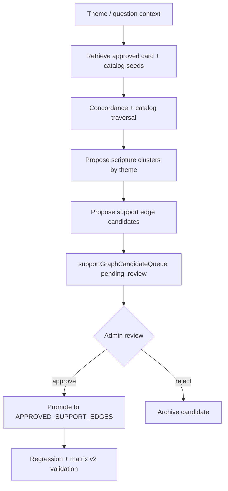

# Precept Discovery Design

**Date:** 2026-06-08  
**Phase:** 2D — design only (not implemented)

---

## Purpose

Define how BibleBuddy can later scan Genesis through Revelation to propose new line-upon-line / precept-upon-precept support relationships **without** auto-changing doctrine or final answers.

---

## Authority model (non-negotiable)

```
Scripture is authority
    ↓
Admin approves doctrine edges
    ↓
Approved Support Graph (frozen)
    ↓
Support Relationship Engine verifies claims
    ↓
OpenAI narrates approved evidence only
```

OpenAI never decides doctrine. Candidates never become approved without admin review.

---

## Discovery pipeline (future)



### Step 1 — Scan scope

- Walk approved catalog `teachingOrder` chains as seeds (not raw Bible crawl without seeds).
- Expand via concordance index where approved (`BibleLearningEnginePlan.md` Part I).
- Group verses by frozen theme keys from `approvedDoctrineRegistry` and catalog `themes[]`.

### Step 2 — Relationship proposals

For each candidate cluster, propose one edge type:

| Edge type | When proposed |
|-----------|---------------|
| `directly_affirms` | Verse text explicitly states claim pattern |
| `indirectly_supports` | Verse in approved teaching order, line upon line |
| `cautions_against` | Caution passage pattern from existing cards |
| `limits_claim` | Binding rule limits over-strong claim |
| `contradicts` | Citation denial pattern |
| `scripture_silent` | Related topic but no approved affirmation |

### Step 3 — Confidence assignment

| Signal | Confidence |
|--------|------------|
| Matches existing bindingRule text | high |
| In approved teachingOrder only | medium |
| Concordance thematic match only | low |
| Conflicts with frozen denial | reject candidate |

### Step 4 — Candidate queue

All proposals go to `supportGraphCandidateQueue.js`:

```json
{
  "topic": "sabbath",
  "proposedClaim": "pattern description",
  "scriptures": ["Exodus 20:8-11"],
  "scriptureOrder": ["Genesis 2:2-3", "Exodus 20:8-11"],
  "relationshipType": "directly_affirms",
  "reason": "Derived from sabbath.card primaryScriptures",
  "confidence": "medium",
  "source": "precept_discovery_scan",
  "reviewRequired": true,
  "autoApplied": false,
  "status": "pending_review"
}
```

### Step 5 — Admin promotion

Promotion requires:

1. Admin explicit approval (no auto-promote)
2. Edge transcribed from approved source field (card, catalog, registry)
3. Offline fixture pass (`baeClaimValidatorFixtures.js`)
4. Phase 2B regression pass on affected topics
5. No new doctrine text introduced

---

## Safeguards against historical regressions

| Risk | Guard |
|------|-------|
| Template responders | Discovery writes queue only — never `reply` |
| Study loops | No fallback speaker on discovery failure |
| Witness-path prose | Witness lines remain claims, not answers |
| Auto doctrine change | `autoApplied: false` always until admin |
| IOG ingestion | Out of scope until readiness ≥85 and P1 complete |
| OpenAI doctrine | Discovery runs in BB services, not compose prompt |

---

## Metrics for discovery quality

- Candidate precision: % promoted after admin review
- Class C reduction per promoted edge
- False A rate: approved claims later contradicted by denial rules
- Traceability: every promoted edge has `source` field to frozen asset

---

## Phase 2D foundation

Phase 2D delivers:

- `approvedSupportGraph.js` — frozen approved edges
- `supportGraphCandidateQueue.js` — admin-review queue
- Reference normalization — ref graph layer
- Support engine wiring — `supportGraphMatch` on every claim

Future discovery feeds the queue; only admin promotion mutates the approved graph.
