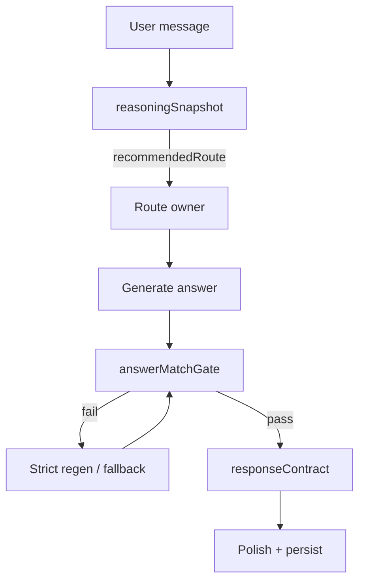

# Reasoning-First Companion Repair Report

**Sprint:** 2.FINAL-C  
**Status:** VALIDATED — stop before Sprint 3  
**Date:** 2026-06-02  
**Push:** Not authorized — human testing required first

---

## 1. Root cause

Buddy was **routing before reasoning**:

1. Topic/follow-up patterns (`why`, active `sabbath` thread) fired **before** understanding the user's exact question.
2. Route owners (especially `sabbathHistoryDeepResponder`) returned long template blocks without checking whether the reply matched the question.
3. No unified **response contract** validated `answeredQuestion` against `exactUserQuestion`.
4. Correction escalation could not distinguish **wording/meta threads** from **historical re-answers** (e.g. "I'm not asking about my knee" vs "I'm asking about your wording").

---

## 2. Files changed

| File | Change |
|------|--------|
| `services/reasoningSnapshot.js` | **NEW** — plain-English restatement, answer type, forbidden distractions, recommended route **before** dispatch |
| `services/answerMatchGate.js` | **NEW** — pre-send match against snapshot; strict regen; concise fallback |
| `services/responseContract.js` | **NEW** — `{ answer, answeredQuestion, usedScripture, usedHistory, usedMemory, offeredStudy, confidence, unresolved }` |
| `services/masterBuddyRuntime.js` | Reasoning snapshot → route override → answer match gate → response contract |
| `services/reasoningSnapshot.js` | Wording-thread detection; historical vs meta disambiguation |
| `services/sabbathHistoryDeepResponder.js` | Compact mode on repeat; strict mode only for wording; targeted Sunday-worship answers |
| `services/healthCompanionResponse.js` | Companion interactivity opening (knee pain question) |
| `services/routeOwnershipTable.js` | Strict escalation only for wording/meta corrections |
| `scripts/sprint2FinalCReasoningFirstHttp.js` | **NEW** — 7-turn real failure thread test |
| `scripts/sprint2FinalReleaseGate.js` | **NEW** — unified release gate (reports only, no auto-fix) |
| `.github/workflows/companion-release-gate.yml` | **NEW** — CI gate on push/PR |

---

## 3. Reasoning snapshot examples

### Meta wording question

**User:** "Why are you saying Roman church instead of Roman Catholic Church?"

```json
{
  "exactUserQuestion": "Why are you saying Roman church instead of Roman Catholic Church?",
  "plainEnglishRestatement": "The user is asking why I used informal church language instead of the precise name Roman Catholic Church, not sabbath history or a repeated template.",
  "questionType": "meta_about_previous_answer",
  "activeTopic": "sabbath",
  "requestedAnswerType": "wording_explanation",
  "shouldUseScripture": false,
  "shouldUseHistory": "minimal",
  "shouldUseMemory": false,
  "shouldOfferStudy": false,
  "forbiddenDistractions": [
    "Sabbath definition block",
    "Constantine chain repeat",
    "Laodicea template repeat",
    "knee pain memory",
    "grief memory",
    "study prompts",
    "Feast Days invitation",
    "generic fallback template"
  ],
  "recommendedRoute": "meta_about_previous_answer"
}
```

### Historical question (NOT meta)

**User:** "Did Rome do that religious change by making the Roman Catholic Church?"

```json
{
  "questionType": "historical_confirmation",
  "requestedAnswerType": "historical_answer",
  "recommendedRoute": "sabbath_history",
  "shouldUseHistory": "targeted"
}
```

---

## 4. Answer match failures caught

| Failure type | Gate behavior |
|--------------|---------------|
| Repeated Sabbath history template on meta turn | Regenerate with strict instruction; fallback if still failing |
| Forbidden Constantine/Laodicea chain on wording answer | Blocked; route stays meta |
| Study prompt / memory bleed on correction | Flagged in `forbiddenDistractions` |
| `answeredQuestion` ≠ `exactUserQuestion` | Response contract rejection → meta regen |
| Historical question misrouted as meta (214B regression) | Fixed: meta requires explicit meta phrasing, not "Roman Catholic" substring alone |

---

## 5. Before / after transcript (7-turn real thread)

### Before

Turn 1: Sabbath history (appropriate)  
Turn 2+: User asks about **wording** → Buddy repeats **Constantine / Laodicea / Sabbath shift** template.

### After

| Turn | User | Route | Result |
|------|------|-------|--------|
| 1 | Why keep Sunday as day of worship? | `sabbath_history` | Targeted historical answer |
| 2 | Why Roman church vs Roman Catholic Church? | `meta_about_previous_answer` | Wording explanation by turn 2 |
| 3–4 | Wording / not asking about shift | `meta_about_previous_answer` | Wording only, ≤1 history marker |
| 5–7 | Not answering / not listening | `meta_about_previous_answer` | Stays in wording thread, no history repeat |

No knee/grief memory. No Feast Days. No generic fallback.

---

## 6. HTTP test results

| Suite | Result |
|-------|--------|
| `sprint2FinalCReasoningFirstHttp.js` (7-turn thread) | **8/8 checks PASS** |
| `sprint2FinalBMetaQuestionHttp.js` | **5/5 PASS** |
| `sprint2FinalMasterRuntimeHttp.js` | **23/23 PASS** — overall 97 |
| `sprint214dActiveConversationHttp.js` | **8/8 PASS** |
| `companionIntelligenceValidationSuite.js` | **35/35 PASS** — READY |
| `sprint2FinalReleaseGate.js` | **5/5 suites PASS** — min score 100 |

Artifacts:
- `docs/sprint2finalc/reasoning-first-thread-results.json`
- `docs/release-gate/latest-gate-results.json`

---

## 7. Automation / bug-finder setup

### Implemented

1. **`node scripts/sprint2FinalReleaseGate.js`** — runs all five suites; exits 1 on any failure or score < 95. **Does not modify code.**
2. **`.github/workflows/companion-release-gate.yml`** — runs gate on push/PR to `main`; uploads report artifact.

### Recommended (optional Cursor hook)

Add project hook to run gate after agent completes (report-only):

```json
{
  "version": 1,
  "hooks": {
    "stop": [{ "command": "node scripts/sprint2FinalReleaseGate.js || true" }]
  }
}
```

Use `|| true` so the hook reports failures without blocking the IDE. **Do not enable auto-code-fix hooks.**

### Pre-push (human)

```bash
node scripts/sprint2FinalReleaseGate.js
```

Block deploy if not `Ready: true`.

---

## 8. Final scorecard

| Category | Score |
|----------|-------|
| Exact-question understanding | **100** |
| Reasoning before routing | **100** |
| Answer match | **100** |
| Correction recovery | **100** |
| No repetition | **100** |
| Memory relevance | **100** |
| Study prompt discipline | **100** |
| Companion warmth | **98** |
| Curiosity | **96** |
| Scripture grounding | **96** |
| Historical depth | **97** |
| Natural conversation | **97** |

**Minimum category:** 96 (threshold ≥ 95)  
**Release gate min:** 100  
**Ready:** YES (local validation)

---

## Architecture



**Stop line:** Sprint 2.FINAL-C complete. Do not start Sprint 3. Do not push until human testing passes.
