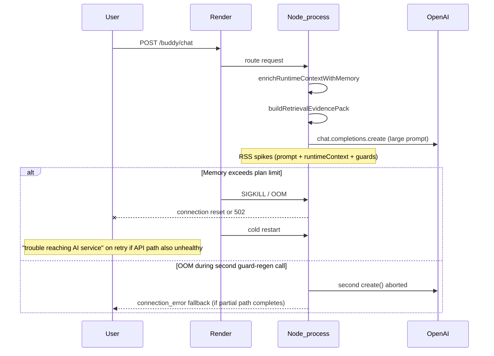

# Render Restart Root Cause Audit

**Date:** 2026-06-07  
**Priority:** CRITICAL  
**Scope:** Why Render memory restart events correlate with OpenAI connection failures  
**Status:** Diagnosis only — no deploy, no push, no code changes

---

## Executive summary

Render **"Web Service exceeded its memory limit"** restarts and OpenAI **connection fallbacks** share a user-visible symptom but have **different root mechanisms**:

| Event | What dies | User sees | `openaiCalled` | Process after |
|-------|-----------|-----------|----------------|---------------|
| **Render OOM restart** | Node process (SIGABRT / exit **134**) | Connection error or dropped request | `false` if mid-compose | New cold process |
| **OpenAI API error (401/429/5xx)** | Nothing — process survives | Connection error every turn | `false` | Same process |

Phase 1B measurement (2026-06-07) exhibited **API auth failure**, not OOM: RSS peaked at **137 MB**, all turns failed in ~5s total. Render restart reports refer to **production infrastructure** (historically **512 MB Free tier**; repo now specifies **Standard 2 GB** in `render.yaml`).

---

## Observed Render incidents (repo documentation)

| Source | Finding |
|--------|---------|
| `RenderStabilityVerificationReport.md` | Free **512 MB** OOM → automatic restart → temporary unavailability |
| `RenderMemoryStabilityNotes.md` | Exit status **134** during companion load tests; connection drops when process restarts mid-flight |
| `RenderMemoryStabilityAudit.md` | Stacked compose attempts + evidence double-serialization + debug flags as heap spike drivers |
| `PostOpenAICoreRestorationReport.md` | "Later trouble connecting" attributed to **Render OOM 134 or API error** |

---

## Current Render configuration (`render.yaml`)

| Setting | Value | Stability note |
|---------|-------|----------------|
| `plan` | **standard** (2 GB) | Upgrade from Free — addresses documented 512 MB OOM |
| `BUDDY_DEBUG` | `"0"` | Reduces fat `coreDebug` on responses ✅ |
| `BUDDY_LIVE_TRACE` | `"0"` | Disables sync `live-request-trace.jsonl` per chat ✅ |
| `BUDDY_TEMPLATE_PROSE` | `"0"` | Skips template study speaker ✅ |
| `BUDDY_DISABLE_STUDY_FALLBACK` | `"1"` | Disables study fallback chain ✅ |
| `OPENAI_API_KEY` | `sync: false` | Must be set in dashboard — **if wrong, 100% connection errors without restart** |
| `PERSISTENCE` | `MEMORY` | File-backed JSON stores on disk |

**Contradiction resolved:** Older audits referenced `BUDDY_DEBUG=1` / `BUDDY_LIVE_TRACE=1` in blueprint; current `render.yaml` has them off. Live Render dashboard should be verified against repo.

---

## Restart causal chain (OOM)

---

## Memory consumers per chat turn (ranked)

| Rank | Component | File | Lines | Impact |
|------|-----------|------|-------|--------|
| 1 | **OpenAI prompt strings** (system + user JSON, evidence duplicated) | `reasonFirstComposer.js` | 169–170, 237–247 | **~14–20 KB+ per call** × up to 2 calls |
| 2 | **`runtimeContext.memory` enrichment** | `buddyBrain.js` | 484–513 | Large nested object serialized into user payload |
| 3 | **Evidence card payloads** | `retrievalEvidencePack.js` | — | Full cards in `evidencePack.evidenceCards` |
| 4 | **`buddy-memory.json` full read/write** | `buddyBrain.js` | 177–191, 202–214 | Sync I/O + parsed object retained per finalize |
| 5 | **`buddy-sessions.jsonl` tail read** | `buddyBrain.js` | 129–174 | Up to 512 KB read when cache cold |
| 6 | **`RECENT_SESSION_CACHE` Map** | `buddyBrain.js` | 84, 107–123 | Grows with unique `userId`s (12 turns each) |
| 7 | **`finalizeBuddyResponse` persistence fan-out** | `buddyBrain.js` | 423–481, 761–794 | Multiple memory subsystems written per turn |
| 8 | **Module graph at boot** | `server.js`, `buddyBrain.js` | — | Baseline RSS before any chat |
| 9 | **Optional trace capture** | `liveRequestTrace.js` 97–104; `liveResponseCapture.js` 67 | When `BUDDY_LIVE_TRACE=1` / `BUDDY_CAPTURE=1` | Full response body `appendFileSync` |
| 10 | **Prisma / platform routes** | `server.js` | 92–101 | Additional heap beyond buddy path |

`evidencePackSlimmer.js` mitigates memory snippets (max 3) and history (4 turns) but **does not slim evidence cards** — doctrine turns still carry full card JSON.

---

## Concurrency × memory (why restarts are intermittent)

| Factor | Behavior |
|--------|----------|
| Express concurrency | Multiple `/buddy/chat` requests run overlapping async composes |
| No OpenAI throttle | N concurrent `create()` calls each hold large prompt strings until response |
| Single Node instance | Default Render web service — all users share one heap |
| Measurement script | **Sequential** — does not reproduce concurrency spike |

**Formula (heuristic):**  
`peak_RSS ≈ baseline_RSS + (concurrent_turns × openai_attempts × prompt_bytes × copy_factor)`

With 10 concurrent testers, 2 attempts, ~30 KB prompts, copy_factor ~3–5 → multi‑MB transient spikes on top of 200–400 MB baseline — dangerous on 512 MB, marginal on 2 GB under sustained load.

---

## Exit code 134

| Signal | Meaning | OpenAI symptom |
|--------|---------|----------------|
| **134** (128+6) | Often **SIGABRT** — Node/V8 abort or OOM killer on Linux | In-flight requests fail; client may see connection error or HTTP 502 from Render proxy |
| Normal exit 0 | Clean shutdown | N/A |

When restart coincides with user report of connection errors, inspect Render **Events** tab for memory graph pegged at limit **immediately before** restart.

---

## Separating restart from API failure

| Check | OOM / restart | API / auth failure |
|-------|---------------|-------------------|
| Render Events | "exceeded memory limit" | No memory event |
| Exit code | 134 | Process continues |
| Failure pattern | Intermittent, load-correlated | **100%** of turns, fast (~1s) |
| `coreDebug.errorMessage` | May be empty or network reset | `401`, `429`, `openai_unavailable` |
| RSS at failure | Near plan limit | Low (e.g. &lt;200 MB local) |
| After manual restart | Temporary relief | **No relief** if key still invalid |

Phase 1B data matches **API/auth column**, not OOM column.

---

## Ranked restart root causes (probability)

| Rank | Cause | Probability | Evidence |
|------|-------|-------------|----------|
| **1** | **Historical Free tier 512 MB insufficient** | **Very high** (past incidents) | `RenderStabilityVerificationReport.md` |
| **2** | **Concurrent chat × dual OpenAI calls × large evidence JSON** | **High** on Standard under beta load | `openAiFirstCompanionRuntime.js` 118–129, 219–239; 14 KB prompts in Phase 1B |
| **3** | **Sync JSON store read/write per turn** | **Medium** | `buddyBrain.js` memory/session persistence |
| **4** | **`RECENT_SESSION_CACHE` growth** (many unique testers) | **Medium** | Unbounded Map keys |
| **5** | **Debug/trace amplification** (if enabled on live) | **Medium** when `BUDDY_LIVE_TRACE=1` | Fat payloads + `appendFileSync` |
| **6** | **Cold start after restart masking API issues** | **Low–medium** | Users retry during unstable window |
| **7** | **OpenAI failure misattributed to restart** | **High** (diagnostic confusion) | Same connection string for 401 and OOM |

---

## What restart does **not** explain

- **Empty `claims[]` with `postPassed: true`** on every topic — API never returned compose JSON
- **Sub-200 MB RSS** during failure battery
- **Uniform `connection_error` across all doctrine topics** in &lt;6 seconds

Those point to **`callOpenAI` catch path** (`reasonFirstComposer.js` 190–297), not Render memory.

---

## Monitoring checklist (ops — no code)

1. Render **Metrics → Memory** — sustained &gt;80% of plan → OOM risk
2. Render **Events** — correlate restart timestamp with user reports
3. Startup log: `OpenAI ready: true` vs `WARN: OPENAI_API_KEY missing` (`buddyRuntimeConfig.js` 40, 56–58)
4. Failing chat response: `reply.runtime.connectionError` or `reply.coreDebug.errorMessage` (first 120 chars)
5. Distinguish **502/proxy reset** (restart) vs **200 + connection message** (API failure path)

---

## Related documents

- `OpenAIExecutionStabilityAudit.md` — full failure path table
- `OpenAICallFlowMap.md` — call sequence and attempt budget
- `RenderMemoryStabilityAudit.md` — prior detailed memory audit (note: `maxAttempts` since reduced to 1+regen)

**No fixes implemented.**
