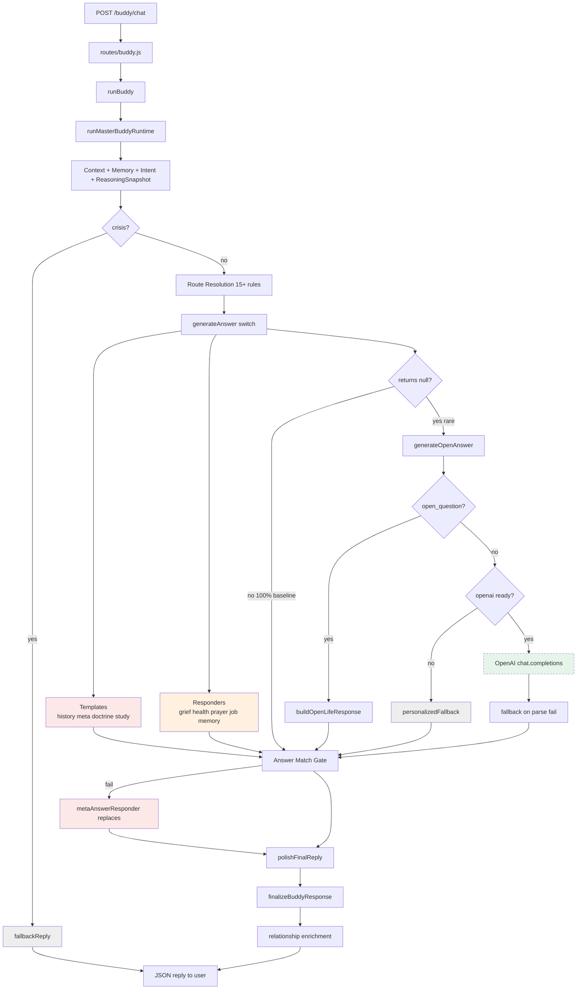

# Runtime Call Graph — POST /buddy/chat → Final User Reply

**Audit type:** Read-only architecture trace  
**Generated:** 2026-06-02  
**Scope:** Production path only (`routes/buddy.js` → `buddyBrain.runBuddy` → `masterBuddyRuntime`)  
**Evidence:** Code trace + baseline experiment (50 turns, `CurrentRuntimeBaselineReport.md`)

---

## 1. Reply Ownership Summary (Measured)

| Category | Measured % | Definition |
|----------|------------|------------|
| **OpenAI reasoning** | **0%** | Final prose from `openai.chat.completions.create` in `generateOpenAnswer` |
| **Templates** | **60%** | Canned blocks from history/meta/doctrine/study presenters |
| **Responders** | **40%** | Companion prose from grief/health/prayer/discernment/memory modules |
| **Route-owned prose** | **100%** | Any reply where `generateAnswer()` returns before OpenAI (templates + responders) |
| **Fallback systems** | **0%** | `fallbackReply` / `personalizedFallback` (0% in baseline; architecturally available) |

**Note:** Route-owned prose is the superset (100%). Templates and responders are subcategories. OpenAI and fallback are mutually exclusive escape hatches that did not fire in the baseline sample.

---

## 2. Top-Level HTTP Entry

```
POST /buddy/chat
│
├─ server.js
│    mountRoute('Buddy routes', '/buddy', './routes/buddy')
│
└─ routes/buddy.js
     router.post('/chat')
     │
     ├─ extract: userId, mode, personaKey, message
     ├─ validate message non-empty → 400 if missing
     ├─ runBuddy({ userId, mode, personaKey, message })
     └─ res.json({ ok: true, reply: normalizePayload(reply) })
          normalizePayload: wraps non-object replies in default companion shape
```

**Alternate entry:** `POST /buddy/stream` — identical `runBuddy()` call; SSE word-chunk delivery only.

**OpenAI at this layer:** None.

---

## 3. buddyBrain.runBuddy (Delegate Only)

```
runBuddy(inputOrUserId, modeArg, personaKeyArg, messageArg)
│
└─ runMasterBuddyRuntime(H, ...)
     H = helper bundle:
       normalizeInput, getUserCompanionProfile, getRecentSessions,
       enrichRuntimeContextWithMemory, classifySafety, fallbackReply,
       finalizeBuddyResponse, buildMemoryRecallStructured,
       applyFallbackLoopGuard, persistBuddyMemory, appendSession,
       appendQualityEvent, updateUserMemory, buildSystemPrompt,
       safeJsonParse, normalizeStructured
```

**OpenAI at this layer:** None. No composition logic in `buddyBrain.js`.

---

## 4. runMasterBuddyRuntime — Full Call Graph

```
runMasterBuddyRuntime(H, ...)
│
├─[A] normalizeInput ─────────────────────────────── input parsing
│
├─[B] EMPTY MESSAGE GUARD
│    └─ H.fallbackReply() ────────────────────────── BYPASS #1 → FALLBACK PROSE
│       return early
│
├─[C] CONTEXT BUILD (no prose)
│    ├─ H.classifySafety(message)
│    ├─ H.getUserCompanionProfile(userId)
│    ├─ H.getRecentSessions(userId, 8)
│    ├─ getRecentInsightsForUser(userId)          [contentInsight.js — not chat path OpenAI]
│    ├─ getSnapshot()                             [projectBrain.js]
│    ├─ buildRuntimeContext()                     [runtimeOrchestrator.js]
│    └─ H.enrichRuntimeContextWithMemory()        [buddyBrain.js → memory engines]
│
├─[D] CONVERSATION STATE (no prose)
│    ├─ getActiveConversation(userId)             [activeConversationManager.js]
│    ├─ resolveQuestionIntent()                   [questionIntentResolver.js]
│    ├─ resolveFollowUpQuestion()                 [questionIntentResolver.js]
│    ├─ shouldEscalateCorrection()                [questionIntentResolver.js]
│    └─ classifyRelationshipRecallQuery()         [relationshipRecallEngine.js]
│
├─[E] REASONING SNAPSHOT (advisory — no prose)
│    └─ buildReasoningSnapshot()                  [reasoningSnapshot.js]
│         outputs: plainEnglishRestatement, recommendedRoute,
│                   forbiddenDistractions, strictAnswerMode
│         ⚠ Does NOT compose user-facing text
│         ⚠ recommendedRoute feeds route dispatch, not OpenAI
│
├─[F] CRISIS SHORT-CIRCUIT
│    if safety.level === 'crisis':
│    ├─ H.fallbackReply({ safety: crisis }) ─────── BYPASS #2 → FALLBACK PROSE
│    ├─ scoreCompanionQuality()
│    ├─ polishFinalReply()
│    ├─ appendSession, appendQualityEvent, persistBuddyMemory
│    └─ return early (never reaches generateAnswer or OpenAI)
│
├─[G] ROUTE RESOLUTION (15+ rules)
│    routeKey := reasoningSnapshot.recommendedRoute
│              || resolveRouteKey()                [routeOwnershipTable.js]
│    overrides:
│    ├─ classifyContinueStudyIntent → continue_study
│    ├─ classifyRelationshipRecallQuery → memory_recall
│    ├─ classifyStudyConnectionQuery → study_connection
│    ├─ classifyHealthCompanion → health_support
│    ├─ classifyEmotionalSupport → grief_support
│    ├─ classifyPrayerIntent → prayer
│    ├─ classifyDiscernment → job_discernment
│    ├─ resolveSabbathCompanionIntent → sabbath_history
│    ├─ meta/isMetaQuestion → meta_about_previous_answer
│    ├─ default → sabbath_definition | doctrine_general
│    └─ open_question → open_general
│
│    getRouteOwner(routeKey)                       [routeOwnershipTable.js]
│    buildPresentationFlags()                     [masterBuddyRuntime.js]
│
├─[H] generateAnswer(routeKey) ─────────────────── PRIMARY PROSE GATE
│    switch(routeKey) → see Section 5
│    ⚠ Returns complete reply in ~100% of baseline turns
│    ⚠ OpenAI NOT called here
│
├─[I] FALLBACK DISPATCH CHAIN (only if generateAnswer returns null)
│    ├─ retry doctrine_general
│    ├─ registry_study via detectRegistryStudyTopic
│    └─ generateOpenAnswer() ────────────────────── ONLY OpenAI entry (Section 6)
│
├─[J] LAST-RESORT FALLBACK
│    if !structured:
│    └─ H.fallbackReply() ───────────────────────── BYPASS #3 → FALLBACK PROSE
│
├─[K] ANSWER MATCH GATE (meta/correction turns only)
│    if needsAnswerMatchGate:
│    ├─ applyAnswerMatchGate()                     [answerMatchGate.js]
│    │    on fail → buildMetaAnswerResponse() ─── BYPASS #4 → TEMPLATE REPLACES PROSE
│    └─ validateResponseContract fail:
│         buildMetaAnswerResponse() ─────────────── BYPASS #5 → TEMPLATE REPLACES PROSE
│
├─[L] attachResponseContract()                    [responseContract.js — metadata only]
│
├─[M] FINALIZE PATH (branch by route)
│    │
│    ├─ memory_recall:
│    │    polishFinalReply → appendSession → return
│    │
│    ├─ doctrine (_skipFinalizeEnrichment):
│    │    enrichResponseWithRelationshipIntelligence() ── MODIFIES PROSE
│    │    polishFinalReply → appendSession → recordConversationState → return
│    │
│    └─ standard:
│         polishFinalReply() ────────────────────── MODIFIES PROSE
│         H.finalizeBuddyResponse() ─────────────── see Section 7
│         recordConversationState()
│         recordCompanionEvent()
│         return finalized
│
└─[N] RESPONSE TO HTTP
     routes/buddy.js → normalizePayload → JSON to client
```

---

## 5. generateAnswer() — Route Dispatch Call Graph

Every case below returns **complete user-facing prose** without calling OpenAI.

```
generateAnswer({ routeKey, ... })
│
├─ crisis
│    └─ H.fallbackReply()                          → buddyBrain.fallbackReply
│
├─ continue_study
│    └─ buildContinueStudyResponse()               → continueStudyIntent.js [TEMPLATE]
│
├─ study_connection
│    └─ buildStudyConnectionResponse()             → studyConnectionIntent.js [TEMPLATE]
│
├─ memory_recall
│    └─ H.buildMemoryRecallStructured()            → buddyBrain + relationshipRecallEngine [RESPONDER]
│         └─ searchRelationshipRecall() → formatted memory dump prose
│
├─ sabbath_history | historical_evidence | historical_follow_up
│    ├─ if meta/wording in reasoningSnapshot:
│    │    └─ buildMetaAnswerResponse()             → metaAnswerResponder.js [TEMPLATE]
│    └─ else:
│         └─ buildSabbathHistoryResponse()         → sabbathHistoryCompanion.js
│              └─ buildSabbathHistoryDeepResponse() → sabbathHistoryDeepResponder.js [TEMPLATE]
│
├─ health_support
│    └─ buildHealthSupportResponse()               → healthCompanionResponse.js [RESPONDER]
│
├─ grief_support | rest_support
│    └─ buildEmotionalSupportResponse()            → griefCompanionResponse.js [RESPONDER]
│
├─ prayer
│    └─ buildPrayerCompanionResponse()             → prayerCompanionResponse.js [RESPONDER]
│
├─ job_discernment
│    └─ buildDiscernmentResponse()                  → companionDiscernmentResponder.js [RESPONDER]
│
├─ meta_about_previous_answer
│    └─ buildMetaAnswerResponse()                  → metaAnswerResponder.js [TEMPLATE]
│
├─ sabbath_definition | doctrine_general
│    ├─ runDoctrineRuntimePipeline()             → doctrineRuntimePipeline.js
│    │    └─ routeDoctrineResponse()
│    │         └─ buildSourceGroundedReply()      → sourceGroundedResponder.js [TEMPLATE]
│    ├─ orchestrateBuddyRuntime()                  → retrievalFirstBuddyOrchestrator.js [metadata]
│    ├─ presentCompanionDoctrine()                 → companionDoctrinePresenter.js [TEMPLATE FRAMING]
│    └─ polishFinalReply()
│
├─ registry_study
│    └─ presentRegistryStudyResponse()             → registryStudyPresenter.js [TEMPLATE]
│
└─ default (open_question)
     └─ buildOpenLifeResponse()                    → companionDiscernmentResponder.js [RESPONDER]
          ⚠ Called INSIDE generateAnswer, not OpenAI path
```

---

## 6. generateOpenAnswer() — Theoretical OpenAI Path

```
generateOpenAnswer(...)
│
├─ if questionType === 'open_question':
│    └─ buildOpenLifeResponse() ─────────────────── BYPASS #6 → RESPONDER (not OpenAI)
│
├─ if !openai (no package or no API key):
│    └─ buildPersonalizedFallback() ─────────────── BYPASS #7 → FALLBACK TEMPLATE
│         applyFallbackLoopGuard()
│
├─ ELSE OpenAI PATH:
│    ├─ buildRuntimeInstructions()
│    ├─ H.buildSystemPrompt() + MASTER_OPENAI_RULES
│    ├─ openai.chat.completions.create() ───────── ★ ONLY OpenAI CALL IN CHAT PATH
│    ├─ H.safeJsonParse(raw) || fallback ────────── BYPASS #8: parse fail → fallback prose
│    ├─ H.normalizeStructured(parsed, fallback) ── BYPASS #9: uses fallback.reply if parse empty
│    ├─ H.applyFallbackLoopGuard() ──────────────── BYPASS #10: may replace reply
│    └─ polishFinalReply() ──────────────────────── MODIFIES OpenAI output
│
└─ catch:
     └─ H.fallbackReply() ───────────────────────── BYPASS #11 → FALLBACK
```

**Baseline measurement:** This function was reached **0 times** with successful OpenAI composition across 50 turns. All turns were satisfied by `generateAnswer()` first.

---

## 7. finalizeBuddyResponse() — Post-Composition Modifications

```
finalizeBuddyResponse({ structured, ... })
│
├─ scoreCompanionQuality()                        [runtimeOrchestrator.js — scoring only]
│
├─ if memory enabled && !crisis:
│    ├─ if activeConversationLock || skipEnrichment:
│    │    polishCompanionReply() ───────────────── MODIFIES prose (tone only)
│    └─ else:
│         enrichResponseWithRelationshipIntelligence() ── APPENDS/MODIFIES prose
│              [companionRelationshipOrchestrator.js]
│         polishCompanionReply()
│
├─ buildCompanionNextSteps()                      [companionNextSteps.js — may append suggestions]
│
├─ appendSession → buddy-sessions.jsonl
├─ appendQualityEvent
├─ updateUserMemory / persistBuddyMemory
└─ recordActiveConversationTurn
```

**OpenAI interaction:** None. All modifications apply to whatever prose `generateAnswer` or `generateOpenAnswer` produced.

---

## 8. polishFinalReply() Pipeline (Applied Multiple Times)

```
polishFinalReply(reply)
└─ polishCompanionReply(                      [companionReplyPolish.js]
     sanitizeDoctrineResponse(               [runtimeResponseSanitizer.js]
       stripInternalRuntimeLabels(            [runtimeLabelStripper.js]
         reply))))
```

Applied at:
- Crisis exit
- Doctrine path (pre-return)
- Standard path (pre-finalize)
- Inside finalizeBuddyResponse
- Inside generateOpenAnswer

---

## 9. Mermaid — End-to-End Call Graph



---

## 10. Module Import Graph (masterBuddyRuntime.js)

| Imported module | Role in call graph |
|-----------------|-------------------|
| `openaiClient` | OpenAI client (null if unavailable) |
| `runtimeOrchestrator` | Context, instructions, quality scoring |
| `doctrineRuntimePipeline` | Doctrine intercept |
| `retrievalFirstBuddyOrchestrator` | Scripture chain metadata |
| `companionDoctrinePresenter` | Doctrine prose framing |
| `continueStudyIntent` | Study continuation template |
| `griefCompanionResponse` | Grief/rest prose |
| `registryStudyPresenter` | Registry study template |
| `personalizedFallback` | Fallback template |
| `relationshipRecallEngine` | Memory recall routing + prose |
| `healthCompanionResponse` | Health prose |
| `prayerCompanionResponse` | Prayer prose |
| `studyConnectionIntent` | Study connection template |
| `companionReplyPolish` | Post-process polish |
| `sabbathIntentRouter` | Sabbath route override |
| `sabbathHistoryCompanion` | History template wrapper |
| `questionIntentResolver` | Intent classification |
| `metaAnswerResponder` | Wording/meta template |
| `reasoningSnapshot` | Pre-route understanding |
| `answerMatchGate` | Validation + template regen |
| `responseContract` | Response metadata |
| `doctrineBoundaries` | Topic detection |
| `activeConversationManager` | Thread state |
| `routeOwnershipTable` | Route ownership policy |
| `companionDiscernmentResponder` | Job/life prose |
| `runtimeResponseSanitizer` | Doctrine sanitization |
| `runtimeLabelStripper` | Label stripping |
| `companionRelationshipOrchestrator` | Relationship prose append |

**Total direct prose-generating imports:** 15 modules. **OpenAI-using imports:** 1 (`openaiClient`), reached only via `generateOpenAnswer`.

---

## 11. Persistence Side Effects (Do Not Change Reply Text)

| Function | File | Effect |
|----------|------|--------|
| `appendSession` | buddyBrain.js | Writes `data/buddy-sessions.jsonl` |
| `updateUserMemory` | buddyBrain.js | Updates user memory store |
| `persistBuddyMemory` | buddyBrain.js | Persists companion memory |
| `updateActiveConversation` | activeConversationManager.js | Updates `data/active-conversation-state.json` |
| `recordCompanionEvent` | companionIntelligence.js | Event logging |

---

**Audit only. No production changes.**
